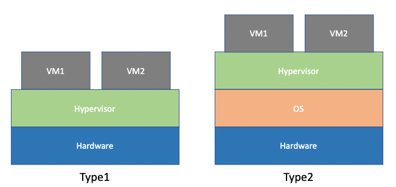
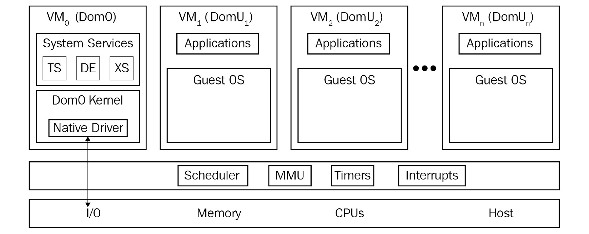

# 第1章 Linux の仮想化を理解する
本章では，一般的な Linux の仮想化技術と，ほかの仮想化技術と比較した場合の利点に関して，次のトピックを扱います．

- Linux の仮想化とその基本的なコンセプト
- 仮想化の種類
- ハイパーバイザ (Hypervisor) と VMM
- オープンソースの仮想化プロジェクト
- クラウドの Linux の仮想化技術によって何がもたらされるのか．

## Linux の仮想化とその全ての始まり
仮想化 (virtualization) は，パーティショニング (partitioning) のようなハードウェアの機能や，ハイパーバイザのようなソフトウェアの機能を用いて，仮想化されたリソースを作成し，それを物理リソースにマッピングすることをコンセプトとしています．
ハイパーバイザは，全ての仮想マシンのワークロードが可能な限り CPU 時間を多く使えるよう，効率的にリソースの管理を行なってくれます．

仮想化自体は x86 のマシンが登場するよりも数十年近く前，1967年の IBM CP-40 や S/360-40 の時代から存在していました．
しかし，2003年に64ビットのマルチコア CPU が AMD から登場したことで，PC 市場でも仮想化が注目されるようになりました．
それから15年近くの歳月が流れ，Red Hat の KVM，Microsoft の Hyper-V，VMware の ESXi，Oracle の Olacle VM など，様々仮想化ソリューションが提供されるようになっています．
これによって，EC2 や AWS，Office 365，Azure，vCloud Director，vRealize Automation など，様々なクラウドサービスも生まれました．
こうした中で，2003年10月に登場した **Xen** は x86 アーキテクチャに対応した，初めてのオープンソースのハイパーバイザとして非常に重要です．
Red Hat は当初，2007年にリリースされた Red Hat Enterprise Linux 5 で Xen による仮想化を導入していました．
しかし，2010年の Red Hat Enterprise Linux 6 では **KVM** に切り替えられています．
これには，Xen がカーネルの本流と外れていること，Red Hat が開発に影響力を持っておきたかったことなど，様々な理由があります．

技術的に KVM では，Linux のカーネルをハイパーバイザ向けに変換するという，Xen とは異なるアプローチで仮想化を実現しています．
また，CPU 側で AMD-V や Intel VT のような仮想化支援機能をサポートしている必要があります．

## 仮想化の種類
仮想化には，何を仮想化しているのかによる分類と，どうやって仮想化しているのかによる分類の，大きく2通りの分類があります．
何を仮想化しているのかによる分類には5種類あります．

### デスクトップ仮想化 (Desktop virtualization, VDI: Virtual Desktop Infrastracture)
多くの企業で導入されている仮想化で，様々なデバイスからデスクトップに接続でき流ようになります．
この仮想化には，次のようなメリットがあります．

- 一元的に管理・監視がしやすい
- システムの更新作業がしやすい
- アプリケーションの展開がしやすい
- コンプライアンスやセキュリティの管理がしやすい

### サーバ仮想化 (Server virtualization)
仮想マシンとと物理マシンを隔離することで，バックアップが簡単にできるようになったり，電力効率を改善したり，自由に環境を移行できるようにしたりと，様々な機能を実現する．

### アプリケーション仮想化 (Application virtualization)
Microsoft の App-V のようなストリーミング / リモートプロトコルの技術，あるいはVMware App Volumes のようなアプリケーションをパッケージ化できる方法を用いて実装されています．

### ネットワーク仮想化 (Network virtualization, SDN: Software-Defined Networking)
物理的なネットワークデバイスとは独立した仮想的なネットワークを作成する技術です．
さらに，複数の拠点にまたがってネットワーク仮想化を実現するのが SDN です．
この技術によって，物理的なネットワークを変更することなく，ネットワーク全体をソフトウェア的に設定できるようになります．

### ストレージ仮想化 (Storage virtualization, SDS: Software-Defined Storage)
複数の物理的なストレージデバイスを束ねて，1つの仮想ストレージとして一元的に管理できるようにする技術です．
SDSは，抽象化によってストレージソフトウェアスタックを実行中のハードウェアから切り離すとともに，異なるタイプのストレージリソースを仮想マシンやアプリケーションに提供します．

このような仮想化技術が大規模化するにつれ，増え続けるインフレを効率的に管理するために，様々な自動化ツールやオーケストレーションツールが登場しました．
数千台規模の仮想マシンを標準的なユーティリティで制御するのは到底不可能です．
そこで，よりプログラム的に API 駆動のアプローチで仮想マシンの管理を行う OpenStack や OpenShift，Ansible, Elasticsearch，Logstash，Kibana (後ろ3つを合わせて **ELK**) といったツールが開発されています．

一方，仮想化の方法には，次のような種類があります．

### パーティショニング (Partitioning)
CPU をいくつかのパートに分割し，各パートをそれぞれのシステムに割り当てる方式です．
例として，IBM の LPARs (Logical Partitions) が挙げられます．

### 完全仮想化 (Full Virtualization)
仮想マシンを使って標準的なハードウェアをシミュレートする方式です．
ゲスト OS を修正しなくても良いのが利点です．
ソフトウェアベースとハードウェアベースの2種類があります．

- ソフトウェアベース  
  ソフトウェアによってハードウェアをエミュレートする方法．オーバヘッドが大きくスケーラビリティに欠ける．
- ハードウェアベース  
  AMD-V や Intel VT のような CPU の仮想化支援技術を用いて仮想化する．KVM や ESXi，Hyper-V，Xen はこちら．

### 準仮想化 (Paravirtualization)
ゲスト OS を修正して仮想化されていることを認識できるようにして，CPU の仮想化支援技術なしで実現する方式です．
Xen はこのモードで動作させることもできます．

### ハイブリッド仮想化 (Hybrid Virtualization)
完全仮想化と準仮想化を組み合わせた方式で，ゲスト OS の修正は必要ないが，準仮想化のドライバを仮想マシン側に追加する必要があります．
Xen や ESXi がこのモードで動作させることができます．

### コンテナ型仮想化 (Container-based Virtualization)
コンテナを用いた仮想化方式です．
必要なアプリケーションを全てパッケージ化したオブジェクトなので，仮想マシンやハイパーバイザを使う必要がなく，高速なデプロイが可能です．
また，ハイパーバイザと共存させることも可能です．

## ハイパーバイザ / 仮想マシンマネージャ (Virtual Machine Manager) を使う 
ハイパーバイザ，あるいは仮想マシンマネージャは，その名の通り仮想マシンやゲストハウス OS の監視と制御を行うソフトウェアです．
仮想ハードウェアの提供や仮想マシンのライフサイクル管理，仮想マシンのマイグレーション，リアルタイムの計算資源の割り当て，仮想マシン管理のポリシー設定などの機能を担っています．
また，物理プラットフォームの資源制御も行なっています．
VMM は各ゲスト OS の設定に基づいて，プロセッサやメモリなどのリソースを割り当てていくので，仮想化において非常に重要な役割を果たしています．

## Type 1 と Type 2 のハイパーバイザ
ハイパーバイザは，ホスト OS の有無によって，Type 1 と Type 2 のハイパーバイザに分類されます．
Type 1 のハイパーバイザはハードウェア上で直接動作する一方，Type 2 は OS 上で動作します．

Type 1 のハイパーバイザは，別名 **ベアメタル** (bare-metal) ハイパーバイザや**組み込み** (embedded) ハイパーバイザ，**ネイティブ** (native) ハイパーバイザなどとも呼ばれます．
その例としては，次のようなものがあります．

- oVirt-node
- VMware ESXi/vSphere
- Red Hat Enterprise Virtualization Hypervisor (RHEV-H)

Type 1 のハイパーバイザのメリットとしては，次のようなものが挙げられます．

- インストールや設定が簡単
- サイズが小さい
- 仮想マシンを実行するだけであればオーバヘッドが小さい
- ある仮想マシンの問題が他の仮想マシンに波及することはないのでセキュリティが守られる

しかし，カスタマイズ性は低くなっています．  
一方，Type 2 のハイパーバイザは OS 上で動作するため，様々なカスタマイズが可能です．
また，ハードウェアへのアクセスはホスト OS が担うため，幅広いハードウェア上で動作します．
Type 2 ハイパーバイザの代表的な例としては，VMware Player や Workstation，Fusion，Oracle VirtualBox が挙げられます．

Type 1 と Type 2 の使い分けは，まだ OS がインストールされていないか，すでにされているかによって決めれば大丈夫です．

## オープンソースの仮想化プロジェクト
Linux のオープンソース仮想化プロジェクトには次のようなものがあります．

- KVM (Kernel-based Virtual Machine) : 完全仮想化
- VirtualBox : 完全仮想化
- Xen : 完全仮想化，準仮想化
- Lguest : 準仮想化
- UML (User Model Linux) : First
- Linux-Vserver : First

ここでは，Xen と KVM について見ていきます．

### Xen
Xen はケンブリッジ大学の研究プロジェクトに始まり，2003年にリリースされました．
その後，Ian Pratt と Simon Crosby が XenSource 社を立ち上げて，オープンソースプロジェクトとして Xen の開発に取り組んでいます．
2013年4月15日には Linux 財団の共同プロジェクトとなり，新しい Xen Project が立ち上げられました． (https://xenproject.org/)

Xen は Intel IA32/64 や x86_64 をはじめ，PowerPC や ARM，MIPS など，様々なプロセッサに対応しています．

Xen の核となるコンセプトは，次の4つのブロックで構成されます．

- Xen ハイパーバイザ  
  割り込みや時間管理，CPU やメモリのリクエスト，ハードウェアのやりとりなど，物理マシンと仮想マシンの相互通信を取り持つ
- Dom0 
  QEMU を用いてバイナリ変換による標準的なコンピュータシステムをエミュレートし，仮想マシン環境の管理を行う
- 管理ユーティリティ  
  GUI/CLI による Xen 環境全体を管理するユーティリティ
- 仮想マシン  
  Xen で実行されるゲスト

次の図のように，Dom0 だけは他の仮想マシンを管理するため完全に分離されていますが，それ以外はうまくスタックされたような構造になっています．

Xen の仮想環境では，**virsh** コマンドによって環境の管理が可能です．

### KVM
KVM は VT-x や AMD-V のようなハードウェア機能を利用した，最新世代を代表するオープンソースの仮想化プロジェクトです．
Linux のカーネルをハイパーバイザとして利用しており，標準カーネルの変更による恩恵をそのまま享受できます．
例えば，スケジューラやネスト型仮想化の改善，Spectre 攻撃への対応やAMD Secure Encripted Virtualization の座ポート，Intel iGPU のパススルーなど，実に様々な変更に対応しています．
入出力のエミュレーションには QEMU を利用しています．
QEMU はプロセッサをはじめ，ディスクやネットワーク，VGA，PCI，USB，シリアルポート・パラレルポート通信など，ありとあらゆる仮想ハードウェアのエミュレーションが可能です．

## クラウドにおける Linux 仮想化
クラウド市場において，Amazon は2006年に AWS (Amazon Web Services) と EC2 (Amazon Elatic Compute Cloud) をリリースしました．
その後，Google Cloud Platform (GCP) が2008年に，Microsoft Azure が2010年にリリースされています．
これらが，IaaS (Infrastracture-as-a-Service) 最大のプロバイダとなっています．
そして，これらのクラウドプラットフォームは Linux ベースのシステムで構成されています．
(Amazon は Xen と KVM，GCP は KVM を使っています．)

最近では，Linux 仮想化による IaaS 構築向けに，次のようなオープンソースプロジェクトがあります．

- OpenStack  
  複数のサブプロジェクトからなる IaaS Cloud 構築向けのプロジェクトで，OpenStack 財団によって管理されている
- CloudStack  
  ASF (Apache Software Foundation) の管理するプロジェクトで，EC2/S3 API と互換性のあるスケーラブルな IaaS 構築に適している
- Eucalyptus  
  AWS と互換性のあるプラーベートクラウドを構築できるプロジェクトで，KVM と Xen の両方をサポートする

ここで1つ重要な疑問が生じます．
異なるソリューションを同時に扱うことができる何らかの管理レイヤーを用いて，様々な種類のソリューション(仮想化ソリューションなど)を含む環境(純粋な仮想化環境，またはクラウド環境)を実際に動かすことができるのかということです。
例えば，OpenStack を例に取ると，10以上の仮想化ソリューションをサポートしています．

- KVM
- Xen (via libvirt)
- LXC (Linux コンテナ)
- Microsoft Hyper-V
- VMware ESXi
- Citrix XenServer
- User Mode Linux (UML)
- PowerVM (IBM Power 5-9 プラットフォーム)
- Virtuozzo (仮想マシンとストレージ，コンテナを使えるソリューション)
- z/VM (IBM Z / IBM LinuxONE 向け仮想化ソリューション)

このように，異なる CPU アーキテクチャやハイパーバイザを1つの管理ツールを用いて管理することができます．

## まとめ
本章では，仮想化の基礎とその種類について扱いました．
今日の大規模な IT 社会における仮想化の重要性を念頭に置き，これらの概念をどのように結びつけ，大規模な仮想化環境とクラウド環境という大局を作り出すことができるかを知っておくことは有益なことです．
次章では，KVM ハイパーバイザとその関連ユーティリティについて見ていきます．
