# 仮想化ソリューションとしての KVM
本章では，概念としての仮想化と，libvirt や QEMU (Quick Emulator)，そして KVM による実装について議論します．
マルチコ CPU と仮想化の技術的背景に始まり，CPU や OS の理論を深く掘り下げて，ハイパーバイザとは何か，仮想化はどう機能するのかを見ていきます見ていきます．
本章のコンテンツは次のとおりです．

- 概念としての仮想化
- 内部的な libvirt，QEMU，KVM の働き
- これらがどのように相互にやり取りをして仮想化を実現しているか

## 概念としての仮想化
仮想化はハードウェアとソフトウェアを切り分け，様々なワークロード間でリソースを効率的かつプログラマティックに分けあったり共有したりするアプローチです．  
仮想化によって，単一のハードウェア上で複数のゲスト OS を動かすことができます．
これは，物理マシンのリソースをスケジューリングアルゴリズムなどを用いて，ハイパーバイザが仮想マシンへ振り分けることで実現されています．

### 仮想化環境 vs 物理環境
物理サーバと仮想サーバを比較すると，次の図のようになります．

<div align="center">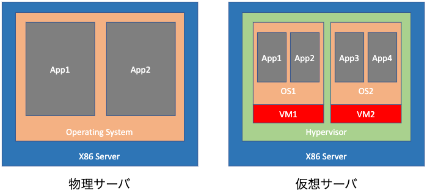</div>

物理サーバでは，ハードウェアに直接 OS をインストールします．
一方，仮想化された環境では，ハイパーバイザを実行して仮想マシンを作成します．
そして，仮想マシン上で OS やアプリケーションを動かします．
OS が仮想化に対応していない場合など，アプリケーションを物理サーバで実行する必要があることもあります．

### なぜ仮想化はそれほど重要なのか
今日でも，スケールアップや並列化のできるようにプログラムされていないアプリケーションはたくさんあります．
すると，CPU やメモリなど，サーバの計算資源を有効に活用でなくなってしまいます．
そのため，そのようなリソースを使い切ることを目的に仮想化が使われています．
これ以外にも，CPU の動作周波数が頭打ちになり，シングルコアで性能を上げることが難しくなったことも，仮想化が重視されるようになった一因と言えます．  
仮想化とは別のアプローチとして，Intel Pentium Pro のデュアルソケットシステムや，AMD Opteron のデュアル / クアッドソケットシステムのように，システムごとに複数の実行ユニットを持つとういうものもありました．  
いずれにせよ，2005年にマルチコア CPU が登場して以降，その方針は変わっていません．
そのため，Microsoft や Oracle が自社アプリケーションでマルチコアの恩恵を受けるには，OS やアプリケーションを作り直す必要がありました．
つまり，マルチコア CPU が主流となったことが，仮想化が重視されるきっかけとなったと言えます．

このようなマルチコア化と並行して，CPU にはいくつか他の機能も追加されました．
例えば，MMX や SSE，AVX，AES などの命令セットが追加されました．
これによって，特定のタイプの命令を CPU レジスタにオフロードすることで，CPU のパイプラインを占有することなく処理を実行でき流ようになります．
すなわち，小規模なアクセラレータを CPU ダイ上に搭載したとみなすことができます．
そのような追加機能の1つが，Intel の Virtual Machine Extensions (VMX) や AMD Virtualization (AMD-V) であり，ハードウェアベースの仮想化をサポートしています．

### 仮想化のハードウェア要件
ここまで，ソフトウェアベースの仮想化を見てきましたが，ソフトウェアだけでなくハードウェアの面でも，仮想化技術の開発が行われています．
2003年から2006年まで，Intel の Pentium 4/D や AMD の Athlon，Turion，Duron などの CPU ではハードウェアによる仮想化をサポートしていませんでした．
また，64ビット CPU の登場も，ハードウェアによる仮想化が浸透するきっかけになりました．
これは，32ビット CPU で扱えるメモリが最大で 4GB であり，仮想化用途での使用に耐えられないからです．

今日のハードウェア支援技術を活用した仮想化ハイパーバイザを利用するには，次のような要件を満たす必要があります．

- 第2レベルアドレス変換 (SLAT: Second-Level Address Transration)，RVI (Rapid Virtualization Indexing)，EPT (Extended Page Tables) のサポート  
  メモリの仮想アドレスと物理アドレスを変換する機能で，物理メモリ上に散らばった仮想メモリの領域を，**TLB** (Translation Lookaside Table) によって実装される SLAT などを用いて，メモリのアクセス遅延を軽減する．SLAT は Intel では EPT，AMD では RVI と呼ばれる．
- Intel VT や AMD-V のサポート  
  ハードウェア仮想化と完全仮想化のサポートしていること．
- Long モードのサポート  
  CPU のアーキテクチャが64ビット出あること．
- AMD-Vi や Intel VT-d，ARM の stage 2 table のような IOMMU (Input/Output Memory Management Unit) 仮想化が利用可能であること  
  グラフィックカードやストレージコントローラ，ネットワークデバイスなどの周辺機器に複数の仮想マシンから利用できるようにする技術で，CPU とマザーボードの設定で利用できるように設定する必要がある．
- SR-IOV (Single Root Input Output Virtualization) が利用可能であること  
  VF (Virtual Function) を用いて複数の仮想マシンで，1つの PCI Express 物理デバイスを共有する機能．ただし，ハードウェアとドライバのサポートが必要．
- PCI パススルーが利用可能であること  
  PF (Physical Function) を用いて，PCI Express に接続されたデバイスが，あたかも仮想マシンに直接接続されているかのように見せかける機能．
- TPM (Trusted Platform Module) のサポート  
  暗号化キーの作成や保存，安全な利用を支援するマザーボードチップに実装された機能．2018年，Intel から TPM2 がオープンソース化された．

SR-IOV と PCI パススルーの違いは，仮想マシンに転送するレベルの違い (物理レベル or 仮想レベル) と転送する方法の違い (直接 or ハイパーバイザ経由) です．  
AMD は Athlon64 で，Intel は Nehalem で，それぞれメモリコントローラを CPU に内蔵するようになりました．
それまでは，NorthBridge チップと呼ばれる別のハードウェアがメモリやバスの管理を担っていましたが，メモリコントローラの内蔵によってメモリの入出力操作の遅延が短縮されました．
また，デュアルチャネルメモリアーキテクチャもこの時に導入されました．
現在，サーバでは3チャネルや4チャネルがデファクトスタンダードになり，Intel Xeon コアでは6チャネル，AMD EPYC では8チャネルの構成となっています．
これは，メモリの帯域や遅延に影響があり，さらにメモリに左右されやすいアプリケーションの速度に大きな影響を与えます．
メモリの遅延は小さく帯域幅は広いほど望ましいと言えます．

### 仮想化のソフトウェア要件
コンピュータ科学の分野では，システム内のリソースにアクセスする際，データや障害を守るために階層的な保護領域や特権リングを利用します．

<div align="center">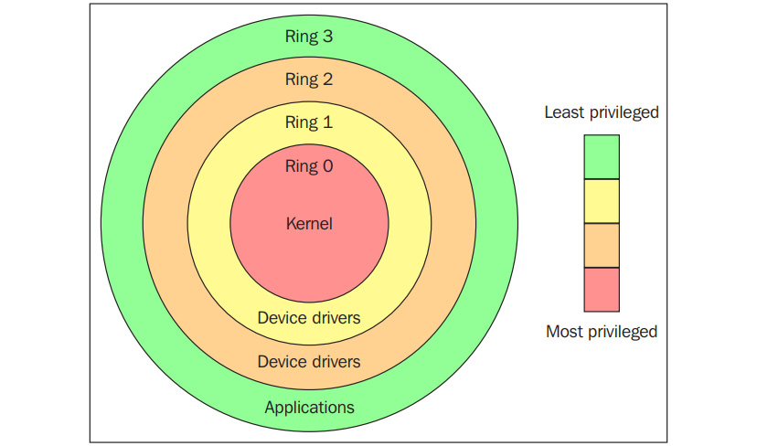</div>

Ring0 が最も特権的なレベルで，物理的なハードウェアと直接やりとりする階層となり，メモリや入出力ポート，CPU 命令などのリソースを保護します．
Ring1 と Ring2 はほとんど使われることはなく，多くの汎用的なシステムでは2つのリングしか使用しません．
CPU モードには主にカーネルモードとユーザモードがあり，OS から見ると Ring0 がカーネルモード (あるいはスーパーバイザモード)，Ring3 がユーザモードにあたります．
アプリケーションは Ring3 で実行されます．
(詳しくは[こちら](https://access.redhat.com/sites/default/files/attachments/processstates_20120831.pdf)を参照のこと)

Linux や Windows のような OS では，スーパーバイザモードとユーザモードを使い分けており，ユーザモードではメモリや CPU，入出力ポートへのアクセスが制限されているため，カーネルの呼び出しなしではほとんど何もできません．
一方，カーネルは Ring0 上で動作します．
そこで，ユーザモードのコードはスーパバイザモード，あるいはカーネル空間へのシステムコールを実行し手処理を行います．
つまり，通常の環境で OS は Ring0 で動作し，リソースの管理やハードウェアへのアクセスを担っています．
これを表したのが次の図です．

<div align="center">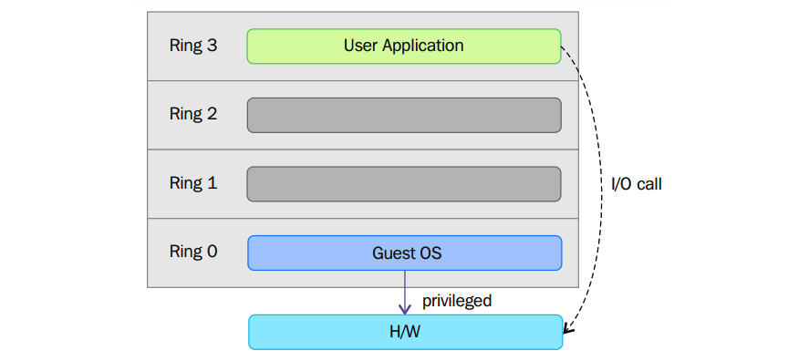</div>

Ring0 以外では unprotected と呼ばれるプロセッサモードで命令が実行されます．
Ring0 で実行されるコードしかホスト側のメモリや CPU，入出力デバイスにアクセスできないため，ハイパーバイザや VMM はカーネルと同じく Ring0 に配置する必要があります．
Ring0 で同時に実行できるカーネルは1つだけなので，もしハードウェアによる仮想化支援がなければ，ゲスト OS は Ring1 かそれより外側で動作させるしかありません．
しかし，ゲスト OS が仮想化レイヤを意識せずにリソースにアクセスするためには，Ring0 にインストールする必要があります．
そこで，完全仮想化と準仮想化と呼ばれる方法が登場するのです．

#### 完全仮想化 (Full Virutualization)
完全仮想化では，特権命令をエミュレートして，ゲスト OS を Ring1 で実行する際の制約を解決しています．
完全仮想化は，第1世代の x86 VMM に実装されました．
これは，バイナリ変換などの技術によって，機密命令や仮想化不可能な命令の実行をトラップして仮想化しています．
つまり，バイナリ変換では一部のシステムコールが解釈され，動的に書き換わります．
以下の図は，ゲスト OS が Ring1 を通じてホストのハードウェアにアクセスし，非特権命令がリング1の関与なしに実行される時の動作を示しています．

<div align="center">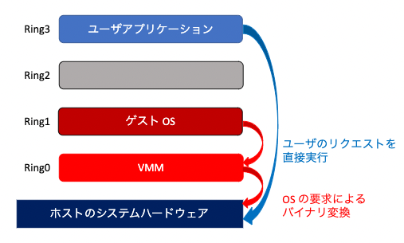</div>

この方法では，クリティカルな命令を検出して，ソフトウェアでエミュレートする VMM のトラップに置き換えます．
次の図のように，バイナリ変換はネイティブに仮想化されたアーキテクチャ上で実行される仮想マシンと比べて，大きな性能のオーバヘッドを生じる可能性があります．

<div align="center">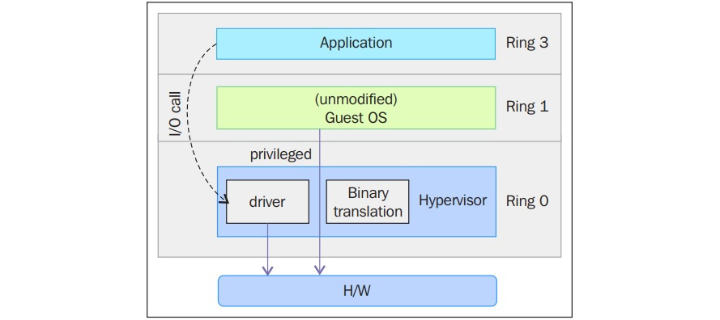</div>

完全仮想化では，OS を修正なしでそのまま利用できることが大きな利点ですが，準仮想化に比べてオーバヘッドは大きくなります．

#### 準仮想化 (Para Virtualization)
準仮想化では，VMM/ハイパーバイザーとゲストの間でバックエンド (ハイパーコール) パスを介して通信するように OS をように修正する必要があります．

<div align="center">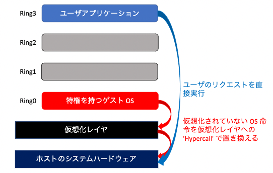</div>

ハイパーバイザは API を提供し，ゲストの仮想マシンの OS から API を呼び出し，特権命令の呼び出しは API の機能に変換されます．
この場合，ゲスト OS は Ring0 で実行できます．
準仮想化では，Ring0 で実行されるべき特権命令や操作は，ハイパーコール (hypercall) の呼び出しで置き換えられます．
ハイパーコールは VMM を呼び出して処理を行うため，完全仮想化に比べて性能が大幅に向上します．

### ハードウェア支援型仮想化
Intel と AMD は，それぞれ VT-x と AMD-V と呼ばれる x86 アーキテクチャの新しい拡張機能を作成しました．
ハードウェア支援型仮想化は，完全仮想化をハードウェアの力で効率的に利用することができます．
ベンダによっては，アクセラレーテッド仮想化 (accelerated virtualization) や，ハードウェア仮想マシン (hardware virtual machine)，ネイティブ仮想化 (native virtualization) などと呼んでいます．

仮想化支援のために，IA-32 命令セットの拡張として，**VT** (Virtualization Technology) や **SVM** (Secure Virtual Machine) が導入されています．
この拡張によって，VMM/ハイパーバイザーは，カーネルモードで動作することを期待するゲスト OS を，より低い特権リングで動作させることができるようになります，
また，VMM/ハイパーバイザを実行するための Ring-1 と呼ばれる新しい特権アクセスレベルを導入しました．
これによって，ゲスト OS を Ring0 で実行できるようになり，VMM/ハイパーバイザの負担が軽減されるので，性能のオーバヘッドが小さくなります．

<div align="center">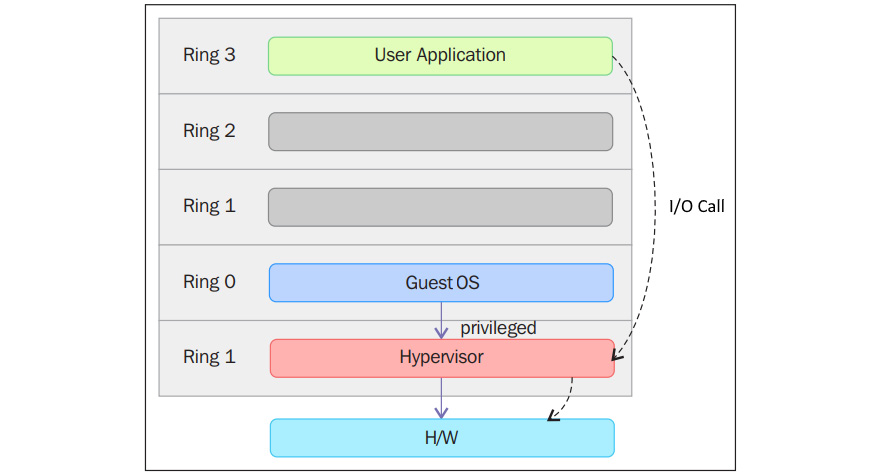</div>

このような仮想化向けハードウェアを用いることで，VMM の構築とゲスト OS の隔離を両立できます．
その一つ例が KVM です．

## libvirt, QEMU, KVM の内部的な働き
libvert と QEMU，KVM がそれぞれどんな役割を担い，どのように相互作用をするのか見ていきます．

### libvirt
[libvirt](https://libvirt.org) は KVM を使うときの API (Application Programming Interface) です．
また，これまでに出てきたハイパーバイザのデーモンと管理ツールでもあります．
Gnome ベースの GUI 管理ツールである [virt-manager](http://virt-manager.org) や，CLI ツールの **virsh** などのユーティリティがあります．
virt-manager の ```--connect``` オプションを使ってリモートのハイパーバイザを管理することも可能です．
[oVirt](http://www.ovirt.org) のような管理ツールの一部としても使われています．

libvirt の目標は，管理レイヤとして，仮想マシンのプロビジョンや作成，変更，監視，制御，マイグレーションなどの管理タスクを実行する API を提供することです．
libvirt プロセスはデーモン化されており，**libvirtd** と呼ばれます．
クライアントから URI を渡されると，libvirtd はハイパーバイザへの接続を開きます．

#### virsh 経由でリモートシステムに接続する
virsh では，次のようにリモートに接続できます．

```bash
$ virsh --connect qemu+ssh://root@remoteserver.yourdomain.com/system list --all
```

それでは，libvirt のソースコードを見てみましょう．

```bash
$ git clone git://libvirt.org/libvirt.git
```

libvirt は基本的には C 言語で記述されていますが，さまざまな言語とバインディングされています．
ソースコードは主に docs，daemon，src というディレクトリから構成されています．
libvirt はドライバベースと呼ばれるアーキテクチャを採用しており，内部的にドライバを持つことで LXC や Xen，QEMU，VirtualBox，Microsoft Hyper-V，bhyve，IBM PowerVM，OpenVZ など，さまざまなハイパーバイザに対応します．

<div align="center">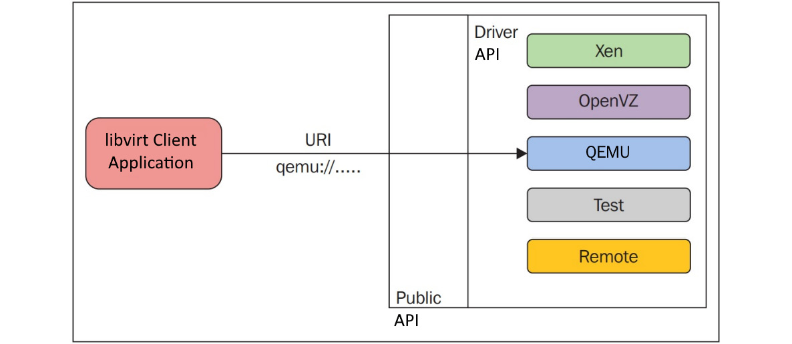</div>

これによって，virsh から複数種類のハイパーバイザに接続出来るようになり，使い勝手が非常に良くなります．
ライブラリの初期化時にクライアントから渡される接続 URI に依存して，パブリック API はバックグラウンドで内部ドライバを使用します．
ハイパーバイザやインターフェイス，ネットワーク，ノードデバイス，nwfilter，secret，ストレージなど，さまざまなドライバが実装されています．
詳しくは ```driver.h``` を参照してください．

次のような構造体を例に見てみましょう．

```c
struct _virConnectDriver {
    (...略...)
    virHypervisorDriver *hypervisorDriver;
    virInterfaceDriver *interfaceDriver;
    virNetworkDriver *networkDriver;
    virNodeDeviceDriver *nodeDeviceDriver;
    virNWFilterDriver *nwfilterDriver;
    virSecretDriver *secretDriver;
    virStorageDriver *storageDriver;
};
```

構造体の各フィールドではハイパーバイザドライバをはじめ，各種ドライバが定義されています．
ドライバには**プライマリドライバ**と**セカンダリドライバ**があり，ハイパーバイザドライバはプライマリドライバに分類されます．
libvirt では，次のようなドライバ実装が存在します．

- bhyve: BSD ハイパーバイザ
- esx/: vSphere API over SAOP を用いた VMware ESX/GSX サポート
- hyperv/: WinRM を用いた Microsoft Hyper-V サポート
- lxc/: Linux Native Container
- openvz/: CLI ツールを用いた OpenVZ サポート
- phyp: SSH 越しの CLI ツールを用いた IBM Power Hypervisor
- qemu/: QEMU CLI/monitor を用いた QEMU/KVM
- remote/: 一般的な libvirt ネイティブ RPC クライアント 
- test/: テスト用のモックドライバ
- uml/: ユーザモードの Linux
- vbox/: ネイティブ API を用いた VirtualBox
- vmware/: vmrun を用いた VMware Workstation/Player
- xen/: ハイパーコール (XenD SEXPR) と XenStore を用いた Xen
- xenapi/: libxenserver を用いた Xen

セカンダリドライバは，全てではないものの，複数のハイパーバイザで共有されています．
セカンダリドライバには次のようなものがあります．

- cpu/: CPU の管理
- interface/: ホストネットワークのインターフェイス管理
- network/: 仮想 NAT ネットワーク
- nwfilter/: ネットワークトラフィックフィルタリングのルール
- node_device/: ホストデバイスのエミュレーション
- secret/: 秘密管理
- security/: アクセス制御に必須なドライバ
- storage/: ストレージ管理ドライバ

他のセカンダリドライバは，インターフェース設定やファイアウォールルール，ストレージ管理，API の一般的なプロビジョニングなどを担っています．
[libvirt API のページ]()には次のように書かれています．

```
OnDevice では，アプリケーションはハイパーバイザーへの virConnectPtr 接続を取得し，ハイパーバイザーの利用可能なドメインと，ストレージやネットワークなどの関連仮想化リソースを管理するのに使われます．
これらはすべて，ファーストクラスのオブジェクトとして公開され，ハイパーバイザーの接続（およびそれが利用可能なノードまたはクラスタ）に接続されます．
```

この関係性を図で表すと次のようになります．

<div align="center">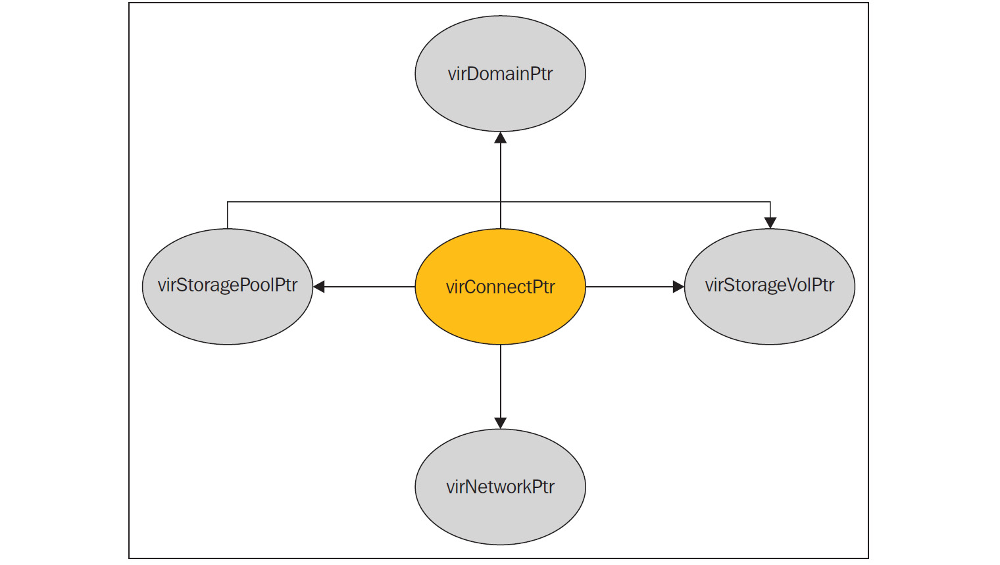</div>

libvirt 内のほとんどの関数は，これらのオブジェクトを使って操作を行います．

- virConnectPtr  
  ハイパーバイザとの接続を表すオブジェクトで，libvirt API の中でも特に重要なオブジェクト
- virDomainPtr  
  libvirt では，仮想マシンやゲストシステムはドメインと呼ばれ，そのアクティブ/定義されたドメイン/仮想マシンを表すオブジェクト
- virStorageVolPtr  
  ドメイン/ゲストシステムに公開されている各ストレージボリュームの一つを表すオブジェクト
- virStoragePoolPtr  
  エクスポートされたストレージボリュームはストレージプールの一部であり，その一つを表すオブジェクト
- virNetworkPtr  
  libvirt で定義された仮想ネットワークを表すオブジェクト

それでは，QEMU ドライバのソースコードである ```qemu_driver.c``` に注目してみましょう．

```c
static virDrvOpenStatus qemuConnectOpen(virConnectPtr conn,
                                        virConnectAuthPtr auth G_GNUC_UNUSED,
                                        virConf *conf G_GNUC_UNUSED,
                                        unsigned int flags)
{
  ...
}
```

libvirt はハイパーバイザやエミュレータを調べてドライバコードを利用します．
ここでは，QEMU/KVM を見つけてくるのは QEMU ドライバの役割となります．
QEMU ドライバは qemu-kvm バイナリと /dev/kvm デバイスノードを見つけ出して，KVM 完全仮想化ハードウェアアクセラレーションゲストが利用可能であることを確かめます．
これらが利用できない場合には，qemu や qemu-system-x86_64，qemu-system-mips，qemu-system-microblaze などのバイナリによって，KVM なしで QEMUエミュレータを動かせないか確認します．

検証は ```qemu_capabilities.c``` で行われます．

```c
static int virQEMUCapsInitGuest ( ..,  .. ,  virArch hostarch,  virArch guestarch)
{
    ...
    binary = virQEMUCapsFindBinaryForArch (hostarch, guestarch);
    ...

    native_kvm = (hostarch == guestarch);
    x86_32on64_kvm = (hostarch == VIR_ARCH_X86_64 &&  guestarch == VIR_ARCH_I686);

    ...

    if (native_kvm || x86_32on64_kvm || arm_32on64_kvm || ppc64_kvm) {
        const char *kvmbins[] = {
            "/usr/libexec/qemu-kvm", /* RHEL */
            "qemu-kvm", /* Fedora */
            "kvm", /* Debian/Ubuntu */    …};
    ...
    kvmbin = virFindFileInPath(kvmbins[i]);
    ...
    virQEMUCapsInitGuestFromBinary (caps, binary, qemubinCaps, kvmbin, kvmbinCaps,guestarch);                 
    ...
}
```

次に KVM のイネーブルメントを実行します．

```c
int virQEMUCapsInitGuestFromBinary(..., *binary, qemubinCaps, *kvmbin, kvmbinCaps, guestarch)
{
  ...

  if (virFileExists("/dev/kvm") && (virQEMUCapsGet(qemubinCaps, QEMU_CAPS_KVM) ||
      virQEMUCapsGet(qemubinCaps, QEMU_CAPS_ENABLE_KVM) ||     kvmbin))
      haskvm = true;
}
```

基本的に，libvirt の QEMU ドライバはさまざまなディストリビューションやパスでバイナリの検索を行います．
また，ホストとゲストのアークテクチャの組み合わせに基づいて，適切な QEMU バイナリの検索も行います．
QEMU バイナリと KVM が両方見つかれば，KVM でハードウェア支援を用いた完全仮想化されたゲストが利用可能となります．
そして，```qemu_command.c``` でコマンドライン引数の処理をして，最終的に ```exec()``` で QEMU と KVM のプロセスを作成します．

```util/vircommand.c```
```c
static int virExec(virCommandPtr cmd)
{
  ...

  if (cmd->env)
    execve(binary, cmd->args, cmd->env);
  else
    execv(binary, cmd->args);
}
```

KVM では，カーネルモジュールが公開している ```/dev/kvm``` を libvirt が直接使って，```ioctl()``` 関数によって仮想化を実行する，と誤解されることがあります．
仮想マシンの作成にあたって libvirt がやっているのは，QEMU のプロセスを立ち上げるだけで，```ioctl()``` 関数を介して KVM とやりとりを行います．
仮想マシンのプロパティは，仮想マシンごとに ```/etc/libvirt/qemu``` にある XML ファイルに定義します．
libvirt クライアントは libvirtd が待ち受ける AF_UNIX ソケット ```/var/run/libvirt/libvirt-sock``` を通じて要求を発行します．

### QEMU
QEMU の作成者は FFmpeg と同じ Fabrice Bellard 氏です．
ライセンスは GNU の GPL (General Public License) で，エミュレータや仮想化向けの汎用オープンソースプロジェクトです．
エミュレータとして使用した場合には，あるマシン用に作られた OS やプログラムを，別のマシン上で実行することができます．
動的翻訳 (dynamic translation) を用いることで，とても高い性能を引き出すことができます．
一方，QEMU はハードウェア仮想化を行うハイパーバイザ/VMM としても機能します．

#### エミュレータとしての QEMU
エミュレータとして QEMU を用いた場合には，バイナリ翻訳 (binary translation) を用いて，あるマシン向けに作られた OS やプログラムを，別のマシン上で実行できます．
動的バイナリ翻訳技術によってデバイスモデルを提供し，CPU をエミュレートして，アーキテクチャの異なる OS を変更なしで実行できるようになっています．
バイナリ翻訳は TCG (Tiny Code Generator) と呼ばれる JIT (Just-In-Time) コンパイラによって，次の図のように行われます．

<div align="center">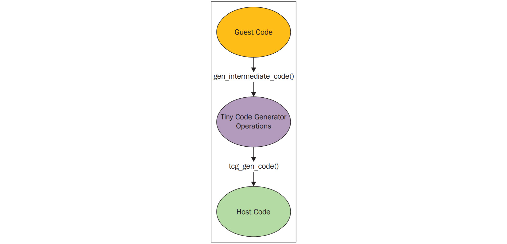</div>

これによって，多少実行速度を犠牲にしつつ，より広範な互換性を獲得しています．

#### バーチャライザとしての QEMU
QEMU をバーチャライザとして利用した場合，ゲスとコードを直接ホストの CPU で実行します．
Xen や KVM が動作しているときには，QEMU はこのモードで実行され，Power PC や S390，x86 などの仮想化を行います．
また，入出力デバイスのエミュレーションだけでなく，仮想マシンの作成や初期化も担っています．
さらに，以下の図に示すように，ゲストの仮想CPU (vCPU) ごとに POSIX スレッドの初期化を行い，QEMU-KVM のユーザーモードアドレス空間内で仮想マシンの物理アドレス空間をエミュレートするフレームワークも提供しています．

<div align="center">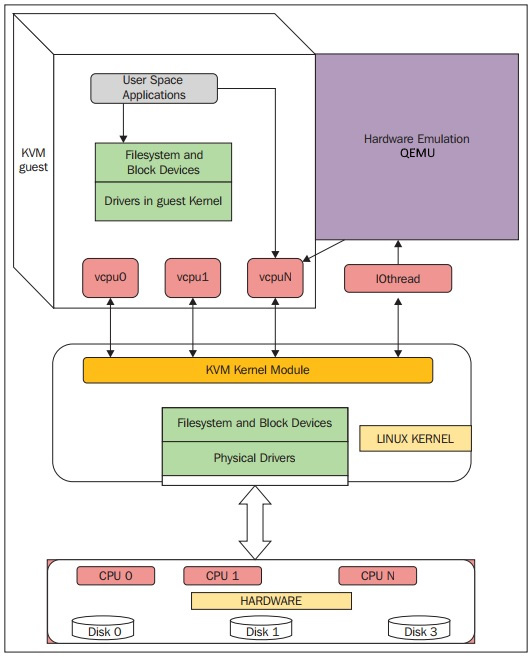</div>

QEMU ではゲストコードを物理 CPU で実行するために POSIX スレッドを利用します．
また，KVM ハイパーバイザのユーザ空間部分を提供し，KVM カーネルモジュールを介してゲスとコードを実行します．
KVM で作業する場合には，入出力のエミュレーションやセットアップ，ライブマイグレーションを行います．  
QEMU は KVM のデバイスファイル ```/dev/kvm``` を開いて，```ioctl()``` 関数を呼び出します．
これによって，KVM は QEMU を利用してハイパーバイザとして機能します．
KVM は，プロセッサの提供するハードウェア仮想化拡張機能 (VMX/SVM) をアクセラレータ，またはイネーブラとして CPU アーキテクチャと密結合させます．
そのため，仮想システムも CPU と同じアーキテクチャを採用する必要があります．

### QEMU と KVM の関係
QEMU のコードを見てみましょう．

```bash
$ git clone git://git.qemu-project.org/qemu.git
```

```KVMState``` や ```CPU{X86}State```，```MachineState``` のようなデータ構造や ```ioctl()``` 関数の呼び出しによって，QEMU のユーザ空間や KVM のカーネル空間を作成します．

### データ構造
ここでは，QEMU で重要なデータ構造について見ていきます．
構造体 ```KVMState``` は，仮想マシン歩表現するファイルディスクリプタが含まれています．

```kvm-all.c```
```c
struct KVMState
{
  ...
  
  int fd;
  int vmfd;
  int coalesced_mmio;
  struct kvm_coalesced_mmio_ring *coalesced_mmio_ring;

  ...
}
```

各 vCPU に対して ```CPUX86State``` 構造体を割り当て，シルトとして保持することで，汎用レジスタ (RSP/RIP を含む) などの管理を行います．

```c
struct CPUState {
  ...

  int nr_cores;
  int nr_threads;

  ...

  int kvm_fd;

  ...

  struct KVMState *kvm_state;
  struct kvm_run *kvm_run;
}
```

また，```CPUX86State``` は例外と割り込み処理を扱う標準的なレジスタを探索します．

```target/i386/cpu.h```
```c
typedef struct CPUX86State
{
  /* standard registers */
  target_ulong regs[CPU_NB_REGS];

  ...

  uint64_t system_time_msr;
  uint64_t wall_clock_msr;

  ...

  /* exception/interrupt handling */
  int error_code;
  int exception_is_int;

  ...
}
```

```ioctl()``` 関数の呼び出しは，基本的にシステム KVM や仮想マシン，vCPU レベルにマッピングされます．
```ioctl()``` 関数を呼び出すには ```/dev/kvm``` を開く必要があり，結果のファイルディスクリプタは ```KVMState -> fd``` に保存されます．

- ```kvm_ioctl()```  
  主に ```KVMState -> fd``` をパラメータとして実行され，```/dev/kvm``` を開いて得られるファイルディスクリプタが格納される．
  ```c
  kvm_ioctl(s, KVM_CHECK_EXTENSION, extension);
  kvm_ioctl(s, KVM_CREATE_VM, type);
  ```
- ```kvm_vm_ioctl()```  
  主に ```KVMState -> vmfd``` をパラメータとして実行される．
  ```c
  kvm_vm_ioctl(s, KVM_CREATE_VCPU, (void *)vcpu_id);
  kvm_vm_ioctl(s, KVM_SET_USER_MEMORY_REGION, &mem);
  ```
- ```kvm_vcpu_ioctl()```  
  主に KVM の vCPU ファイルディスクリプタである ```CPUState -> kvm_fd``` をパラメータとして実行される．
  ```c
  kvm_vcpu_ioctl(cpu, KVM_RUN, 0);
  ```
- ```kvm_device_ioctl()```  
  主にデバイスの ```fd``` をパラメータとして実行される．
  ```c
  kvm_device_ioctl(dev_fd, KVM_HAS_DEVICE_ATTR, &attribute) ? 0 : 1;
  ```

```kvm-all.c``` は QEMU と KVM のやりとりにおいて重要なソースファイルとなっています．  
```kvm_init()``` 関数は KVM のデバイスファイルを開き，KVMState の ```fd[1]``` と ```vmfd[2]``` を埋めます．

```c
static int kvm_init(MachineState *ms)
{
  ...

  KVMState *s;
  s = KVM_STATE(ms->accelerator);

  ...

  s->vmfd = -1;
  s->fd = qemu_open("/dev/kvm", O_RDWR);   // ----> [1]

  ...

  do {
    ret = kvm_ioctl(s, KVM_CREATE_VM, type); // --->[2]
  } while (ret == -EINTR);
  s->vmfd = ret;

  ...

  ret = kvm_arch_init(ms, s);   // ---> ( target-i386/kvm.c: )

  ...
}
```

```kvm_ioctl()``` 関数は ```KVM_CREATE_VM``` を引数として取り，```vmfd``` を返しています．
QEMU は ```fd``` と ```vmfd``` を受け取ると，```kvm_fd``` か ```vcpu_fd``` のどちらかを受け取る必要があります．

```c
main() ->
    -> cpu_init(cpu_model);      [#define cpu_init(cpu_model) CPU(cpu_x86_init(cpu_model)) ]
      -> cpu_x86_create()
  -> qemu_init_vcpu
      -> qemu_kvm_start_vcpu()
    -> qemu_thread_create
  -> qemu_kvm_cpu_thread_fn()
    -> kvm_init_vcpu(CPUState *cpu)

int kvm_init_vcpu(CPUState *cpu)
{
  KVMState *s = kvm_state;

  ...

  ret = kvm_vm_ioctl(s, KVM_CREATE_VCPU, (void *)kvm_arch_vcpu_id(cpu));
  cpu->kvm_fd = ret;   // --->   [vCPU fd]

  ...

  mmap_size = kvm_ioctl(s, KVM_GET_VCPU_MMAP_SIZE, 0);
  cpu->kvm_run = mmap(NULL, mmap_size, PROT_READ | PROT_WRITE, MAP_SHARED,  cpu->kvm_fd, 0);  // [3]

  ...

  ret = kvm_arch_init_vcpu(cpu);   [target-i386/kvm.c]

  ...
}
```

```kvm_init_vcpu()``` 関数では vCPU 1コアにつき，ホストのメモリページを2つを割り当て，QEMU のユーザ空間と KVM のカーネルモジュールの間でやりとりを行う ```kvm_run``` と ```pio_data``` というプロセスを作成します．
また，先程の ```fds``` を返す ```ioctl()``` 関数の実行中，Linux カーネルはファイル構造体と関連する匿名ノードを割り当てます．

ゲストコードを実行するには，vCPU のスレッドから ```KVM_RUN``` を引数として ```ioctl()``` 関数を実行します．

```c
int kvm_cpu_exec(CPUState *cpu) {
  struct kvm_run *run = cpu->kvm_run;

  ...

  run_ret = kvm_vcpu_ioctl(cpu, KVM_RUN, 0);

  ...
}
```

```kvm_cpu_exec()``` 関数には，KVM から QEMU-KVM ユーザ空間に制御が戻った時の動作も定義しています．
ゲストカーネルコードが，QEMU がエミュレートするハードウェアデバイスレジスタにアクセスするなどのイベントが発生した場合，KVM は QEMU に制御を戻す必要があります．
このような処理を行う理由には，次のようなものが挙げられます．

```c
switch (run->exit_reason) {
  case KVM_EXIT_IO:
    DPRINTF("handle_io\n");
  
  case KVM_EXIT_MMIO:
    DPRINTF("handle_mmio\n");

  case KVM_EXIT_IRQ_WINDOW_OPEN:
    DPRINTF("irq_window_open\n");

  case KVM_EXIT_SHUTDOWN:
    DPRINTF("shutdown\n");

  case KVM_EXIT_UNKNOWN:

  ...

  case KVM_EXIT_INTERNAL_ERROR:

  ...

  case KVM_EXIT_SYSTEM_EVENT:
    switch (run->system_event.type) {
      case KVM_SYSTEM_EVENT_SHUTDOWN:
      case KVM_SYSTEM_EVENT_RESET:
      case KVM_SYSTEM_EVENT_CRASH:
      ...
    }
  
  ...
}
```

### QEMU のスレッディングモデル
QEMU-KVM はマルチスレッドでイベント駆動なアプリケーションです．
重要なスレッドには次のようなものがあります．

- メインスレッド
- 仮想ディスク入出力のバックエンドで動作するワーカスレッド
- 各 vCPU あたり1つのスレッド

それぞれの仮想マシンには，ホストシステムで実行される QEMU のプロセスがあり，ゲスとシステムが終了すると，そのスレッドも破棄されます．
vCPU スレッドとは別に，ネットワークパケットやディスク入出力の完了などを処理するために，セレクト(2)イベントループを実行する，専用の入出力スレッドが存在します．
入出力スレッドも QEMU によって生成されます．
これらをまとめると，以下の図のようになります．

<div align="center">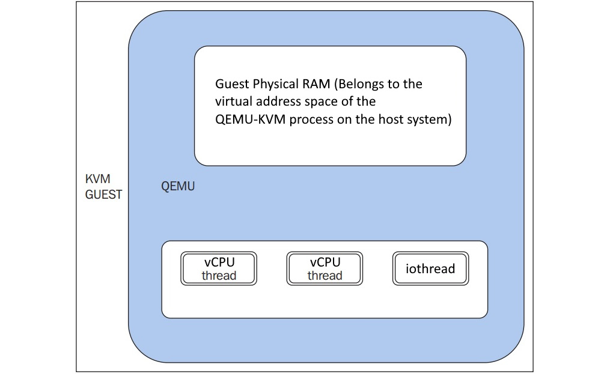</div>

上の図に示したように，ゲストの RAM は QEMU プロセスの仮想アドレス空間内に割り当てられており，これをゲストの物理 RAM として扱います．

タイマやファイルディスクリプタの監視などを行うイベントループスレッドも ```iothread``` から呼び出されます．
```main_loop_wait()``` が，ファイルディスクリプタのコールバックやボトムハーフ，タイマなどを担当しています．
ボトムハーフは，オーバヘッドが小さく，待ち時間なしでスレッドセーフかつシグナルセーフなスケジューリングを実現します．

ディレクトリブロックにはホスト側のブロックデバイスのコードが，hw/block/ にはデバイスエミュレーションのコードが格納されています．

## KVM

