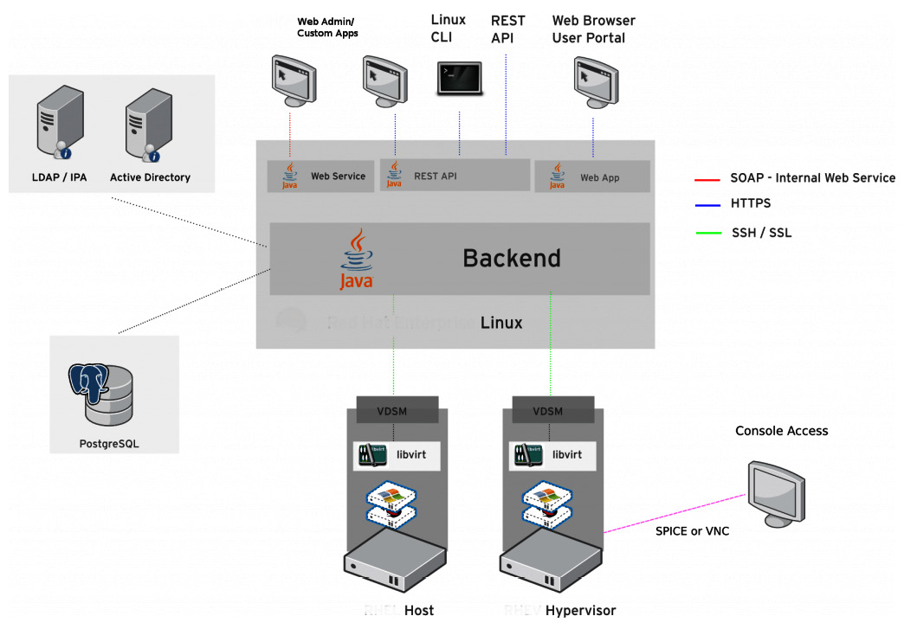

# KVM ハイパーバイザと libvirt・oVirt のインストール
本章では，カーネル仮想マシン (KVM: Kernel Virtual Machine) と，その管理ツールである libvirt と oVirt について扱います．
また，これらツールのインストールについても見ていきます．
特に oVirt は Python ベースのデーモンやサポートするユーティリティ，ライブラリ，GUI フロントエンドなど，オプションが多いため，ステップバイステップでインストールしていきます．  
具体的な内容は次のとおりです．

- QEMU と libvirt に詳しくなる
- oVirt に詳しくなる
- QEMU，libvirt，oVirt をインストールする
- QEMU と libvirt で仮想マシンを始める

## QEMU と libvirt に詳しくなる
QEMU をマシンエミュレータとして利用した場合には，サポートされているあらゆるプラットフォーム上で仮想マシンを作成したり実行したりできます．
ただし，ここでは QEMU をバーチャライザとして使用した場合に焦点を絞ります．
この時，CPU 上で直接仮想マシンのコードを実行できるので，オーバヘッドが小さくネイティブかそれに近い性能を引き出せます．
QEMU はモジュール方式を採用しており，効率的に物理リソースを活用できます．

libvirt を QEMU の管理プラットフォームとして利用する場合，**virsh** コマンドのようなユーティリティが使えるようになります．
これによって，仮想マシンや仮想ネットワークの管理など，さまざまな操作が可能です．
oVirt のようなツールは，libvirt を API として使い，GUI ユーティリティを構築しています．
他にも，サーバが KVM に対応しているかを確認する ```virt-host-validate``` のように，さまざまなコマンドが用意されています．

## oVirt に詳しくなる
システム管理は基本的に全てコマンドラインツールで処理することが可能です．
しかし，仮想マシンマネージャのような GUI ツールも使えると便利です．

現状，大規模な KVM 環境を管理する場面には直面していませんが，いずれ環境のスケールアウトを考える段になると，前述のようなコマンドラインツールだけでは大変不便です．
複数のハイパーバイザに接続し，ネットワークやストレージ，メモリ，CPU など，仮想化の4本柱と呼ばれるすべての機能を管理するようなツールには，GUI を備えていることが望ましいと言えます．
oVirt は，KVM ベースの環境で WEB ベースのコンソールから一元的にシステムの管理を行う，オープンソースの GUI ツールとなっています．

oVirt は，GUI で接続可能なエンジンとホストと通信を行うエージェントというブロックに分けられます．
エンジンブロックでは，仮想マシンの管理や移動，イメージの作成，ストレージや仮想ネットワークの管理などを一元的に行うことが可能です．
エンジンで行った操作をホスト側に反映する役割を担っているのがエージェント (vdsm) です．
oVirt のエンジンでは次のような操作が可能です．

- 仮想マシンのライブマイグレーション
- イメージ管理
- OVF 形式を使った仮想マシンのエクスポートやインポート
- V2V (Virtusl-to-Virtual) 変換
- 可用性の向上
- リソースの監視

oVirt では vdsm と呼ばれるエージェントを介して，oVirt エンジンによる GUI ベースでの管理を実現しています．
vdsm は Python ベースのエージェントで，KVM ホストと直接通信し，ローカルにインストールされた libvirt で必要な操作を行います．
また，仮想ネットワークやストレージの管理，アクセスなどを設定するのにも利用されています．
さらに，vdsmはMOM（Memory Overcommitment Manager）によって，仮想化ホストのメモリを効率的に管理することができます．

oVirt のアーキテクチャをした図に示します．

<div align="center"></div>

## QEMU・libvirt・oVirt のインストール
初めに，基本的な情報から見ていきます．
これ以降登場するツールは，一部 Ubuntu でサポートされていないものもありますが，CentOS の開発が中止になってしまったので，Ubuntu 20.04 での動作を見ていきます．

- OS は Ubuntu (書籍内では CentOS 8 を使用)
- GUI の使えるサーバを想定
- 必要なものは全て手動でインストールする
- サンプルは物理16コアのCPUと64GBのメモリを搭載したマシンで実行している

初めに，必要なパッケージをインストールします．

```bash
$ sudo apt install qemu qemu-utils qemu-kvm libvirt-daemon libvirt-clients virt-manager virt-viewer
```

次に，IOMMU を有効にします．
```/etc/default/grub``` の ```GRUB_CMDLINE_LINUX=""``` を次のように変更します．
Intel CPU の場合，```amd``` を ```intel``` に置き換えます．

```
GRUB_CMDLINE_LINUX="amd_iommu=on"
```

ここで一度再起動します．
これで準備は完了です．  
続いて，次のコマンドで KVM の要求を満たしているかを確認します．

```bash
$ virt-host-validate
  QEMU: Checking for hardware virtualization                                 : PASS
  QEMU: Checking if device /dev/kvm exists                                   : PASS
  QEMU: Checking if device /dev/kvm is accessible                            : PASS
  QEMU: Checking if device /dev/vhost-net exists                             : PASS
  QEMU: Checking if device /dev/net/tun exists                               : PASS
  QEMU: Checking for cgroup 'cpu' controller support                         : PASS
  QEMU: Checking for cgroup 'cpuacct' controller support                     : PASS
  QEMU: Checking for cgroup 'cpuset' controller support                      : PASS
  QEMU: Checking for cgroup 'memory' controller support                      : PASS
  QEMU: Checking for cgroup 'devices' controller support                     : PASS
  QEMU: Checking for cgroup 'blkio' controller support                       : PASS
  QEMU: Checking for device assignment IOMMU support                         : PASS
  QEMU: Checking if IOMMU is enabled by kernel                               : PASS
  QEMU: Checking for secure guest support                                    : WARN (AMD Secure Encrypted Virtualization appears to be disabled in kernel. Add kvm_amd.sev=1 to the kernel cmdline arguments)
   LXC: Checking for Linux >= 2.6.26                                         : PASS
   LXC: Checking for namespace ipc                                           : PASS
   LXC: Checking for namespace mnt                                           : PASS
   LXC: Checking for namespace pid                                           : PASS
   LXC: Checking for namespace uts                                           : PASS
   LXC: Checking for namespace net                                           : PASS
   LXC: Checking for namespace user                                          : PASS
   LXC: Checking for cgroup 'cpu' controller support                         : PASS
   LXC: Checking for cgroup 'cpuacct' controller support                     : PASS
   LXC: Checking for cgroup 'cpuset' controller support                      : PASS
   LXC: Checking for cgroup 'memory' controller support                      : PASS
   LXC: Checking for cgroup 'devices' controller support                     : PASS
   LXC: Checking for cgroup 'freezer' controller support                     : PASS
   LXC: Checking for cgroup 'blkio' controller support                       : PASS
   LXC: Checking if device /sys/fs/fuse/connections exists                   : PASS
```

AMD Secure Encrypted Virtualization は，仮想マシンで使用しているメモリ暗号化をハードウェアでサポートする技術ですが，KVM ホストを共有する使い方はしないので，ここでは一旦無視します．
それ以外は PASS しているので問題ありません．  
さらに，```virsh net-list``` と ```virsh list``` コマンドで，必要なユーティリティが揃っていることを確認します．

```bash
$ virsh net-list
 Name      State    Autostart   Persistent
--------------------------------------------
 default   active   yes         yes

$ virsh list
 Id   Name   State
--------------------

```

デフォルトの仮想ネットワークのスイッチやブリッジが正しく設定できています．
今の所，動かしている仮想マシンはないので，これで OK です．

### KVM に仮想マシンをインストールしてみる
それでは，試しに仮想マシンを実行してみましょう．
```/var/lib/libvirt/images``` に ISO ファイルをコピーして仮想マシンを作成します．
次のコマンドで実行できます．

```bash
$ virt-install \
--virt-type=kvm \
--name ubuntu2004_test \
--vcpus 2 \
--ram 4096 \
--os-variant=ubuntu20.04 \
--cdrom /home/yuko/Downloads/ubuntu-20.04.3-live-server-amd64.iso \
--network=default \
--graphics vnc \
--disk size=16
```

```--os-variant``` パラメータは，```virt-install``` コマンドでインストールするゲスト OS の種類を指定します．
サポートされているゲスト OS の一覧は，次のコマンドで表示できます．

```bash
$ osinfo-query os
```

```--network``` パラメータでは，仮想マシンをネットワークに接続するため，デフォルトの仮想ブリッジを指定しています．  
```virt-install``` が開始されると，インストール手続きに従って VNC コンソールのウィンドウが表示されます．
その後，言語やキーボード，タイムゾーン，日付，インストール先を選択します．
ネットワークの設定やインストール方法の選択も可能となっています．
インストールを開始したあとは，管理ユーザのパスワードを入力します．

このような操作を複数の仮想マシンに対して，1つ1つ設定していたのでは非常に面倒です．
そのため，もっと簡単な方法が用意されています．

### 仮想マシンのインストール自動化
**kickstart** と呼ばれるファイルを用いて，インストールの手続きを自動化できます．
kickstart ファイルは，基本的にサーバの設定を記述したテキストファイルで，予め準備して WEB なりローカルのディスクなりで広く入手できるようにしておく必要があります．
Cent OS では ```anaconda-ks.cfg``` という，物理サーバをデプロイするためのファイルが用意されているので，それを修正して使うことができます．
しかし，Ubuntu 20.04 以降では kickstart の公式のサポートがなくなりました．
AutoInstall が自動インストールツールとして設定されているので，そちらを使うこととします．

AutoInstall の関連ページ: 
- [Ubuntu 20.04をAutoInstallで自動インストールしてみた](https://qiita.com/YasuhiroABE/items/637f1046a15938f9d3e9)
- [Automated Server Installs Introduction](https://ubuntu.com/server/docs/install/autoinstall)
- [Autoinstall Quick Start](https://ubuntu.com/server/docs/install/autoinstall-quickstart)

## oVirt のインストール
oVirt はセルフホストエンジンとしてデプロイすることもできますが，ここではスタンドアローンのアプリケーションとしてインストールしてみます．
インストールは2段階に分けて行います．

1. 一元管理のための oVirt エンジンをインストールする
2. ホストに oVirt エージェントをデプロイする

一般的に，oVirt のデプロイでは，そのために1つ仮想マシンを作成します．

```bash
$ wget http://download.opensuse.org/repositories/home:/evilissimo:/ubuntu:/16.04/xUbuntu_16.04/Release.key
$ sudo apt-key add - < Release.key 
$ sudo apt-get update
$ sudo apt-get install ovirt-guest-agent
$ sudo service ovirt-guest-agent start
```

この手順ではインストールできませんでした．．．
[oVirt の公式ページ](https://www.ovirt.org/develop/release-management/features/virt/guestagentubuntu.html)には，Ubuntu 18.04 以降での記載がほぼないので，あまり使わないほうがいいのかもしれません．
その代わりに，Proxmox VE などが使えそうです．

Proxmox VE の関連ページ:
- [Proxmox 公式サイト](https://www.proxmox.com/en/)
- [Proxmox の Wiki](https://pve.proxmox.com/wiki/Main_Page)
- [Proxmox VE7.0をインストールしクラスタを構築する](https://qiita.com/yuuri23/items/7d3bc77b441728f8621b)

## QEMU と libvirt を使って仮想マシンを始める

