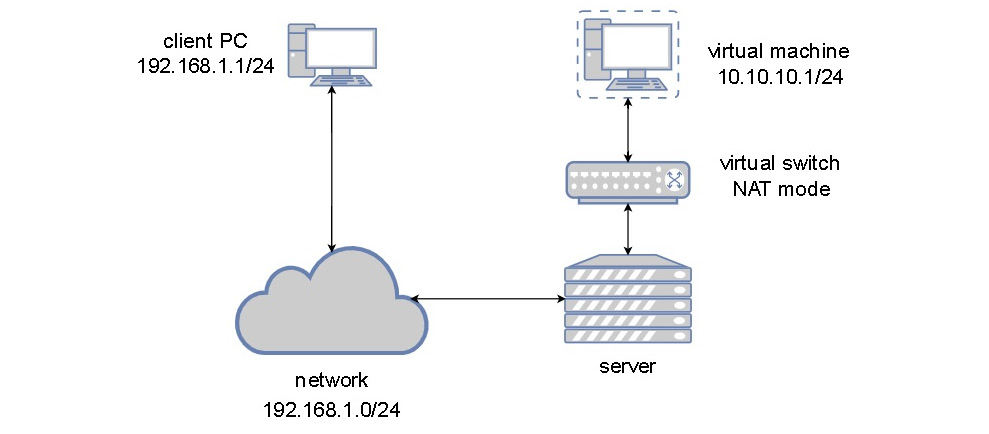
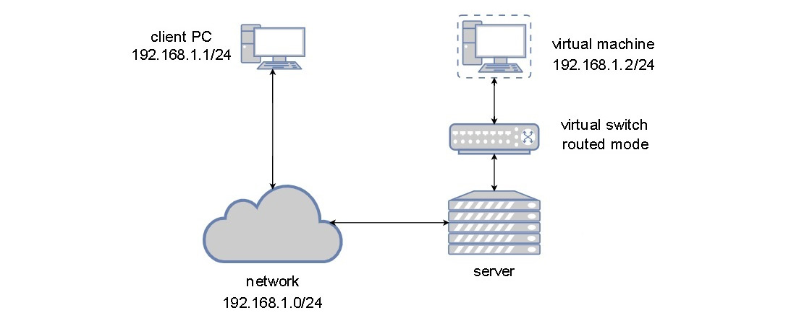
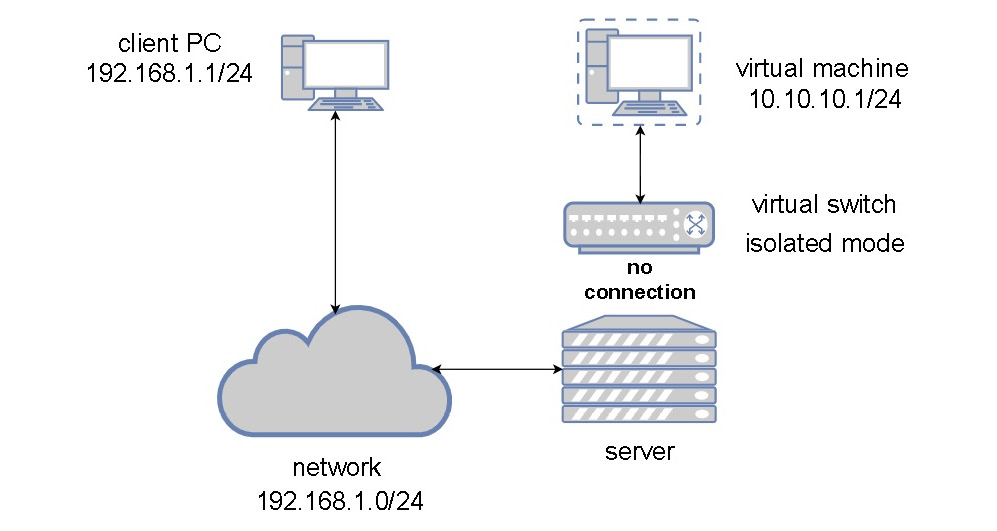
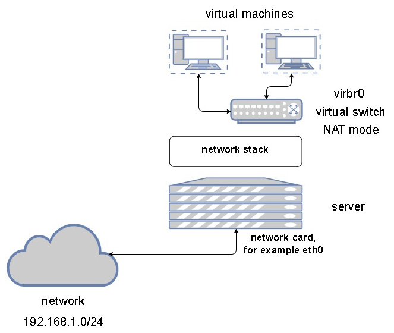

# libvirt の仮想ネットワーク
仮想ネットワークの仕組みを理解することは非常に重要です．
仮想ネットワークの導入によって管理面でもコスト面でも大きなメリットを得られます．
本章では，仮想ネットワークと Linux ベースのネットワークの概念について説明し，物理ネットワークとの比較を行います．
また，per-host や spanned-across-hosts のための仮想スイッチや，シングルルート入出力仮想化の概念についても扱います．
さらに，基本に立ち返って，クラウドのような大規模環境へのスケーラビリティを確保する方法についても見ていきます．

- 物理/仮想ネットワークを理解する
- TAP/TUN を使う
- Linux ブリッジを実装する
- Open vSwitch を設定する
- SR-IOV の理解して設定する
- macvtap を理解する

## 物理/仮想ネットワークを理解する
実際のところ，物理ネットワークだろうと仮想ネットワークだろうと，大きな差はありません．
ただし，トポロジーに関連した違いがいくつかあります．
すなわち，物理的なオブジェクトと同じ働きをするソフトウェアベースのオブジェクトが存在するということです．

それではまず，仮想化されたネットワークの基本的な構成要素である，仮想スイッチについて見てみましょう．
仮想スイッチは，次の2つを実現するソフトウェアベースのレイヤ2スイッチのことです．

- 仮想マシンを接続する
- アップリンクを使って物理サーバのカードに接続し，物理ネットワークのカードを物理スイッチに接続できるようにする

物理ネットワークカードと仮想マシンの間に，ソフトウェアベースの仮想スイッチを挿入しなければ，物理ネットワークのポートを持つ仮想マシンしか，物理ネットワークに接続できなくなってしまいます．
これは，効率性や統一性といった仮想化の基本原則に違反していますし，何よりコストがかかります．
仮想マシンの台数分だけ物理ポートを用意するのは非現実的です．  
そこで，仮想スイッチを導入することで，サーバに必要な物理ネットワークのアダプタを削減し，仮想マシンをネットワークに接続するのに必要なスイッチのポートが少なくて済みます．
また，物理ネットワークカード1枚で複数の仮想マシンへの接続を賄えるため，効率性の問題も解決できます．

## 仮想ネットワーク
仮想スイッチと仮想マシンの接続には，vNIC (virtual Network Interface Card) と呼ばれるオジェクトを用います．
仮想ネットワークカードで仮想マシンを構成するたびに，物理ネットワークカードを物理スイッチへのアップリンクとして使用する仮想スイッチに接続する機能が提供されます．  
もちろん，このアプローチには潜在的な欠点もあります．
大量の仮想マシンを同じ物理ネットワークカードをアップリンクとして利用する単一の仮想スイッチに接続すると，物理ネットワークに接続できなくなります．
これには，仮想スイッチを複数の物理アップリンクを使用することで対処します．

Linux には，以下に挙げるものを代表に，20種類近いネットワークインターフェイスが用意されています．

- ブリッジ (bridge)  
  (仮想マシン) ネットワーク向けのレイヤ2インターフェイス
- ボンド (bond)  
  バランシングとフェイルオーバのため，ネットワークインターフェイスを1つの論理インターフェイスにまとめる
- チーム (team)  
  論理インターフェイスを作成せずにバランシングとフェイルオーバを行う
- MACVLAN  
  レイヤ2上の単一物理インターフェイスに複数の MAC アドレスを割り当てる
- IPVLAN  
  MACVLAN とは異なり，同じ MAC アドレスを使用しレイヤ 3 で多重化される
- MACVTAP/IPVTAP  
  TUN と TAP，ブリッジを組み合わせて仮想ネットワークをシンプルにする新しいドライバ
- VXLAN  
  クラウドオーバレイネットワークで一般的に使われる
- VETH  
  ローカルのトンネリングで使われる仮想イーサネットインタフェース
- IPOIB (IP over Infiniband)  
  HPC や低遅延ネットワークの普及によって Linux カーネルでサポートされるようになった

また，ネットワークインターフェイスの他に，10種類のトンネリングインターフェイスが用意されています．

- GRETAP, GRE: Generic Routing Encapsulation  
  レイヤ2とレイヤ3のプロトコルをカプセル化するプロトコル
- GENEVE  
  VXLAN や GRE などを融合したクラウドオーバレイネットワーク向けのプロトコルで，Open vSwitch や VMware NSX でサポートされる
- IPIP  
  パブリックなネットワーク経由で内部的な IPv4 サブネット接続を IP over IP トンネルで実現する
- SIT: Simple Internet Translation  
  IPv4 経由で独立した IPv6 ネットワークをつなぐ
- ip6tnl  
  IPv6 のトンネルインターフェイスを用いて IPv4/6 のトンネルを実現する
- IR6GRE, IP6GRETAP  

本節では，KVM 仮想化にとって重要な TAP/TUN とブリッジ，Open vSwitch，MACVTAP インターフェイスを扱います．
しかし，これらについて詳しく見ていく前に，NAT や Routed，Isolated といった基本的な仮想ネットワークの概念について説明していきます．

### libvirt の NAT ネットワーク
自宅でインターネットを利用する場合，インターネットに接続するデバイスにはパブリックな IP アドレスが割り当てられ，ローカル側ではそれぞれのデバイスにサブネットが割り当てられています．
同様に，仮想マシンは NAT モードの libvirt スイッチに接続されています．
仮想マシンはホストの IP アドレスを介して物理ネットワークに接続されたものとは通信できますが，その逆はできません．
NAT の向こう側にある仮想マシンと通信するためには，仮想マシンが通信を開始するか，ポートフォワーディングなどの設定をしておく必要があります．

<div align="center"></div>

上の図のように仮想マシンの側から見ると，完全に独立したネットワークセグメントに配置され，仮想ネットワークスイッチをゲートウェイとして外部のネットワークへのアクセスに利用しています．

### libvirt の routed ネットワーク
2つ目のタイプはルーティングされたネットワークです．
このネットワークでは，仮想マシンが仮想スイッチを介して物理ネットワークに接続され，仮想マシンは物理ホストと同じレイヤー2や3に位置しています．
自環境において別に NAT ネットワークを用意しなくても仮想マシンに接続できるため，非常によく用いられます．
ただし，仮想マシンに使用するNATネットワークを意識してルーティングを設定する必要があります．

<div align="center"></div>

ここまで見てきた2種類のネットワークとは異なり，isolated モードでは仮想スイッチがアップリンクに接続されません．
そのため，スイッチの中だけで通信が行われます．

### libvirt の isolated ネットワーク
先にも述べた通り，isolated モードでは仮想スイッチに接続した仮想マシンの間でのみ通信が可能となります．
この方法は，ある特定のトラフィックを物理ネットワークから切り離すのに非常に便利です．  
例えば，WordPress のような Web サービスを稼働している仮想マシンがあったとき，routed モードのネットワークと isolated モードのネットワークを用意しておき，後者にデータベースなどを稼働している仮想マシンを接続して，それらが外部からアクセスできないようにしてやります．
このように，isolated モードはセキュリティが重要な場面でしばしば利用されます．

<div align="center"></div>

第3章のように必要なパッケージをすべてインストールすると，デフォルトの仮想スイッチがそのまま設定されます．
VMware の vSphere でも同様の設定が行われますし，Hyper-V ではデプロイの過程で仮想スイッチの設定を行うか聞かれます．  
デフォルトの仮想スイッチは，DHCP サーバがアクティブな NAT モードで動作し，作成した仮想マシンい対して IP の設定などがなされた状態となるため，直ぐに使い始めることができます．

<div align="center"></div>

それでは，仮想ネットワークの設定方法について見ていきましょう．

1. デフォルトネットワークの設定が書かれた XML ファイルをテンプレートとしてネットワークファイルを作ってみましょう．
    ```bash
    $ virsh net-dumpxml default > default.xml
    ```
    ```default.xml``` の中身は次のようになっています．
    ```xml
    <network>
        <name>default</name>
        <uuid>1ba419f5-30a3-4fea-9c34-d743c672b8f1</uuid>
        <forward mode="nat">
            <nat>
                <port start="1024" end="65535"/>
            </nat>
        </forward>
        <bridge name="virbr0" stp="on" delay="0"/>
        <mac address="52:54:00:c0:fb:78"/>
        <ip address="192.168.122.1" netmask="255.255.255.0">
            <dhcp>
                <range start="192.168.122.2" end="192.168.122.254"/>
            </dhcp>
        </ip>
    </network>
    ```
2. 新しいオブジェクト UUID とユニークな MAC アドレスを生成します．UUID は ```uuidgen``` コマンドで生成できますが，MAC アドレスの生成は[Red Hat のウェブサイト](https://access.redhat.com/documentation/en-us/red_hat_enterprise_linux/6/html/virtualization_administration_guide/sect-virtualization-tips_and_tricks-generating_a_new_unique_mac_address)で紹介されている方法を使います．
    ```bash
    $ uuidgen
    a587a97e-5697-43a1-97f7-1ea4fa5ed1fd

    $ python2
    >>> import random
    >>> def randomMAC():
    ...     mac = [ 0x00, 0x16, 0x3e,
    ...             random.randint(0x00, 0x7f),
    ...             random.randint(0x00, 0xff),
    ...             random.randint(0x00, 0xff) ]
    ...     return ':'.join(map(lambda x: "%02x" % x, mac))
    ... 
    >>> print randomMAC()
    00:16:3e:62:f3:9b
    ```
    これをもとに，XML ファイルを書き換えます．新しくブリッジを設定するので ```<bridge name="virbr1">``` としています．
    ```xml
    <network>
        <name>test-nat</name>
        <uuid>a587a97e-5697-43a1-97f7-1ea4fa5ed1fd</uuid>
        <forward mode="nat">
            <nat>
                <port start="1024" end="65535"/>
            </nat>
        </forward>
        <bridge name="virbr1" stp="on" delay="0"/>
        <mac address="00:16:3e:62:f3:9b"/>
        <ip address="192.168.123.1" netmask="255.255.255.0">
            <dhcp>
                <range start="192.168.123.2" end="192.168.123.254"/>
            </dhcp>
        </ip>
    </network>
    ```
3. 最後に ```virsh``` コマンドで XML ファイルを取り込み，新しい仮想ネットワークを作成します．
   ```bash
   $ virsh net-define test-nat.xml
   Network test-nat defined from test-nat.xml

   $ virsh net-start test-nat
   Network test-nat started

   $ virsh net-autostart test-nat
   Network test-nat marked as autostarted

   $ virsh net-list
   Name       State    Autostart   Persistent
   ---------------------------------------------
   default    active   yes         yes
   test-nat   active   yes         yes
   ```

同様の手順で routed モードと isolated モードの仮想ネットワークも作成します．
routed モードのネットワークの設定には，物理インターフェイスが必要なので ```ifconfig``` などで確認しておきます．

```test-route.xml```
```xml
<network>
  <name>test-route</name>
  <uuid>53a76fde-d4c7-4108-8cdc-6636eb6b5bb5</uuid>
  <forward dev="enp5s0" mode="route">
    <interface dev="enp5s0" />
  </forward>
  <bridge name="virbr2" stp="on" delay="0"/>
  <mac address="00:16:3e:7f:7f:bd"/>
  <domain name="yukoweb-route" />
  <ip address="192.168.124.1" netmask="255.255.255.0">
    <dhcp>
      <range start="192.168.124.100" end="192.168.124.254"/>
    </dhcp>
  </ip>
</network>
```

routed モードでは，ネットワークインターフェイスが接続しているのと同じサブネットが使われます．

```test-iso.xml```
```xml
<network>
  <name>test-iso</name>
  <uuid>b29f4b10-890e-4b39-aca5-e3ac3999a092</uuid>
  <bridge name="virbr3" stp="on" delay="0">
  <mac address="00:16:3e:23:3d:12"/>
  </bridge>
  <domain name="yukoweb-iso" />
  <ip address="192.168.125.1" netmask="255.255.255.0">
    <dhcp>
      <range start="192.168.125.128" end="192.168.125.254"/>
    </dhcp>
  </ip>
</network>
```

仮想ネットワークの設定は，仮想マシンマネージャの GUI からも行うことができます．
しかし，大規模な環境では XML で記述した設定ファイルを取り込むほうが簡単に設定ができます．

ここまでは，ホスト側で仮想ネットワークを設定していましたが，```virsh``` コマンドで仮想マシンに仮想ネットワークカードを追加して，仮想ネットワークに接続することもできます．
次の例では，```ubuntu2004_test``` を isolated モードの仮想ネットワークに接続します．

```bash
$ virsh attach-interface --domain ubuntu2004_test --source isolated --type network --model virtio --config --live
```

以上が基本的な仮想ネットワークの構成になります．
これ以外にも SR-IOV のような接続方法もありますが，これらについては後ほど説明します．

## TAP/TUN デバイスでユーザー空間ネットワークを利用する
第1章で使用した ```virt-host-validate``` コマンドは，次のようなデバイスが存在することをチェックしています．

- ```/dev/kvm```  
  KVM ドライバによって作成され，仮想マシンが物理ハードウェアに接続するのに必要となる．これがないと仮想マシンの性能が著しく低下する．
- ```/dev/vhost-net```  
  vhost-net インスタンスの設定を行うインターフェイスとして機能する．これがないと仮想マシンのネットワーク性能が著しく低下する．
- ```/dev/net/tun```  
  仮想マシンのネットワーク接続を容易にするための TUN/TAP デバイスを作成するために使用される．

ここでは，特に最後の項目について詳しく見ていきます．


  