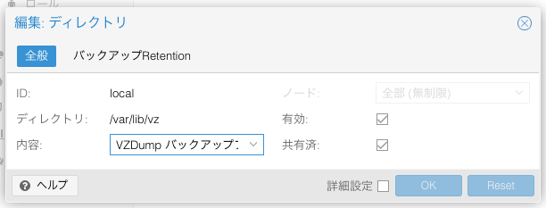
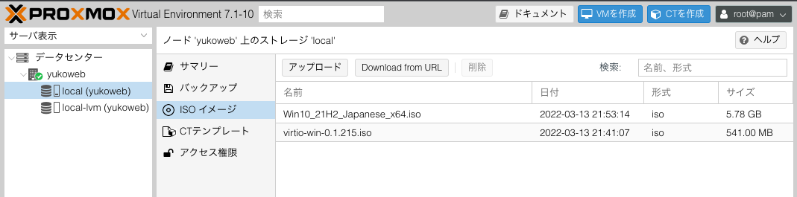
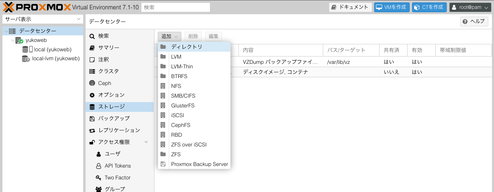
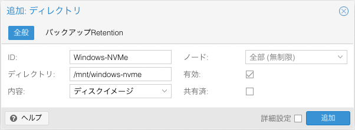

# Proxmox を導入する
現在，自宅環境ではメインのデスクトップ PC と自宅サーバ用のデスクトップ PC を分けて運用しています．
ただ，自宅サーバ用 PC には GPU を搭載できないのと，それほど部屋も広くないのでなるべくコンパクトにまとめたくなったので，メイン PC に集約してしまおうと考えました．
これまでは，Windows と Ubuntu をデュアルブートして使っていましたが，これでは Windows を使いたいときに自宅サーバを落とさなければなりません．
そこで，仮想化によって両立できる環境を作っていきたいと思います．

## 技術選定
仮想化の方式には大きく分けて2種類あります．
Type1 のベアメタル型と Type2 のホスト型です．
ここではあまり詳しくは触れませんが，Type1 はハードウェア上に直接ハイパーバイザを導入するため，オーバヘッドが小さくなります．
一方，Type2 では OS 上にハイパーバイザを導入するためオーバヘッドは大きくなりますが，幅広いハードウェアに対応できます．

代表的なものとしては，

Type1:
- VMware vSphere ESXi
- Microsoft Hyper-V
- Linux KVM

Type2:
- VMware Player
- Oracle VirtualBox

といったものがあります．
GPU を使えるかどうかという視点で考えると，Type2 のハイパーバイザでは中々面倒なようです．
オーバヘッドも大きくなりますし，Type1 でも対応しているハードウェアしか使っていないので，今回は Type1 のハイパーバイザを使うこととします．  
Type1 の中でも VMware の ESXi の無償版では vCPU が8コアまでしか使えませんし，Hyper-V も基本的には Windows Server の機能なので，必然的に KVM を使うことになります．
また，素の KVM を使っても良いのですが，コマンドラインで全ての仮想マシンを管理するのは不便なので，KVM ベースの仮想化をブラウザから GUI 操作で管理できる Proxmox を採用します．

参考： [Proxmox Virtual Environment](https://www.proxmox.com/en/proxmox-ve)

## Proxmox のインストール
まずは，[Proxmox のダウンロードページ](https://www.proxmox.com/en/downloads)から最新の iso ファイルをダウンロードしてきます．
この iso ファイルを USB メモリに焼いてインストールメディアを作成します．
ここでは Mac における手順を示します．

```bash
# パソコンに差した USB メモリを探す
$ diskutil list

# ディスクの消去
$ diskutil eraseDisk MS-DOS UNTITLED /dev/disk8                                                                [16:25:11]
Started erase on disk8
Unmounting disk
Creating the partition map
Waiting for partitions to activate
Formatting disk8s2 as MS-DOS (FAT) with name UNTITLED
512 bytes per physical sector
/dev/rdisk8s2: 60552288 sectors in 1892259 FAT32 clusters (16384 bytes/cluster)
bps=512 spc=32 res=32 nft=2 mid=0xf8 spt=32 hds=255 hid=411648 drv=0x80 bsec=60581888 bspf=14784 rdcl=2 infs=1 bkbs=6
Mounting disk
Finished erase on disk8

# ディスクのアンマウント
$ diskutil unmountDisk /dev/disk8

# ディスクへの書き込み
$ sudo dd if=proxmox-ve_7.1-2.iso of=/dev/disk8
2019432+0 records in
2019432+0 records out
1033949184 bytes transferred in 184.005032 secs (5619135 bytes/sec)

$ diskutil eject /dev/disk8
```

## Proxmox VE のインストール
少し前の記事ですが，[このページ](https://blog.nishi.network/2020/08/12/proxmox-part1/)を参考に進めます．
「無償版リポジトリの設定」のところで，```/etc/apt/sources.list``` に

```
deb http://download.proxmox.com/debian/pve buster pve-no-subscription
```

を追記となっていますが，正しくは

```
deb http://download.proxmox.com/debian/pve bullseye pve-no-subscription
```

となります．

### SSH の設定
一応，SSHの設定をしておきます．
リモート接続元のマシンの SSH キーをホストマシンの ```~/.ssh/authorized_keys``` に登録し，```/etc/ssh/sshd_config``` を編集します

```
# 35行目
PermitRootLogin without-password

# 60行目
PasswordAuthentication no
```

SSHD を再起動して設定を反映します．

```bash
$ /etc/init.d/ssh restart
```

これで，SSH　の設定は完了です．

### ストレージの拡張
256GB の SSD にインストールしたはずが，なぜか 60GB くらいしか使われていないので，100％使うように変更します．

```bash
$ lvremove /dev/pve/data
$ lvresize -l +100%FREE /dev/pve/root
$ resize2fs /dev/mapper/pve-root
```

このコマンドを実行した後，「データセンター」>「ストレージ」>「local」と進み，「共有済」というチェックボックスにチェックを入れて拡張は完了です．

<div align="center"></div>

## Windows 10 の仮想マシン作成の下準備
### IOMMU の設定
Windows の仮想マシンではゲームなどをやりたいので，GPU パススルーの設定をします．
GPU パススルーには IOMMU を有効にしておく必要があるので，```/etc/default/grub``` を編集します．

```
# 以下を追記
GRUB_CMDLINE_LINUX_DEFAULT="quiet amd_iommu=on iommu=pt video=efifb:off"
```

GRUB をアップデートしてマシンを再起動します．

```bash
$ update-grub
$ reboot
```

次のコマンドで IOMMU が有効になっていることを確認します．

```bash
$ dmesg | grep -e DMAR -e IOMMU
[    0.469974] pci 0000:00:00.2: AMD-Vi: IOMMU performance counters supported
[    0.471531] pci 0000:00:00.2: AMD-Vi: Found IOMMU cap 0x40
[    0.472300] perf/amd_iommu: Detected AMD IOMMU #0 (2 banks, 4 counters/bank).
```

### ISO ファイルの準備
ここでは通常の Windows イメージに加えて VirtIO ドライバが必要なので，以下のリンクからダウンロードします．  
- Windows イメージ: [https://www.microsoft.com/ja-jp/software-download/windows10ISO](https://www.microsoft.com/ja-jp/software-download/windows10ISO)
- VirtIO ドライバ: [https://fedorapeople.org/groups/virt/virtio-win/direct-downloads/stable-virtio/virtio-win.iso](https://fedorapeople.org/groups/virt/virtio-win/direct-downloads/stable-virtio/virtio-win.iso) 

「データセンター」>「(ホストマシン)」>「local」>「ISO イメージ」と進み，「アップロード」から ISO ファイルを選択します．

<div align="center"></div>

### ストレージの準備
ゲームなどをインストールするため，Windows には 1TB の NVMe SSD を割り当てます．
最初に，マウントするハードディスクを探してパーティションを作成します．
fdisk の各コマンドの選択は全て規定値のままで大丈夫です．

```bash
$ fdisk -l
Disk /dev/nvme0n1: 931.51 GiB, 1000204886016 bytes, 1953525168 sectors
Disk model: CSSD-M2B1TPG3VNF                        
Units: sectors of 1 * 512 = 512 bytes
Sector size (logical/physical): 512 bytes / 512 bytes
I/O size (minimum/optimal): 512 bytes / 512 bytes

$ fdisk /dev/nvme0n1
Command (m for help): n
Partition type
   p   primary (0 primary, 0 extended, 4 free)
   e   extended (container for logical partitions)
Select (default p): p
Partition number (1-4, default 1): 
First sector (2048-1953525167, default 2048): 
Last sector, +/-sectors or +/-size{K,M,G,T,P} (2048-1953525167, default 1953525167): 

Created a new partition 1 of type 'Linux' and of size 931.5 GiB.

Command (m for help): w
The partition table has been altered.
Calling ioctl() to re-read partition table.
Syncing disks.
```

続いてボリュームグループと論理ディスクを作成します．
Windows 用のストレージなので，グループ名は ```windows``` としています．

```bash
# ボリュームグループの作成
$ vgcreate windows /dev/nvme0n1p1
  Physical volume "/dev/nvme0n1p1" successfully created.
  Volume group "windows" successfully created

# ストレージを 100% 使って論理ディスクを作成
$ lvcreate -n windows-nvme -l 100%FREE windows
  Logical volume "windows-nvme" created.

# 確認
$ lvs
  LV           VG      Attr       LSize    Pool Origin Data%  Meta%  Move Log Cpy%Sync Convert
  root         pve     -wi-ao----  229.97g                                                    
  swap         pve     -wi-ao----    8.00g                                                    
  windows-nvme windows -wi-a----- <931.51g 
```

作成した論理ディスクを ext4 でフォーマットして適当な場所にマウントします．
ここでは，```/mnt/windows-nvme``` にマウントします．

```bash
$ mkfs.ext4 /dev/windows/windows-nvme
mke2fs 1.46.2 (28-Feb-2021)
Discarding device blocks: done                            
Creating filesystem with 244189184 4k blocks and 61054976 inodes
Filesystem UUID: 68cccd56-2db0-45f7-88a2-600b33ca1a34
Superblock backups stored on blocks: 
        32768, 98304, 163840, 229376, 294912, 819200, 884736, 1605632, 2654208, 
        4096000, 7962624, 11239424, 20480000, 23887872, 71663616, 78675968, 
        102400000, 214990848

Allocating group tables: done                            
Writing inode tables: done                            
Creating journal (262144 blocks): done
Writing superblocks and filesystem accounting information: done

$ mount /dev/windows/windows-nvme /mnt/windows-nvme
```

自動でマウントされるように ```/etc/fstab``` に以下を追記します．

```
# <file system> <mount point> <type> <options> <dump> <pass>
/dev/windows/windows-nvme /mnt/windows-nvme ext4 defaults 0 1
```

ここで一旦再起動して，自動マウントされることを確認します．  
最後に，「データセンター」>「ストレージ」>「追加」>「ディレクトリ」からストレージを追加します．

<div align="center"></div>

「ID」には適当な名前を，「ディレクトリ」は先ほどのマウント先をそれぞれ指定します．

<div align="center"></div>

これでストレージの準備は完了です．
次回は，Winodows 10 をゲスト OS として導入します．
