# Windows 11 を仮想マシンにインストールする
昨日は，Proxmox VE を導入し，Windows 11 のインストールに向けた下準備を行いました．
今日は，Windows 11 を実際にインストールしていきます．

## 仮想マシンの作成
仮想マシンの作成も Proxmox VE の管理画面から可能です．
右上にある「VM を作成」をクリックして作成ウィザードを開きます．  
まずは，全体設定として，ノードと ID，仮想マシンの名前を設定します．
ID と仮想マシンの名前は任意に設定できます．

<div align="center">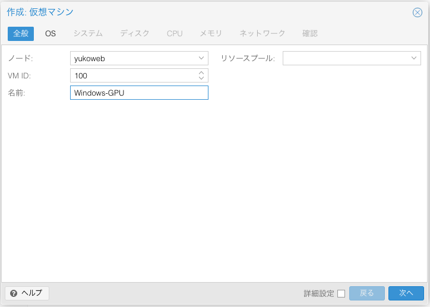</div>

次に，インストールする OS のイメージファイルを指定します．
昨日紹介した手順で，```local``` ストレージにアップロードした ISO ファイルを指定します．
ゲスト OS の種別には「Microsoft Windows」，バージョンには「11/2022」とします．

<div align="center">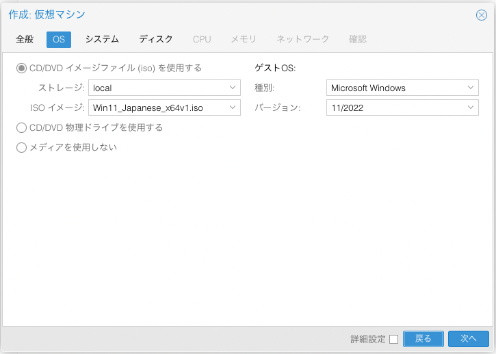</div>

システムの設定では，GPU パススルーをするので，それに合わせて「マシン」に「q35」，「BIOS」に「OVMF (UEFI)」をそれぞれ選びます．

<div align="center">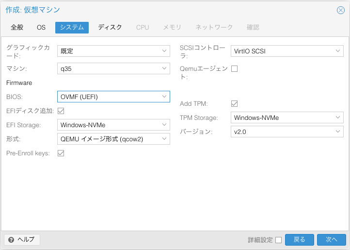</div>

インストール先のハードディスクには，昨日作成した ```Windows-NVMe``` ストレージを指定します．
Windows だとデフォルトで IDE になっていますが，遅いらしいので「バス/デバイス」には「SCSI 0」を指定します．
が，それ以外の項目は任意に指定します．

<div align="center">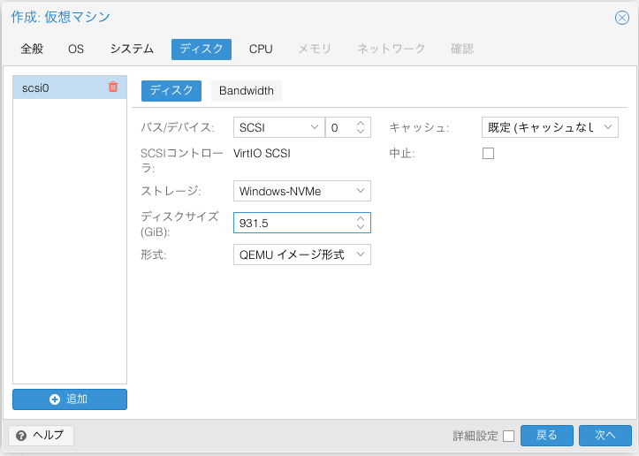</div>

CPU の設定ではソケット数とコア数，および種別を指定します．
16コア32スレッドの CPU (Ryzen9 3950X) を使っているので，それを目安にお好みで決めます．

<div align="center">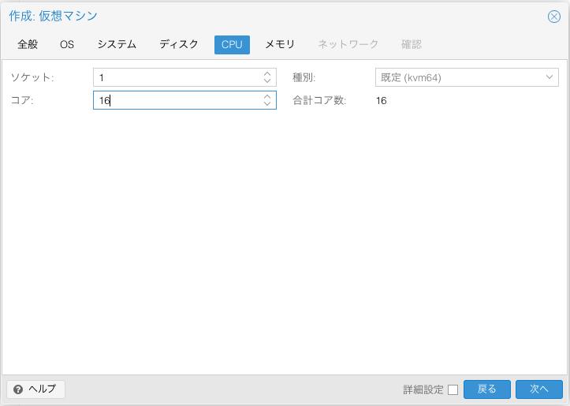</div>

メモリは物理メモリを 64GB 搭載しているので，それをもとに 32GB くらいに設定しておきます．

<div align="center">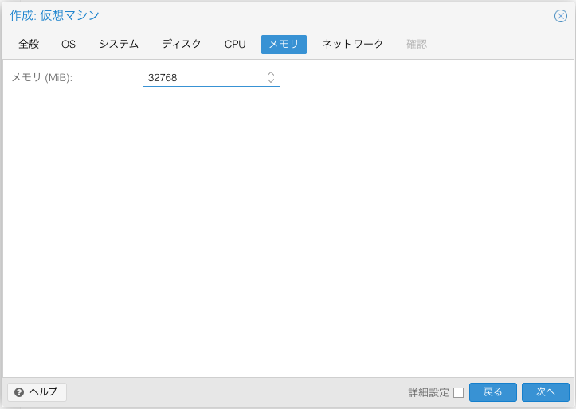</div>

ネットワークは取り敢えずデフォルトのままにしておきます．

<div align="center">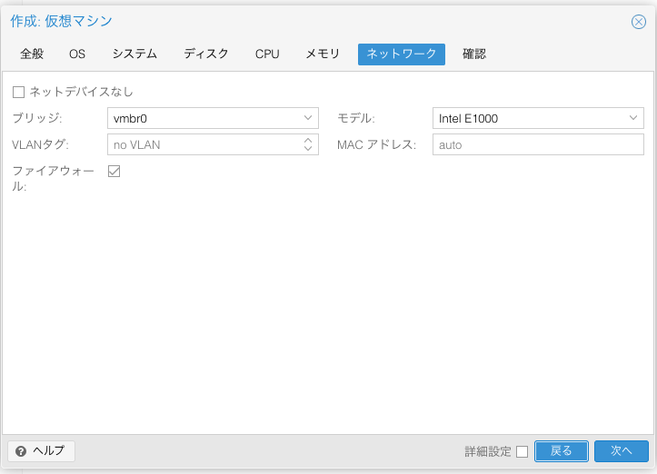</div>

最後に，ここまでの設定内容を確認して「完了」をクリックします．
仮想マシンの作成処理が完了するまで少し待ちます．

<div align="center">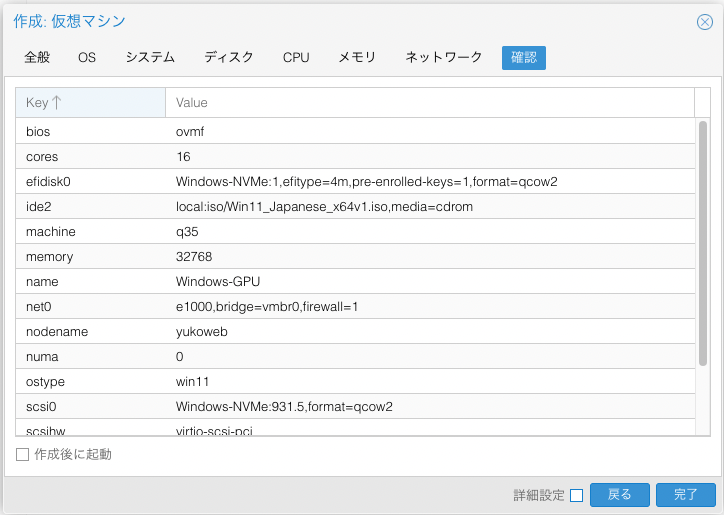</div>

## OS のインストール
仮想マシンをが作成できたら OS のインストールを行います．
OS のインストールに先立って，まずは VirtIO ドライバの ISO を追加します．
作成した仮想マシンで「ハードウェア」>「追加」と進んで「CD/DVD ドライブ」から，次のように設定します．

<div align="center">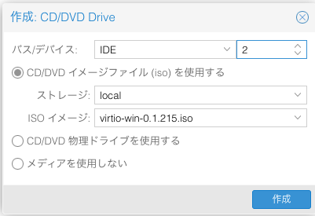</div>

左のバーから作成した仮想マシンを選択して，右の詳細ビューの上の方にある「開始」ボタンをクリックします．
さらに，詳細ビューからコンソールを開くと Windows のインストール画面が現れます．
基本的には，Windows のインストール方法と同じですが，インストールの種類は「カスタム」を選択します．
カスタムでインストールしようとすると，ディスクが認識されていないので，左下の「ドライバーの読み込み」をクリックして，インストールするドライバを選択します．
今回は Windows 11 なので下から3つ目を選びました．

<div align="center">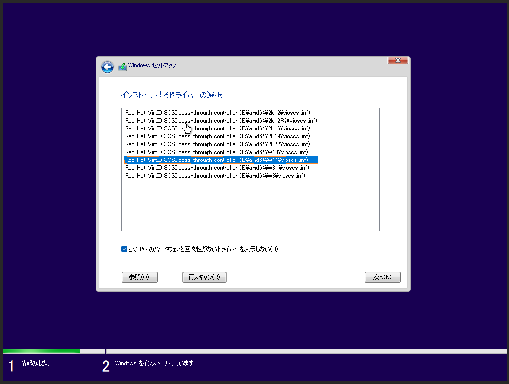</div>

Windows 11 のインストールが完了したら，VirtIO ドライバをインストールします．
エクスプローラから外部ディスクとしてマウントした VirtIO ドライバのドライブを開き，```virtio-win-gt-x64``` を選択してインストールします．(これをインストールしておかないと，仮想メモリの使用率が 90％ 以上に張り付いてしまう？)

<div align="center">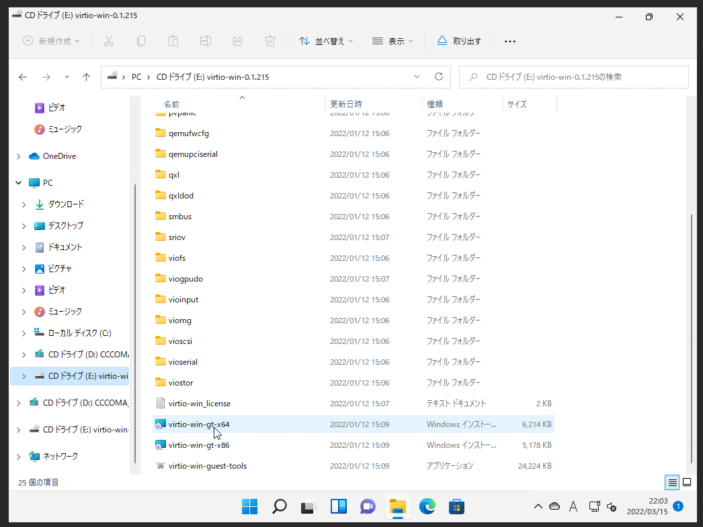</div>

さらに追加で，同じドライブの ```guest-agent``` の中にある ```qemu-ga-x86_64``` を選択して同様にインストールしておきます．
インストールが完了すると，QEMU Guest Agent が使えるようになり，Proxmox の管理画面の「サマリー」に VM の IP アドレスが表示されるようになります．

<div align="center">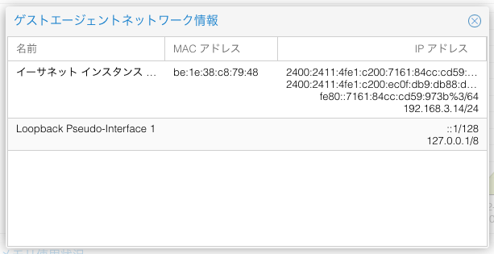</div>

今回は Pro ライセンスで認証しているので，仮想マシン上の Windows の設定からリモートデスクトップを有効にすれば，LAN 内の端末から Windows のリモートデスクトップに接続できるようになります．
下の画像は MacBook Air からリモートデスクトップにアクセスした時のスクリーンショットです．

<div align="center">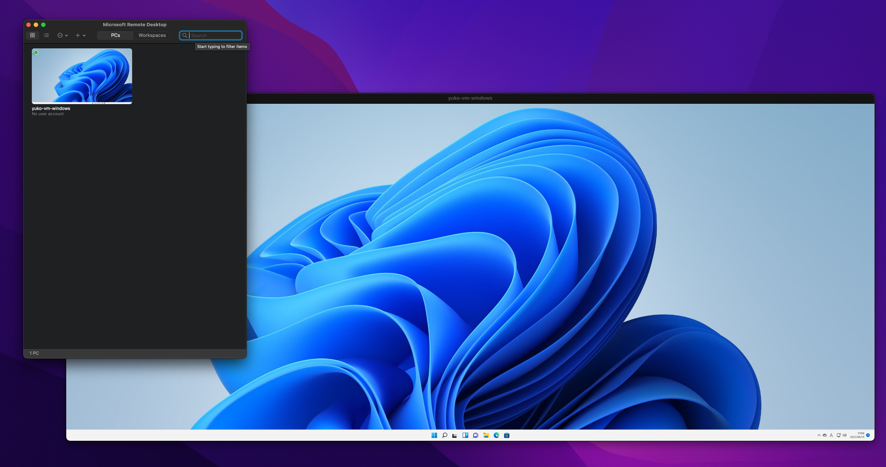</div>

最後に，インストールに使った ISO ファイルはもういらないので，仮想マシンのハードウェアから削除しておきます．
これでとりあえず Windows のインストールできたので，次回は PCI パススルーで GPU を使えるように設定します．