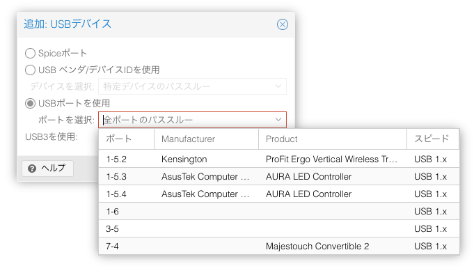
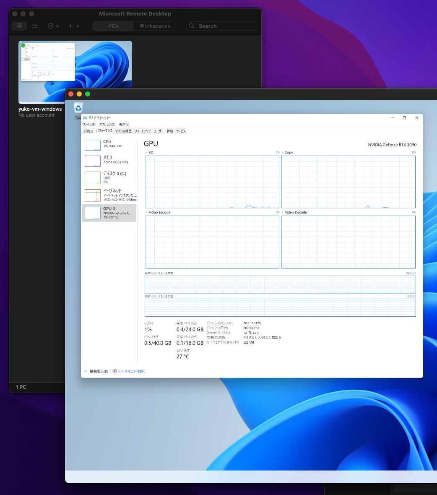

# GPU パススルー
昨日は，Windows 11 を Proxmox VE 上の仮想マシンにインストールしました．
今日は PCI パススルーによって仮想マシン上の Windows 11 から GPU を使えるようにします．

まず，再掲となりますが IOMMU を有効にするため，```/etc/default/grub``` を編集します．

```
# 以下を追記
GRUB_CMDLINE_LINUX_DEFAULT="quiet amd_iommu=on iommu=pt video=efifb:off"
```

GRUB をアップデートしてマシンを再起動します．

```bash
$ update-grub
$ reboot
```

続いて，必要なモジュールとブラックリストを所定のファイルに記述して，PC を再起動します．

```/etc/modules```
```
vfio
vfio_iommu_type1
vfio_pci
vfio_virqfd
```

```/etc/modprobe.d/blacklist.conf```
```
blacklist radeon
blacklist nouveau
blacklist nvidia
blacklist nvidiafb
```

IOMMU Interrupt Remapping が有効であることを確認します．
次のように出力されれれば有効になっています．

```bash
$ dmesg | grep 'remapping'
[    0.470973] AMD-Vi: Interrupt remapping enabled

# 上記の表示が出なければ以下を実行
$ echo "options vfio_iommu_type1 allow_unsafe_interrupts=1" > /etc/modprobe.d/iommu_unsafe_interrupts.conf
```

ここまでできたら，```lspci -v``` でパススルーしたい GPU を探します．
今回は RTX3090 をパススルーしたいので，コマンドの出力から次のような行を探して，さらにベンダ ID を控えておきます．

```bash
# パススルーするデバイスを探す
$ lspci -v
...

0b:00.0 VGA compatible controller: NVIDIA Corporation GA102 [GeForce RTX 3090] (rev a1) (prog-if 00 [VGA controller])
        ...

0b:00.1 Audio device: NVIDIA Corporation GA102 High Definition Audio Controller (rev a1)
        ...

# ベンダ ID を調べる
$ lspci -n -s 0b:00
0b:00.0 0300: 10de:2204 (rev a1)
0b:00.1 0403: 10de:1aef (rev a1)
```

ベンダ ID を ```/etc/modprobe.d/vfio.conf``` に追記して再起動します．

```bash
$ echo "options vfio-pci ids=10de:2204,10de:1aef" > /etc/modprobe.d/vfio.conf
```

ここまで来れば，GPU パススルーの設定はほぼ完了です
最後に，以下の2行を VM の仮想マシンの設定ファイルに追記します．
今回は，ID が 100 の仮想マシンにパススルーするので ```/etc/pve/qemu-server/100.conf``` に追記しますが，数字の部分は仮想マシンの ID に合わせて適宜読み替えてください．

```conf
cpu: host,hidden=1,flags=+pcid
hostpci0: 0b:00,pcie=1,x-vga=on
```

```0b:00``` の部分も場合によって異なるので，適宜変更する必要があります．
追記してファイルを保存すると，以下のようにプロセッサの設定が変更され，PCI デバイスが追加されます．
さらに，マウスとキーボードのパススルーも設定しておきます．
「ハードウェア」>「追加」>「USB デバイス」からマウスとキーボードを選択します．

<div align="center"></div>

これで，全ての準備が完了です．
仮想マシンを起動すると，GPU が接続されて Windows から認識できるようになっています．

<div align="center"></div>

あとは，NVIDIA のホームページから GPU のドライバをダウンロードしてインストールすれば，ゲームも楽しめるようになります．