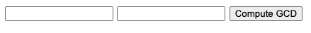
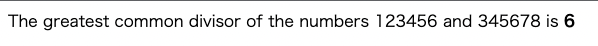

# 2-5. Web にページを貼り出す
Rust の強みの一つに，[crate.io](https://crate.io) から ```cargo``` コマンドを使って簡単にライブラリを取得できる点が挙げられます．
Rust のパッケージは，ライブラリであろうと実行可能ファイルであろうとクレート (crate) と呼ばれます．
ここでは，ウェブフレームワークの ```actix-web``` とシリアル化を行う ```serde``` クレートを用いて Web サーバーを立ち上げます．

```cargo new``` コマンドで ```actix-gcd``` プロジェクトを作成します．
生成された ```Cargo.toml``` を次のように書き換えます．

```toml
[package]
name = "actix-gcd"
version = "0.1.0"
edition = "2021"

# See more keys and their definitions at https://doc.rust-lang.org/cargo/reference/manifest.html

[dependencies]
actix-web = "1.0.8"
serde = { version = "1.0", features = ["derive"] }
```

```[dependences]``` 以下の各行で，必要なパッケージとそのバージョンを指定しています．
上の例のように，バージョンを指定しておけば，新しい crate バージョンが公開された後でも，パッケージのバージョンは固定となります．
パッケージのバージョン管理は第8章で詳しく説明します．

必ずしも必要というわけではありませんが，クレートには ```features``` オプションを指定できます．
```features``` オプションではインターフェイスや実装を指定できます．
```serde``` は Web フォームのデータを処理するクレートですが，```derive``` を選択したときのみ利用可能なので，そのように指定しています．

注意すべきは，直接使うクレートのみを指定すればよいということです．
```cargo``` コマンドを使えば，ほかの依存関係は良しなに処理してくれます．

まず，```actix-gcd/src/main.rs``` に次の内容を書き込んでください．

```rust
use actix_web::{web, App, HttpResponse, HttpServer};

fn main() {
    let server = HttpServer::new(|| {
        App::new()
            .route("/", web::get().to(get_index))
    });

    println!("Serving on http://localhost:3000...");
    server
        .bind("127.0.0.1:3000").expect("error binding server to address")
        .run().expect("error running server");
}

fn get_index() -> HttpResponse {
    HttpResponse::Ok()
        .content_type("text/html")
        .body(
            r#"
                <title>GCD Calculator</title>
                <form action="/gcd" method="post">
                <input type="text" name="n"/>
                <input type="text" name="m"/>
                <button type="submit">Compute GCD</button>
                </form>
            "#,
        )
}
```

初めに，```actix-web``` を ```use``` を使って読み込みます．
```{web, App, ...}``` のように波括弧で括ることで，まとめてモジュールを読み込めます．  
メイン関数では ```HttpServer::new``` を使って3000番ポートに来た ```/``` というパスへのリクエストにメッセージを返すサーバを立てています．
```HttpServer::new``` の引数には，```|| { App::new() ... }``` のようにクロージャ (closure)を渡しています．
クロージャは関数のように呼び出すことのできる値です．
ここでは引数を取っていませんが，引数がある場合には ```||``` の間に指定してやります．
そして，波括弧の中身がクロージャの本体になります．
サーバを起動すると Actix は入ってくるリクエストを処理するためにスレッドのプールを開始します．
各スレッドはクロージャーを呼び出して，リクエストのルーティングや処理方法を指示する ```App``` の値の新しいコピーを取得します．  
クロージャでは ```App::new()``` で新しい空の ```App``` を作成し，```route``` メソッドを呼び出して ```/``` に対するパスを追加しています．
```route``` メソッドには，```get_index``` 関数を呼び出して HTTP の GET リクエストを扱うハンドラ (```web::get().to(get_index)```) を渡しています．
```route``` メソッドは最初に作った ```App``` に新しいルートを追加して返しています．
クロージャの最後にはセミコロンが付いていないので，この ```App``` が返り値となります．  
```get_index``` 関数は HTTP の ```/``` に対する ```GET``` リクエストへのレスポンスとして，```HttpResponse``` の値を構築します．
```HttpResponse::Ok()``` はリクエストが成功した ```HTTP 200 OK``` ステータスを表しています．
```content_type``` と ```body``` メソッドでレスポンスに対して詳細な情報を追加しています．
最終的に，```body``` で指定した内容が，```get_index``` の返り値となります．  
```body``` メソッドの中身は，Rust の「生文字列」という文法で，```r``` と二重引用符，0個以上の ```#``` で囲まれた文字列は，全てエスケープされずに任意の文字列を指定できるようになります．
文字列が意図した場所で終わるようにするには，```#``` の数をテキスト中に出現するよりも多く入れてやれば良いです．

それでは，```cargo``` コマンドで実行してみましょう．

```bash
$ cargo run
    Updating crates.io index
  Downloaded rustc_version v0.2.3
  Downloaded actix-threadpool v0.1.2
  Downloaded failure_derive v0.1.8
  Downloaded serde_urlencoded v0.6.1
  ...
   Compiling actix-http v0.2.11
   Compiling awc v0.2.8
   Compiling actix-web v1.0.9
   Compiling actix-gcd v0.1.0 (/Users/iinuma/programming_languages/rust/ch02/actix-gcd)
    Finished dev [unoptimized + debuginfo] target(s) in 1m 02s
     Running `target/debug/actix-gcd`
Serving on http://localhost:3000...
```

```http://localhost:3000``` にアクセスすると，次のような画面が表示されます．

<div align="center"></div>

今の時点では ```Compute GCD``` ボタンを押しても，存在しないページに飛ぶだけです．  
それでは，ここで ```serde``` クレートを使ってみましょう．
このクレートは，フォームのデータを扱うのに便利なツールです．
まずは，```main.rs``` に以下を追記して，クレートの使用を宣言します．

```rust
use serde::Deserialise;
```

通常，```use``` 宣言はファイルの先頭で行いますが，ネストのレベルが適切であれば記述位置に制約はありません．  
続いて，フォームから取得するデータを格納する構造体 (structure) を定義します．

```rust
#[derive(Deserialize)]
struct GcdParameters {
    n: u64,
    m: u64,
}
```

```#[derive(Deserialize)]``` は先ほどの ```#[test]``` と同じく属性です．
これを記述しておくと，コンパイルに時に ```serde``` クレートがその形を調べて HTML フォームが POST リクエストに使用する形式のデータからこの型を解析するコードを自動的に生成してくれます．
実際に，この属性を付けておけば，JSON や YAML，TOML など，ほとんどの種類の構造化データから ```GcdParameters``` の値を解析することができます．
```serde``` クレートは ```Serialize``` 属性も持っており，Rust の値を構造化されたフォーマットに書き出すという，逆のことを行うコードも生成してくれます．

ここまで定義をしておけば，ハンドラ関数を簡単に記述できます．

```rust
fn post_gcd(form: web::Form<GcdParameters>) -> HttpResponse {
    if form.n == 0 || form.m == 0 {
        return HttpResponse::BadRequest()
            .content_type("text/html")
            .body("Computing the GCD with zero is boring.");
    }

    let response = format!(
        "The greatest common divisor of the numbers {} and {} is <b>{}</b>\n",
        form.n, form.m, gcd(form.n, form.m)
    );

    HttpResponse::Ok().content_type("text/html").body(response)
}
```

Actix のリクエストハンドラは，Actix が HTTP リクエストを抽出できる型を持つ引数を取る必要があります．
ここでは，```web::Form<GcdParameters>``` という型を取る ```form``` を引数として渡しています．
Actix は ```T``` がデシリアライズできる場合に限り，```web::Form<T>``` を HTML の POST リクエストから抽出します．
ここでは，```#[derive(Deserialize)]``` 属性によってデシリアライズが可能となっています．
もし，デシリアライズできない型を指定していた場合には，コンパイル時に Rust がその間違いを指摘してくれます．  
```post_gcd``` 関数では，初めにパラメータが0でないことを確認し，条件を満たさなければ ```400 BAD REQUEST``` を返します．
その後，最大公約数を求めてレスポンスを構築しています．
```format!``` は文字列を返すマクロです．
最後にレスポンスのテキストを ```200 OK``` でラップして返しています．

そして ```main``` 関数に ```post_gcd``` を登録します．

```rust
fn main() {
    let server = HttpServer::new(|| {
        App::new()
            .route("/", web::get().to(get_index))
            .route("/gcd", web::post().to(post_gcd))
    });

    println!("Serving on http://localhost:3000...");
    server
        .bind("127.0.0.1:3000").expect("error binding server to address")
        .run().expect("error running server");
}
```

それでは実行してみましょう．

```bash
$ cargo run
```

次のように表示されれば成功です．

<div align="center"></div>