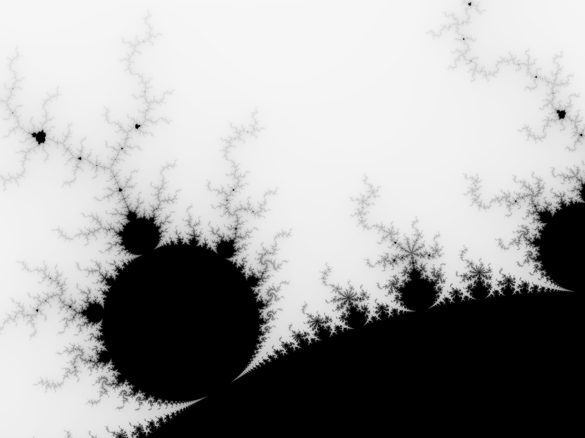

# 2-6. 並列処理
Rust の強みの一つが並列プログラミングをサポートしていることです．
メモリエラーを起こさないことを保証する制約によって，データ競合が起こらない方法でのみスレッドがメモリを共有できることを保証してくれます．

- mutex を使って共有データの構造を変更しようとするスレッドについて，Rust はロックをかけている場合を除いてデータへのアクセスを禁止します．ロックをかけている場合は，アクセスが完了したのち自動的にロックを解除します．C や C++ では，mutex とそれを保護するデータとの関係はコメントに委ねられています．
- 読み込み専用メモリのデータを複数のスレッドで共有する場合，Rust は偶発的にデータが書き換えられないことを保証してくれます．C や C++ では，型システムでこれを保持してくれますが，簡単に書き換えられてしまいます．
- データ構造の所有権を別のスレッドに移すと，Rust は実際にそのデータへの全てのアクセスを放棄したかどうかを確認します．C や C++ では，送信側のスレッドが二度とそのデータに触れないようにチェックする必要があります．これを怠るとプロセッサのキャッシュに何があるか，最近どれだけメモリへの書き込みを行ったかによって影響が変わってきます．

実は前節で扱った Actix サーバでも並列プログラミングが使われており，一度に複数のリクエストがあった場合は，いくつかのスレッドが立ち上がって各関数を処理します．
この時，並列性のことは全く考慮していませんでしたが，Rust が安全に実行してくれることを保証していたのです．

本節では，Mandelbrot 集合を描画するプログラムを作成します．
このプログラムは「困惑するほどの」並列アルゴリズムと呼ばれており，スレッド間のやりとりが非常に単純です．
そのため，より複雑なパターンについては第19章で扱います．

まずは新しいプロジェクトを作成します．

```bash
$ cargo new mandelbrot
     Created binary (application) `mandelbrot` package

 $ cd mandelbrot
```

## Mandelbrot 集合とは何か？
まずは，簡単なコード例を示しつつ，徐々に Mandelbrot 集合の詳細に迫っていきましょう．  
次のコードは Rust の ```loop``` 宣言を用いた無限ループです．

```rust
fn square_loop(mut x: f64) {
    loop {
        x = x * x;
    }
}
```

このような計算は実際には無駄でしかありませんが，処理が進むとどのようなことが起こるでしょうか？
```x``` が1以下なら値はどんどん小さくなってゼロに漸近します．
また，1であれば何度繰り返しても1のままですし，1以上ならば無限大に発散します．
負の数を初期値にすると，最初の演算で正の値になった後，同じような挙動になります．

<div align="center"></div>

それでは，少し違ったループを考えてみましょう．

```rust
fn square_add_loop(mut c: f64) {
    let mut x = 0.;
    loop {
        x = x * x + c;
    }
}
```

```x``` の初期値はゼロで，```x``` の2乗に ```c``` を足しています．
この処理だと，先ほどと比較して ```x``` の挙動の予測が難しくなりますが，実験的に ```c``` が 0.25 より大きいか -2 より小さい場合には無限大に発散し，それ以外の場合にはゼロ近傍で振動します．

続いて，```c``` について，```f64``` ではなく複素数を使った場合を見てみましょう．
Rust で複素数を扱うには ```num``` クレートを用います．
```Cargo.toml``` の ```[dependences]``` に次のとおり追記してください．

```toml
[package]
name = "mandelbrot"
version = "0.1.0"
edition = "2021"

# See more keys and their definitions at https://doc.rust-lang.org/cargo/reference/manifest.html

[dependencies]
num = "0.4"
```

複素数演算に拡張したコードは次のようになります．

```rust
use num::Complex;

fn complex_square_add_loop(mut c: Complex<f64>) {
    let mut z = Complex { re: 0.0, im: 0.0 };
    loop {
        z = z * z + c;
    }
}
```

```Complex``` 型は ```num``` クレートに定義された構造体で，次のように定義されています．

```rust
struct Complex<T> {
    /// Real portion of the complex number
    re: T,

    /// Imaginary portion of the complex number
    im: T,
}
```

```Complex``` は任意の型 ```T``` で実部と虚部の数値の型を指定します．
例えば ```T``` が ```f64``` であれば，実部，虚部ともに64ビット浮動小数点数の ```Complex``` 型を定義できます．
```num``` クレートでは，```*``` や ```+``` など任意の算術演算子が ```Complex``` 型についても使えるようになっています．
このように，独自の型で Rust の演算子を使えるようにする方法もありますが，詳しくは第12章で取り扱います．

数学的に Mandelbrot 集合は無限大に発散しない範囲の複素数 $c$ の集合として定義されます．
この集合をプロットすると，実に奇妙で美しい模様が現れるのです．
複素数 $c$ の実部と虚部を，それぞれ Cartesian 平面上の点の $x$ と $y$ の座標として扱います．
$c$ うち Mandelbrot 集合に含まれる点を黒く，それ以外を明るい色で塗ると，綺麗なパターンが現れてくるのです．
つまり，画像の各ピクセルに対して，複素平面上の対応する点で先のループを実行して，無限に発散するか，原点付近で振動するかを確認し，それに応じて色をつけなければなりません．  
この処理を ```while``` 文で実装すると非常に時間がかかりますが，2つのコツがあります．
1つ目は，無限ループをどこかで打ち切ることです．
有限回のループでも集合の十分な近似値が得られます．
ループ処理の回数は，どの程度正確な境界線を描きたいかによります．
2つ目が，原点を中心とする半径2の円の外にあると，無限大に発散することがわかっています．  
次の関数が，今回 Mandelbrot 集合を求めるのに使う関数となります．

```rust
use num::Complex;

/// Try to determine if `c` is in the Mandelbrot set, using at most `limit`
/// iterations to decide.
///
/// If `c` is not a member, return `Some(i)`, where `i` is the number of
/// iterations it took for `c` to leave the circle of radius 2 centered on the
/// origin. If `c` seems to be a member (more precisely, if we reached the
/// iteration limit without being able to prove that `c` is not a member),
/// return `None`.
fn escape_time(c: Complex<f64>, limit: usize) -> Option<usize> {
    let mut z = Complex { re: 0.0, im: 0.0 };
    for i in 0..limit {
        if z.norm_sqr() > 4.0 {
            return Some(i);
        }
        z = z * z + c;
    }

    None
}
```

この関数は，複素数 $c$ が Mandelblot 集合に含まれるかを有限回の試行で近似的に確認します．
```Option<usize>``` は Rust の標準ライブラリに次のように定義されている ```Option```　型を利用しています．

```rust
enum Option<T> {
    None,
    Some(T),
}
```

```Option``` は列挙型で，この型の値が取り得るいくつかのバリエーションを列挙しています．
任意の型 ```T``` に対して，```Option<T>``` 型の値は ```Some(v)```（```v``` は ```T``` 型の値）か、```None```（```T``` 型の値がないことを示す）のいずれかです．
```Option<T>``` 型の値は，任意の ```T``` 型に対して ```Some(v)``` となります．
上記の関数では ```Option<usize>``` は ```c``` が Mandelbrot 集合に含まれているか否かを表しており，もしそうでなければ，それがわかるまでにどれくらいの繰り返し処理が必要かを表します．
そのため，関数の返り値は集合に含まれている場合に ```None``` となります．

```rust
for i in 0..limit {
```

以前の例ではコマンドライン引数やベクトルの要素を取得するのに使っていましたが，ここでは0から ```limit-1``` までの値を繰り返し生成するのに ```for``` ループを使っています．  
```z.norm_sqr()``` は ```z``` の原点からの距離を返すメソッドで，```z``` が半径2の円のうちにあるか外にあるかを判定します．
```///``` はドキュメンテーションコメントの記述に使用します．
```rustdoc``` からオンラインドキュメントを自動的に生成してくれます．
詳細については第8章で扱います．

## コマンドライン引数のペアをパースする
今回作成するプログラムでは，画像を表示する際のウィンドウサイズなど，複数の引数を取ります．
コマンドライン引数は任意の全て共通の形式に従うので，それをパースする関数を定義します．

```rust
use std::str::FromStr;

/// Parse the string `s` as a coordinate pair, like `"400x600"` or `"1.0,0.5"`.
///
/// Specifically, `s` should have the form <left><sep><right>, where <sep> is
/// the character given by the `separator` argument, and <left> and <right> are
/// both strings that can be parsed by `T::from_str`. `separator` must be an
/// ASCII character.
///
/// If `s` has the proper form, return `Some<(x, y)>`. If it doesn't parse
/// correctly, return `None`.
fn parse_pair<T: FromStr>(s: &str, separator: char) -> Option<(T, T)> {
    match s.find(separator) {
        None => None,
        Some(index) => {
            match (T::from_str(&s[..index]), T::from_str(&s[index + 1..])) {
                (Ok(l), Ok(r)) => Some((l, r)),
                _ => None
            }
        }
    }
}

#[test]
fn test_parse_pair() {
    assert_eq!(parse_pair::<i32>("",        ','), None);
    assert_eq!(parse_pair::<i32>("10,",     ','), None);
    assert_eq!(parse_pair::<i32>(",10",     ','), None);
    assert_eq!(parse_pair::<i32>("10,20",   ','), Some((10, 20)));
    assert_eq!(parse_pair::<i32>("10,20xy", ','), None);
    assert_eq!(parse_pair::<f64>("0.5x",    'x'), None);
    assert_eq!(parse_pair::<f64>("0.5x1.5", 'x'), Some((0.5, 1.5)));
}
```

```parse_pair``` の定義はジェネリック関数です．

```rust
fn parse_pair<T: FromStr>(s: &str, separator: char) -> Option<(T, T)> {
```

```<T: FromStr>``` というクロージャは，「```FromStr``` trait で実装されている型 ```T``` であれば何でも」と読めます．
これを使えば，```parse_pair::<i32>``` は符号付き32ビット整数型をパースする関数，```parse_pair::<i32>``` は符号付き64ビット浮動小数点数型をパースする関数，というように効率的な定義ができるようになります．
この ```T``` は ```parse_pair``` の型パラメータと呼びます．
ジェネリック関数を使用する場合，Rustはしばしば型パラメータを推測してくれるので，テストコードで行ったように書き出す必要はありません．  
関数の返り値は ```None ``` または ```Some((v1, v2))``` を取り得る ```Option<(T, T)>``` 型となっています．
```Some((v1, v2))``` は2つの値のタブルで，いずれも ```T``` 型を取ります．

```rust
match s.find(separator) {
    None => None,
    Some(index) => {
        ...
    }
}
```

```String``` 型の ```find``` メソッドは，文字列中の ```separator``` に一致する文字を探します．
もし，```separator``` が含まれていなければ，```None``` を返してパースは失敗します．
それ以外の場合には， 文字列中で一致する位置 ```index``` を返します．

```rust
match (T::from_str(&s[..index]), T::from_str(&s[index + 1..])) {
    (Ok(l), Ok(r)) => Some((l, r)),
    _ => None
}
```

続いて，この部分について見ていきます．

```rust
(T::from_str(&s[..index]), T::from_str(&s[index + 1..]))
```

```&s[..index]``` と ```&s[index + 1..]``` は ```separator``` 前後の文字列のスライスです．
型パラメータ ```T``` の関連する ```from_str``` 関数は，これらをそれぞれ受け取って ```T``` 型の値として解析しようとし，結果のタプルを生成します．
以下がマッチの対象となります．

```rust
(Ok(l), Ok(r)) => Some((l, r)),
```

このパターンは，タプルの要素が両方とも ```Result``` 型の ```Ok```を取る場合にのみマッチします．
これを満たせば，```Some((l, r))``` が関数の返り値となります．

```rust
_ => None
```

最後にワイルドカード ```_``` を使って，マッチしなけれは ```None``` を関数の返り値とします．  
```parse_pair``` 関数を使って，複素数の浮動小数点数座標のペアを取って ```Complex<f64>``` 値に変換して返す関数を定義します．

```rust
/// Parse a pair of floating-point numbers separated by a comma as a complex
/// number.
fn parse_complex(s: &str) -> Option<Complex<f64>> {
    match parse_pair(s, ',') {
        Some((re, im)) => Some(Complex { re, im }),
        None => None
    }
}

#[test]
fn test_parse_complex() {
    assert_eq!(parse_complex("1.25,-0.0625"),
               Some(Complex { re: 1.25, im: -0.0625 }));
    assert_eq!(parse_complex(",-0.0625"), None);
}
```

```parse_complex``` 関数は ```parse_pair``` を呼び出して，パースが成功すれば ```Complex``` の値を返します．  
よく見ると，```Complex``` の値を作るのに省略記法を使っていることがわかります．
構造体のフィールドを同名の変数で初期化するのはよくあることなので，Rust では ```Complex { re: re, im: im }``` と書くのではなく，```Complex { re, im }``` とシンプルに書くことができます．

## ピクセルから複素数へマッピングする
今回扱うプログラムでは，出力画像の座標と複素数平面状の点を対応付ける必要があります．
この対応付けは，Mandelbrot 集合のどの部分をプロットするのかと，出力の画像サイズに依存します．
そのために，次のような関数を用意します．

```rust
/// Given the row and column of a pixel in the output image, return the
/// corresponding point on the complex plane.
///
/// `bounds` is a pair giving the width and height of the image in pixels.
/// `pixel` is a (column, row) pair indicating a particular pixel in that image.
/// The `upper_left` and `lower_right` parameters are points on the complex
/// plane designating the area our image covers.
fn pixel_to_point(bounds: (usize, usize),
                  pixel: (usize, usize),
                  upper_left: Complex<f64>,
                  lower_right: Complex<f64>)
    -> Complex<f64>
{
    let (width, height) = (lower_right.re - upper_left.re,
                           upper_left.im - lower_right.im);
    Complex {
        re: upper_left.re + pixel.0 as f64 * width  / bounds.0 as f64,
        im: upper_left.im - pixel.1 as f64 * height / bounds.1 as f64
        // Why subtraction here? pixel.1 increases as we go down,
        // but the imaginary component increases as we go up.
    }
}

#[test]
fn test_pixel_to_point() {
    assert_eq!(pixel_to_point((100, 200), (25, 175),
                              Complex { re: -1.0, im:  1.0 },
                              Complex { re:  1.0, im: -1.0 }),
               Complex { re: -0.5, im: -0.75 });
}
```

この変換は，次の図のように行っています．

<div align="center"></div>

この関数は単に計算しているだけなので，詳細は省きますが，いくつか注意することがあります．
次の表現は，タプル要素へのアクセスを表しています．

```rust
pixel.0
```

この ```pixel.0``` を64ビット浮動小数点数として扱いたい場合には次のように記述します．

```rust
pixel.0 as f64
```

一般的に，Rust は暗黙的な数値型同士の変換を許していないので，必要に応じて明示的に示す必要があります．
これは面倒かもしれませんか，いつ何の変換が行われるかが分かるため非常に有用です．
暗黙的な整数型の変換は一見安全そうに見えますが，歴史的に C や C++ のコードではしばしばバグやセキュリティホールの原因となってきました．

## 集合をプロットする
Mandelbrot 集合をプロットするにあたって，画像中の全てのピクセルを複素平面状の点に変換し，```escape_time``` 関数を適用して色付けしてやります．

```rust
/// Render a rectangle of the Mandelbrot set into a buffer of pixels.
///
/// The `bounds` argument gives the width and height of the buffer `pixels`,
/// which holds one grayscale pixel per byte. The `upper_left` and `lower_right`
/// arguments specify points on the complex plane corresponding to the upper-
/// left and lower-right corners of the pixel buffer.
fn render(pixels: &mut [u8],
          bounds: (usize, usize),
          upper_left: Complex<f64>,
          lower_right: Complex<f64>)
{
    assert!(pixels.len() == bounds.0 * bounds.1);

    for row in 0..bounds.1 {
        for column in 0..bounds.0 {
            let point = pixel_to_point(bounds, (column, row),　upper_left, lower_right);
            pixels[row * bounds.0 + column] =
                match escape_time(point, 255) {
                    None => 0,
                    Some(count) => 255 - count as u8
                };
        }
    }
}
```

```escape_time``` の結果，```point``` が集合に属していれば，そのピクセルを黒 (```0```) に色付けします．
それ以外の場合には，集合に属さないことがわかるまでにかかった繰り返し回数によって色の付け方を変えてやります．

```rust
pixels[row * bounds.0 + column] =
    match escape_time(point, 255) {
        None => 0,
        Some(count) => 255 - count as u8
    };
```

## 画像ファイルを書き出す
```image``` クレートは様々な形式の画像ファイルの読み書きや，基本的な操作を行う関数を提供しています．
今回のプログラムでは，最終的な計算結果を PNG 形式にエンコードして保存します．
まずは，```image``` クレートを使うために，```[dependencies]``` に以下を追記します．

```toml
image = "0.13.0"
```

画像を保存する関数は次のようになります．

```rust
use image::ColorType;
use image::png::PNGEncoder;
use std::fs::File;

/// Write the buffer `pixels`, whose dimensions are given by `bounds`, to the
/// file named `filename`.
fn write_image(filename: &str, pixels: &[u8], bounds: (usize, usize)) -> Result<(), std::io::Error>
{
    let output = File::create(filename)?;

    let encoder = PNGEncoder::new(output);
    encoder.encode(pixels, bounds.0 as u32, bounds.1 as u32, ColorType::Gray(8))?;

    Ok(())
}
```

この関数でやっていることは，ファイルを開いて画像の書き込みを試すという非常に単純な処理です．
エンコーダの引数では，書き込みを行うデータ ```pixels``` と ```bounds``` で指定された画像の幅と高さ，エンコードの方法を指定しています．
```ColorType::Gray(8)``` は8ビットのグレイスケール画像でのエンコードを表します．

この関数で注目すべきは，エラーが発生したときの処理です．
Rust では失敗し得る関数は，成功時の値 ```s``` を含む ```Ok(s)``` か，エラーコード ```e``` を含む ```Err(e)``` のいずれかの値を取る ```Result``` を返す必要があります．
ただ，```write_image``` 関数には，成功時に返すべき値がありません．
そのため，成功した際にはユニット (unit) 型の ```()``` を取ります．
ユニット型は C や C++ の ```void``` に似ています．  
```File::create``` でファイルの作成に失敗したり，```encoder.encode``` で画像を書き込めなかった場合にはエラーコードが返されます．
それぞれ，```Result<std::fs::File, std::io::Error>``` と ```Result<(), std::io::Error>``` という同じ ```std::io::Error``` というエラー型を返します．
そのため，この関数でも同じく ```std::io::Error``` を返すようにします．

本来であれば，```File::create``` の結果は次のように記述する必要があります．

```rust
let output = match File::create(filename) {
    Ok(f) => f,
    Err(e) => {
        return Err(e);
    }
};
```

Rust では，このような ```match``` を使った記述は頻繁に登場します．
そのため，短縮記法として ```?``` 演算子が用意されています．
先程の ```match``` ステートメントは次のように書き換えられます．

```rust
let output = File::create(filename)?;
```

## Mandelbrot のプログラムを並列化する
必要な関数が全て揃ったので，まずは並列処理をしない場合のメイン関数を見てみましょう．

```rust
use std::env;

fn main() {
    let args: Vec<String> = env::args().collect();

    if args.len() != 5 {
        eprintln!("Usage: {} FILE PIXELS UPPERLEFT LOWERRIGHT", args[0]);
        eprintln!("Example: {} mandel.png 1000x750 -1.20,0.35 -1,0.20", args[0]);
        std::process::exit(1);
    }

    let bounds = parse_pair(&args[2], 'x').expect("error parsing image dimensions");
    let upper_left = parse_complex(&args[3]).expect("error parsing upper left corner point");
    let lower_right = parse_complex(&args[4]).expect("error parsing lower right corner point");
    
    let mut pixels = vec![0; bounds.0 * bounds.1];

    render(&mut pixels, bounds, upper_left, lower_right);

    write_image(&args[1], &pixels, bounds).expect("error writing PNG file");
}
```

コマンドライン引数を文字列型のベクトルに集約したのち，それぞれについてパースを行います．

```rust
let mut pixels = vec![0; bounds.0 * bounds.1];
```

```vec![v; n]``` マクロは，```n``` 個の要素を持つベクトルを作成して ```v``` で初期化します．
上記の例では，コマンドライン引数で指定した画像サイズ分の要素数を持つベクトルを0で初期化しています．
このベクトルはグレイスケールのピクセル値を保持する配列として用います．

<div align="center"></div>

最後に，PNG ファイルにピクセルバッファを書き出します．
今回のケースではピクセル操作をする必要はないので，ミュータブルに設定していないバッファの参照を ```write_image``` 関数に渡しています．

それでは，リリースモードでビルドして実行してみましょう．
リリースモードでビルドすると，コンパイラによる強力な最適化が行われます．

```bash
$ cargo build --release
  Updating crates.io index
   Compiling autocfg v1.0.1
   ...
   Compiling image v0.13.0
  Compiling mandelbrot v0.1.0 (/Users/iinuma/programming_languages/rust/ch02/mandelbrot)
    Finished release [optimized] target(s) in 0.37s

$ time target/release/mandelbrot mandel.png 4000x3000 -1.20,0.35 -1,0.20
target/release/mandelbrot mandel.png 4000x3000 -1.20,0.35 -1,0.20  3.59s user 0.01s system 93% cpu 3.861 total
```

コマンドを実行すると，次のような画像が生成されます．

<div align="center"></div>

ここでは，UNIX の ```time``` コマンドで実行時間を計測しています．
結果を見てみると3.861秒で描画が完了していることがわかります．
まだ並列処理を実装していませんが，最近のマシンはほとんどがマルチプロセッサなので，並列処理を実装できればもっと速く実行できることになります．

それでは，並列処理を実装してみましょう．
画像をいくつかのセクションに分割し，それぞれのプロセッサにピクセルの色付けを実行させます．
簡単のため，次の図に示すように水平方向に画像を分割し，全てのプロセッサで処理が完了してからファイルに書き出します．

<div align="center"></div>

```crossbeam``` クレートでは，様々な並列処理関連の機能を提供しています．
今回は Scoped Thread という機能を使用します．
まずは，これを使うために ```Cargo.toml``` に以下を追記します．

```toml
crossbeam = "0.8"
```

続いて，```render``` 関数の呼び出し部分を次のように書き換えます．

```rust
let threads = 8;
let rows_per_band = bounds.1 / threads + 1;

{
    let bands: Vec<&mut [u8]> = pixels.chunks_mut(rows_per_band * bounds.0).collect();
    crossbeam::scope(|spawner| {
        for (i, band) in bands.into_iter().enumerate() {
            let top = rows_per_band * i;
            let height = band.len() / bounds.0;
            let band_bounds = (bounds.0, height);
            let band_upper_left = pixel_to_point(bounds, (0, top), upper_left, lower_right);
            let band_lower_right = pixel_to_point(bounds, (bounds.0, top + height), upper_left, lower_right);

            spawner.spawn(move |_| {
                render(band, band_bounds, band_upper_left, band_lower_right);
            });
        }
    }).unwrap();
}
```

1つずつ順を追って見ていきましょう．

```rust
let threads = 8;
let rows_per_band = bounds.1 / threads + 1;
```

まずは処理に使うスレッド数を8に指定しています．
そして，各バンドが何列のピクセルを持つべきかを計算します．
高さがスレッド数の倍数でない場合でも，バンドが画像全体をカバーするように行数を切り上げで丸めます．

```rust
let bands: Vec<&mut [u8]> = pixels.chunks_mut(rows_per_band * bounds.0).collect();
```

ここでは，ピクセルのバッファをバンドに分割します．
バッファの ```chunk_mut``` メソッドは，ミュータブルで重複のないスライスを生成するバッファのイテレータを返します．
このスライスはそれぞれ，```rows_per_band * bounds.0``` ピクセルの完全な行を含んでいます．
```chunks_mut``` が生成する最後のスライスでは，行数は少なくなりますが，各行には同じ数のピクセルが含まれます．
最後に，イテレータの ```collect``` メソッドは，これらの変更可能で重複のないスライスを保持するベクトルを構築します．

```rust
crossbeam::scope(|spawner| {
    ...
}).unwrap();
```

ここが ```crossbeam``` ライブラリの処理部分になります．
引数の ```|spawner| { ... }``` は ```spawner``` を引数に取るクロージャです．
```fn``` による関数の定義とは異なり，クロージャでは引数の型を定義する必要はなく，返り値の型とともに推論されます．
ここでは，```crossbeam::scope``` はクロージャを呼び出し，新しいスレッドを作成するために使用できる値を ```spawner```として渡します．
```crossbeam::scope``` 関数は全てのスレッドが実行を完了するのを待って自身を返します．
この動作により，Rust はスコープ外に出た後にそのようなスレッドがピクセルのある部分にアクセスすることがないことを確認でき、また ```crossbeam::scope``` が戻ってきたときに画像の計算が完了していることを確認することができます．
エラーが発生しなければ、```crossbeam::scope``` は ```Ok(())``` を返しますが，生成したスレッドのどれかがパニックを起こした場合は ```Err``` を返します．
その場合には，```Result``` に対して ```unwrap``` を呼び出し，このコード自体でもパニックを起こして，ユーザーがレポートを受け取るようにしています．

```rust
for (i, band) in bands.into_iter().enumerate() {
```

ピクセルバッファのバンドについて繰り返し処理を行なっています．
```into_iter``` イテレータは，ループ本体の各イテレーションに1つのバンドの排他的所有権を与え，1度にひとつのスレッドだけが書き込めるようにしています．
この仕組みについては第5章で詳しく解説します．
そして，```enumerate``` を使って，各ベクトルの要素とそのインデックスのペアをタプルとして取得します．

```rust
let top = rows_per_band * i;
let height = band.len() / bounds.0;
let band_bounds = (bounds.0, height);
let band_upper_left = pixel_to_point(bounds, (0, top), upper_left, lower_right);
let band_lower_right = pixel_to_point(bounds, (bounds.0, top + height), upper_left, lower_right);
```

実際のインデックスとバンドのサイズがあれば，```render``` 関数に必要なバウンディングボックスが得られるのですが，それは画像全体ではなくバッファのこのバンドのみを参照するものです．
同様に，レンダラーの ```pixel_to_point``` 関数を再利用して，バンドの左上と右下の角が複素平面上のどこにあるかを見つけます．

```rust
spawner.spawn(move |_| {
    render(band, band_bounds, band_upper_left, band_lower_right);
});
```

最後に，スレッドを作成して ```move |_| {...}``` クロージャを実行します．
```move``` キーワードは，クロージャがその中で使われている変数の所有権を持つことを表しています．
実際に，ミュータブルなスライス ```band``` はクロージャしか使っていません．
引数リストの ```|_|``` は使わない引数を1つ取ることを意味しています． 

先にも述べた通り，```crossbeam::scope``` は値が返されるまでに全てのスレッドが完了していることが保証されているので，画像を安全にファイルへ保存できます．

## Mandelbrot のプロットを実行する
今回のプログラムでは，複数の外部クレートを利用しました．
最終的な ```Cargo.toml``` ファイルは次のようになっています．

```toml
[package]
name = "mandelbrot"
version = "0.1.0"
edition = "2021"

# See more keys and their definitions at https://doc.rust-lang.org/cargo/reference/manifest.html

[dependencies]
num = "0.4"
image = "0.13.0"
crossbeam = "0.8"
```

それでは，ビルドして実行してみましょう．

```bash
$ Updating crates.io index
  Downloaded crossbeam v0.8.1
  Downloaded crossbeam-queue v0.3.2
  Downloaded 2 crates (25.4 KB) in 0.64s
   Compiling crossbeam-queue v0.3.2
   Compiling crossbeam v0.8.1
   Compiling mandelbrot v0.1.0 (/Users/iinuma/programming_languages/rust/ch02/mandelbrot)
    Finished release [optimized] target(s) in 3.57s

$ time target/release/mandelbrot mandel.png 4000x3000 -1.20,0.35 -1,0.20
target/release/mandelbrot mandel.png 4000x3000 -1.20,0.35 -1,0.20  4.11s user 0.01s system 293% cpu 1.403 total
```

実行結果を見てみると，CPU での処理は約1.4秒なのに対して，ユーザ時間では4秒以上かかっています．
この時間は画像の書き込みなどに費やされています．
今回は3〜4倍の高速化でしたが，これを大幅に短縮する方法を第19章で扱います．

## 安全は目に見えない
結局，ここで扱った並列プログラムは，他の言語で書いたものとはそれほど大きく変わりません．
ピクセルバッファの一部を各プロセッサに分配し，各プロセッサに別々に処理させ，全員が処理を終えたら結果を表示するというものです．
それでは，Rust の並列処理は何が特別なのでしょうか？  
ここで紹介していないことは，全て自分たちで記述できない Rust のプログラムです．
ここまで見てきたコードでは，バッファをスレッド間で正しく分割していますが，そうではない，つまりデータ競合を引き起こすコードはどれだけでも記述できます．
C や C++ のコンパイラは，微妙なデータ競合を引き起こすコードの探索を支援してくれますが，Rust は何か問題が発生する可能性のある場合には前もって教えてくれます．
第4章と第5章では，Rust のメモリ安全に関するルールを説明します．
第19章ではこのルールが適切な並列処理を保証してくれるかを見ていきます．
