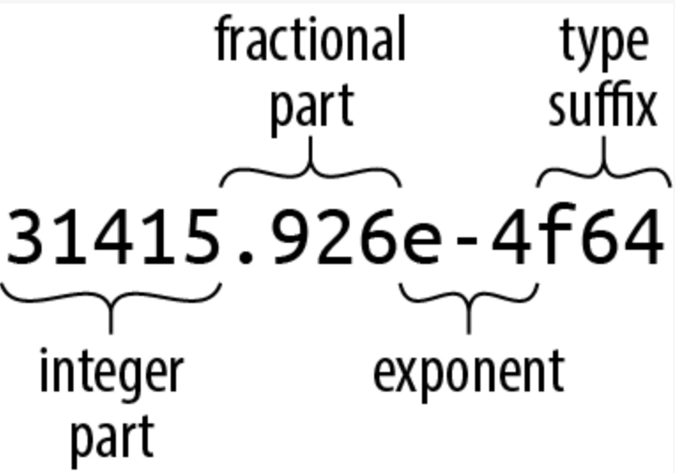

# 3-1. 固定長の数値型
Rust の型システムの基本は固定長の数値型です．
これらの型は，ほとんどすべての最新プロセッサがハードウェアで直接実装している型と一致するように選択されています．  
固定長の数値型は，オーバフローや精度の低下を生じ得ますが，ほとんどのアプリケーションでは十分な精度が得られますし，可変長の整数値や実際の有利数の値で表現するより，何千倍も計算が早くなります．
もしこのような数値型が必要であれば，```num``` クレートでサポートされています．  
Rust の数値型には次のようなものがあります．

| サイズ (bit) | 符号なし整数 | 符号付き整数 | 浮動小数点数 |
| :--: | :--: | :--: | :--: |
| 8 | u8 | i8 |  |
| 16 | u16 | i16 |  |
| 32 | u32 | i32 | f32 |
| 64 | u64 | i64 | f64 |
| 128 | u128 | i128 |  |
| Machine word | usize | isize |  |

```Machine word``` はコードを実行するマシンのアドレスのサイズで，32ビットか64ビットです．

## 整数型
符号なし整数値は非負の整数を表現する型です．

| 型 | 値域 |
| :--: | :--: |
| u8 | 0 ~ $2^8-1$ |
| u16 | 0 ~ $2^{16}-1$ |
| u32 | 0 ~ $2^{32}-1$ |
| u64 | 0 ~ $2^{64}-1$ |
| u128 | 0 ~ $2^{128}-1$  |
| usize | 0 ~ $2^{32}-1$ or $2^{64}-1$ |

符号付き整数は対称的な生徒負の整数値を表現します．

| 型 | 値域 |
| :--: | :--: |
| i8 | $-2^7$ ~ $2^7-1$ |
| i16 | $-2^{15}$ ~ $2^{15}-1$ |
| i32 | $-2^{31}$ ~ $2^{31}-1$ |
| i64 | $-2^{63}$ ~ $2^{63}-1$ |
| i128 | $-2^{128}$ ~ $2^{128}-1$  |
| isize | $-2^{31}$ ~ $2^{31}-1$ or $-2^{63}$ ~ $2^{63}-1$ |

Rust はバイナリファイルの読み込みやソケットからストリームを取得するようなバイトの値として ```u8``` 型を使います．
C/C++ とは異なり，Rust では文字を数値型とは区別して扱います．
つまり，```char``` 型は ```u8``` でもなければ ```u32``` でもないのです．  

```usize``` や ```isize``` は，C/C++ の ```size_t``` に ```ptrdiff_t``` に似ています．
その精度はマシンのアドレス空間のサイズによって決まります．
Rust では配列のインデックスは ```usize``` の値である必要があります．
また，配列やベクトルのサイズや何らかのデータ構造の要素数を表す値も，一般的に ```usize``` 型でなければなりません．

Rust の整数リテラルは ```42u8``` や ```1729isize``` のように，その値の型を指定するサフィックスを取ることができます．
サフィックスの指定がない場合には，ある型の変数に代入されたり，関数に渡されたり，ある型の他の値と比較されたりするまで，値の使われ方を辿ってその型を決定します．
最後に，```i32```　を含めて複数の型の可能性がある場合には，デフォルトの ```i32``` として扱われます．
それ以外の場合にはエラーを出すようになっています．

```0x``` や ```0o```，```0b``` の接頭辞 (prefix) は，それぞれ16進数，8進数，2真数を表します．
```long``` 型の数値を読みやすくするため，```4_294_967_295``` のようにアンダースコアを挿入しても良いことになっています．
アンダースコアの挿入位置に指定はなく，4つごとのブロックに分割したり数値と型接尾辞の間に挿入することも可能です．

Rust では文字型と数値型を区別していますが，文字型のような ```u8``` 型のリテラル，すなわちバイトリテラル (byte literal) が提供されています．
例えば，```b'X'``` は ```u8``` 型として文字 ```X``` を表す ASCII コードを指す値となります．
このバイトリテラルは ASCII 文字にのみ登場する型です．
そのうち次の5種類はバックスラッシュで始まるスタンドイン表記が必要です．

| Character | Byte literal | Numeric equivalent |
| :--: | :--: | :--: |
| Single quote, ' | b'\'' | 39u8 |
| Backslash, \ | b'\\' | 92u8 |
| Newline | b'\n' | 10u8 |
| Carriage return | b'\r' | 13u8 |
| Tab | b'\t' | 9u8 |

また，読み書きのしづらいコードは，```b'\xHH'``` (HH は16進数表記の整数) で表すこともできます．
例えば ```escape``` コードは ASCII コードの27ですが，単に27と書くよりも ```b'\x1b'``` と表記した方がわかりやすくなります．

```as``` 演算子を用いて整数型を他の型を変換することもできます，
これについては型キャスト (Type Cast) の項で詳しく説明します．

```rust
assert_eq!(   10_i8  as u16,    10_u16); // in range
assert_eq!( 2525_u16 as i16,  2525_i16); // in range

assert_eq!(   -1_i16 as i32,    -1_i32); // sign-extended
assert_eq!(65535_u16 as i32, 65535_i32); // zero-extended

// 変換が範囲外になるので，バンド幅を N として 2^N と合同な値が得られる
// これを切り捨て (truncation) と呼ぶ
assert_eq!( 1000_i16 as  u8,   232_u8);
assert_eq!(65535_u32 as i16,    -1_i16);

assert_eq!(   -1_i8  as u8,    255_u8);
assert_eq!(  255_u8  as i8,     -1_i8);
```

さらに，整数型には標準ライブラリでいくつかの演算メソッドが定義されています．

```rust
assert_eq!(2_u16.pow(4), 16);            // 指数演算
assert_eq!((-4_i32).abs(), 4);           // 絶対値演算
assert_eq!(0b101101_u8.count_ones(), 4); // 値が1のビットのカウント
```

詳細についてはドキュメントにまとめられているので，そちらを参照してください．
ただし，"i32 (premitive type)" と "std::i32" に記述が分かれているので注意が必要です．

文脈から型を判断できる場合には型接尾辞は不要ですが，以下のような場合にはエラーとなります．

```rust
println!("{}", (-4).abs());

// error: can't call method `abs` on ambiguous numeric type `{integer}`
```

これは，技術的な問題から，Rust では型独自のメソッドを呼び出す前に正確な整数型を把握しておく必要があるために生じます．
このエラーは，接尾辞や特定の型の関数を呼び出すことで型を記述すれば解消できます．

```rust
println!("{}", (-4_i32).abs());
println!("{}", i32::abs(-4));
```

メソッドの呼び出しは単項の演算子よりも優先されるので，負の値を扱う場合には注意が必要です．
```-4_i32.abs()``` と記述した場合，```4_i32.abs()``` が先に実行されるため，演算結果は ```-4``` となります．

## 算術演算のチェック・ラッピング・飽和・オーバフロー
デバッグビルドの際には，整数の算術演算の結果がオーバフローすると Rust はパニックを生じます．
一方，リリースビルドの場合には丸められます．
つまり，型の値域の中で正しい計算結果と数学的に合同な値が出力されます．
いずれの場合も，C/C++ と同じようにオーバフローの未定義の動作になります．

次のコードはデバッグビルドではパニックとなりますが，リリースビルドでは負の値に丸められて無限ループします．

```rust
let mut i = 1;
loop {
    i *= 10; // panic: attempt to multiply with overflow
             // (but only in debug builds!)
}
```

このようなデフォルトの挙動が不要ならば，所望の動作を明示的に記述することもできます．

```rust
let mut i: i32 = 1;
loop {
    // panic: multiplication overflowed (in any build)
    i = i.checked_mul(10).expect("multiplication overflowed");
}
```

整数型の算術メソッドは，大きく4種類に分けられます．

- ```Checked``` 演算 : 結果の ```Option``` を返す  
  数学的に正しい結果が値の型で表現できる場合には ```Some(v)``` を，そうでなければ ```None``` を返す．
    ```rust
    // The sum of 10 and 20 can be represented as a u8.
    assert_eq!(10_u8.checked_add(20), Some(30));

    // Unfortunately, the sum of 100 and 200 cannot.
    assert_eq!(100_u8.checked_add(200), None);

    // Do the addition; panic if it overflows.
    let sum = x.checked_add(y).unwrap();

    // Oddly, signed division can overflow too, in one particular case.
    // A signed n-bit type can represent -2ⁿ⁻¹, but not 2ⁿ⁻¹.
    assert_eq!((-128_i8).checked_div(-1), None);
    ```
- ```Wrapping``` 演算 : 型の値域の範囲で合同な数値を返す
    ```rust
    // The first product can be represented as a u16;
    // the second cannot, so we get 250000 modulo 2¹⁶.
    assert_eq!(100_u16.wrapping_mul(200), 20000);
    assert_eq!(500_u16.wrapping_mul(500), 53392);

    // Operations on signed types may wrap to negative values.
    assert_eq!(500_i16.wrapping_mul(500), -12144);

    // In bitwise shift operations, the shift distanceis wrapped to fall within the size of the value.
    // So a shift of 17 bits in a 16-bit type is a shift of 1.
    assert_eq!(5_i16.wrapping_shl(17), 10);
    ```  
- ```Saturating``` 演算 : 表現可能な値のうち数学的に正しい答えに最も近いものを返す  
  すなわち，計算結果をその型で表現できる最大値か最小値に「クランプ」する
    ```rust
    assert_eq!(32760_i16.saturating_add(10), 32767);
    assert_eq!((-32760_i16).saturating_sub(10), -32768);
    ```
- ```Overflowing``` 演算 : ```(result, overflowed)``` 形式のタプルを返す  
  ```result``` はラッピングした場合の関数の返り値を，```overflowed``` はオーバフローが発生したか否かのブール値を表す
    ```rust
    assert_eq!(255_u8.overflowing_sub(2), (253, false));
    assert_eq!(255_u8.overflowing_add(2), (1, true));
    ```
  ```overflowing_shr``` と ```overflowing_shl``` は，ビットシフト演算の結果でオーバフローの有無を確認する．シフト幅が型の長さと同じかそれより長い場合にのみ ```true``` となる．実際にシフトが実行される値は，指定したシフト幅と合同な幅だけ．
    ```rust
    // A shift of 17 bits is too large for `u16`, and 17 modulo 16 is 1.
    assert_eq!(5_u16.overflowing_shl(17), (10, true));
    ```

これらのメソッドは，次のような演算で使うことができます．

| 演算 | 演算名 | 例 |
| :--: | :--: | :--: |
| 加算 | add | 100_i8.checked_add(27) == Some(127) |
| 減算 | sub | 10_u8.checked_sub(11) == None |
| 乗算 | mul | 128_u8.saturating_mul(3) == 255 |
| 除算 | div | 64_u16.wrapping_div(8) == 8 |
| 剰余 | rem | (-32768_i16).wrapping_rem(-1) == 0 |
| 負値 | neg | (-128_i8).checked_neg() == None |
| 絶対値 | abs | (-32768_i16).wrapping_abs() == -32768 |
| 指数関数 | pow | 3_u8.checked_pow(4) == Some(81) |
| 左ビットシフト | shl | 10_u32.wrapping_shl(34) == 40 |
| 右ビットシフト | shr | 40_u64.wrapping_shr(66) == 10 |

## 浮動小数点型
Rust は IEEE の定める単精度，及び倍精度の浮動小数点数をサポートしています．
また，正負の無限大や正のゼロ，負のゼロ，数値ではない値 (not-a-number) も含まれています．
これらの型は C/C++ や Java の ```float``` と ```double``` に該当します．

| 型 | 精度 | 範囲 |
| :--: | :--: | :--: |
| f32 | IEEE 単精度 (at least 6 decimal digits) | Roughly –3.4 × $10^{38}$ to +3.4 × $10^{38}$ |
| f64 | IEEE 倍精度 (at least 15 decimal digits)| Roughly –1.8 × 1$10^{308}$ to +1.8 × $10^{308}$ |

浮動小数点数のリテラルは次のような一般的な形式で表現されています．

<div align="center"></div>

浮動小数点数の整数部以降の各パートは任意指定となっていますが，整数リテラル特別するため小数部，指数部，型接尾辞のいずれかは指定しておく必要があります．
小数部は ```5.``` のように単独の小数点で表現することも可能です．

型接尾辞を省略した場合には，整数リテラルと同じく文脈から型を判断します．
いずれの型でも適合するのであれば，デフォルトで ```f64``` 型が選択されます．

型推論のため，Rust では整数リテラルと浮動小数点リテラルを異なるクラスとして扱い，浮動小数点型が整数リテラルとして推論されたり，その逆の推論がなされたりすることはありません．
以下に浮動小数点リテラルの例を示します．

| リテラル | 型 | 数学的な値 |
| :--: | :--: | :--: |
| -1.5625 | 推論 | −($1{\frac{9}{16}}$) |
| 2. | 推論 | 2 |
| 0.25 | 推論 | $\frac{1}{4}$ |
| 1e4 | 推論 | 10,000 |
| 40f32 | f32 | 40 |
| 9.109_383_56e-31f64 | f64 | Roughly 9.10938356 × 10–31 |

```f32``` と ```f64``` には，IEEE で定められた ```INFINITY``` (無限大) や ```NEG_INFINITY``` (負の無限大)，```NAN``` (非数値)，```MIN``` (最小の有限値)，```MAX``` (最大の有限値) を表す定数が定義されています．

```rust
assert!((-1. / f32::INFINITY).is_sign_negative());
assert_eq!(-f32::MIN, f32::MAX);
```

また，いずれの型も全ての算術計算メソッドをサポートしています．

```rust
assert_eq!(5f32.sqrt() * 5f32.sqrt(), 5.); // exactly 5.0, per IEEE
assert_eq!((-1.01f64).floor(), -2.0);
```

```std::f32::consts``` や ```std::f64::consts``` モジュールには，```E``` や ```PI```，ルート2のようによく使う数学的な定数が用意されています．

整数と同様，型接尾辞を書く必要は必ずしもありませんが，リテラルか関数にその型を添えるだけで十分です．

```rust
println!("{}", (2.0_f64).sqrt());
println!("{}", f64::sqrt(2.0));
```

C/C++ とは異なり，Rust では数値型の暗黙的な変換をほとんど行いません．
```f64``` 型の引数を取る関数に ```i32``` 型の値を渡すとエラーになりますし，```i16``` 型から ```i32``` 型への暗黙的な変換も行われません．
ただし，```as``` 演算子による明示的な変換は常に可能です．

暗黙の型変換を行わないことで，Rust の表現は C/C++ に比べて冗長になりがちです．
しかし，特に問題の整数がメモリ上の何らかの大きさを表しており，予期せぬオーバフローが生じた場合など，整数の暗黙型変換はバグやセキュリティホールの原因となることが知られています．
型変換を明示的に記述することで，見逃されがちな問題に目を向けることになります．
