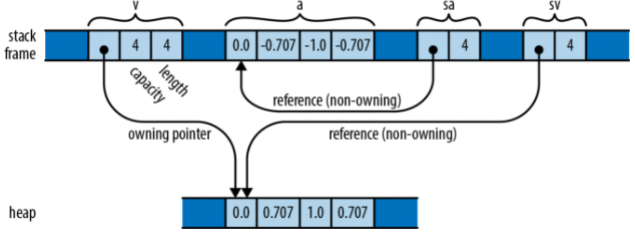

# 3-6. 配列・ベクトル・スライス
Rust にはメモリ上の値のシーケンスを表現するのに3種類の型が用意されています．

- ```[T; N]``` 型は，各要素の型が ```T``` で長さが ```N``` の配列を表します．配列のサイズはコンパイル時に決定される定数で，型の一部となります．そのため，要素を追加したり配列を縮小することはできません．
- ```Vec<T>``` はベクトルで，動的にメモリが確保される ```T``` 型の値の可変長シーケンスです．ベクトルの要素はヒープ領域に確保されるため，要素の追加や他のベクトルを結合したり，要素を削除したりなどなど，好きなようにサイズを変更できます．
- ```&[T]``` や ```&mut [T]``` 型は，それぞれ共有スライス (shared slice)，ミュータブルスライス (mutable slice) と呼ばれ，配列やベクトルなど他の値の一部を構成する，一連の要素への参照となっています．スライスは，その最初の要素へのポインタと，そのポイントからアクセスできる要素数のカウントと考えることができます．ミュータブルスライス ```&mut [T]``` は要素の読み取りと変更を可能にしますが，共有はできません．一方，共有スライス ```&[T]``` は複数のリーダ間でアクセスを共有しますが，要素の変更はできません．

上記のいずれの型であっても，ある値 ```v``` が与えられた時，```v.len()``` はその要素数を返し，```v[i]``` は $i$ 番目の要素を参照します．
最初の要素は ```v[0]```，最後の要素は ```v[v.len() - 1]``` で取得できます．
Rust は常に ```i``` がこの範囲にあることをチェックし，この条件を満たさない場合にはパニックとなります．
あらゆるインデックスでパニックとなる場合には，```v``` の長さがゼロであると考えられます．
```i``` は必ず ```usize``` 型でなければなりません．

## 配列
配列を記述する方法にはいくつかあります．
最もシンプルな書き方は角括弧内に配列の値を書き連ねる方法です．

```rust
let lazy_caterer: [u32; 6] = [1, 2, 4, 7, 11, 16];
let taxonomy = ["Animalia", "Arthropoda", "Insecta"];

assert_eq!(lazy_caterer[3], 7);
assert_eq!(taxonomy.len(), 3);
```

ある同じ値で長い配列を作成する場合には，その値を ```V```，長さを ```N``` として，```[V; N]``` という形式で記述できます．
例えば，```[true; 10000]``` は全ての要素が ```true``` で，1万個の ```bool``` 型の要素を持つ配列です．

```rust
let mut sieve = [true; 10000];
for i in 2..100 {
    if sieve[i] {
        let mut j = i * i;
        while j < 10000 {
            sieve[j] = false;
            j += i;
        }
    }
}

assert!(sieve[211]);
assert!(!sieve[9876]);
```

この文法を用いて固定長のバッファを作成できます．
```[0u8; 1024]``` はゼロ埋めされた 1KB のバッファになります．
Rust には初期化されていない配列を表す表記はありません．
(一般に Rust は，初期化されていない値にアクセスできないことが保証されています．)

配列の長さは型の一部であり，コンパイル時に固定されます．
```n``` が変数であれば，```[true; n]``` は ```n``` 個の要素を持つ配列となります．
実行時に長さの変わる配列が必要な場合には，配列の代わりにベクトルを使います．

配列要素のイテレーションや検索，ソート，充填，フィルタリングなどを行う便利なメソッドは，配列ではなくスライス向けに用意されています．
しかし，これらのメソッドを探索するときに配列への参照をスライスへの参照に暗黙的に変換するので，配列から直接使うことができます．

```rust
let mut chaos = [3, 5, 4, 1, 2];
chaos.sort();
assert_eq!(chaos, [1, 2, 3, 4, 5]);
```

ここで， ```sort``` メソッドは実際にはスライスに対して定義されていますが，オペランドを参照で受け取るため，Rust は暗黙のうちに配列全体を参照する ```&mut [i32]``` スライスを生成し、それを ```sort``` に渡して操作しています．
実は，先ほど紹介した ```len``` メソッドもスライスメソッドなのです．

## ベクトル
ベクトル ```Vec<T>``` は ```T``` 型の要素を持ち，ヒープ領域に確保される可変長の配列です．
ベクトルを生成する方法はいくつかあります．
最も簡単な方法は ```vec!``` マクロを使う方法で，配列の定義と非常に似た文法でベクトルを記述できます．

```rust
let mut primes = vec![2, 3, 5, 7];
assert_eq!(primes.iter().product::<i32>(), 210);
```

もちろん，ベクトルなので動的に要素を追加できます．

```rust
primes.push(11);
primes.push(13);
assert_eq!(primes.iter().product::<i32>(), 30030);
```

また，配列の場合と同様の文法で，指定された値で初期化したベクトルを作成することもできます．

```rust
fn new_pixel_buffer(rows: usize, cols: usize) -> Vec<u8> {
    vec![0; rows * cols]
}
```

```vec!``` マクロは ```Vec::new``` で新しい空のベクトルを作成し，要素をプッシュするのと等価です．

```rust
let mut pal = Vec::new();
pal.push("step");
pal.push("on");
pal.push("no");
pal.push("pets");
assert_eq!(pal, vec!["step", "on", "no", "pets"]);
```

さらに，イテレータを使ってベクトルを作成することもできます．

```rust
let v: Vec<i32> = (0..5).collect();
assert_eq!(v, [0, 1, 2, 3, 4]);
```

上記のように，```collect``` を使う際には方を明記する必要があります．
これは，コレクションにはベクトル以外にも多くの種類があるためで，```v``` の型を明記することでその曖昧さを回避しています．

配列と同様，ベクトルでもスライスのメソッドを使うことができます．

```rust
// A palindrome!
let mut palindrome = vec!["a man", "a plan", "a canal", "panama"];
palindrome.reverse();
// Reasonable yet disappointing:
assert_eq!(palindrome, vec!["panama", "a canal", "a plan", "a man"]);
```

ここでも，```reverse``` メソッドは実際にはスライス向けに定義されており，```&mut [&str]``` スライスをベクトルから作成してメソッドを実行しています．

```Vec``` は Rust にとって重要な型で，動的にサイズを変更できるリストとして多用されます．
そのため，新しくベクトルを構築したり，拡張するメソッドが数多く用意されています．
これについては第16章で扱います．

```Vec<T>``` は3つの値で構成されます．

- ```Vec<T>``` によって作成され所有される，ヒープ領域に確保された要素を格納するバッファへのポインタ
- バッファに格納できる要素数 (容量)
- 現在のベクトルに含まれる値の数 (長さ)

バッファの上限を超えて要素を追加しようとすると，

1. より大きなバッファを確保し
2. 現在の要素を新しいバッファにコピーし
3. ベクトルのポインタと容量を更新して
4. 古いバッファを解放する

という処理が行われます．

前もってベクトルに必要な要素数がわかっている場合には，```Vec::new``` の代わりに ```Vec::with_capacity``` を使えば，最初から全ての要素を格納できるだけのバッファを持ったベクトルを作成できます．
これによって，要素の追加に伴うメモリの再確保が発生しなくなります．
```vec!``` マクロでも，ベクトルの持つ要素数がわかっているので，同じような仕組みを使っています．
ただし，これはベクトルの初期サイズに限ったもので，予想の数を超過したときには通常通り容量の拡張が発生します．

多くのライブラリの関数で ```Vec::new``` の代わりに ```Vec::with_capacity``` を使える場面があります．
例えば，```collect``` を使うとき，```0..5``` というイテレータは予め5つの値を返すことがわかるので，予めメモリを確保しておくという方法を取ることができます．
これについては第15章で見ていきます．

```len``` メソッドが現在の要素数を返すように，```capacity``` メソッドは再確保なしに保持できる要素数を返します．

```rust
let mut v = Vec::with_capacity(2);
assert_eq!(v.len(), 0);
assert_eq!(v.capacity(), 2);

v.push(1);
v.push(2);
assert_eq!(v.len(), 2);
assert_eq!(v.capacity(), 2);

v.push(3);
assert_eq!(v.len(), 3);
// Typically prints "capacity is now 4":
println!("capacity is now {}", v.capacity());
```

最後の行の ```v.capacity()``` は4になるとは限りませんが，3つの値が含まれているので最低でも3以上になります．

ベクトルの任意の位置に要素を挿入したり削除したりできます．
ただし，影響のある全ての要素を前後にシフトする処理が必要となるため，ベクトルが長いと処理が遅くなります．

```rust
let mut v = vec![10, 20, 30, 40, 50];

// Make the element at index 3 be 35.
v.insert(3, 35);
assert_eq!(v, [10, 20, 30, 35, 40, 50]);

// Remove the element at index 1.
v.remove(1);
assert_eq!(v, [10, 30, 35, 40, 50]);
```

```pop``` メソッドは最後のようを削除してその値を返します．
より正確には，```Vec<T>``` からのポップ処理は ```Options<T>``` を返します．
ベクトルが既に空なら ```None``` を返し，最後の要素が ```v``` ならば ```Some(v)``` を返します．

```rust
let mut v = vec!["Snow Puff", "Glass Gem"];
assert_eq!(v.pop(), Some("Glass Gem"));
assert_eq!(v.pop(), Some("Snow Puff"));
assert_eq!(v.pop(), None);
```

```for``` ループでベクトルの要素を繰り返し取り出すことができます．

```rust
// Get our command-line arguments as a vector of Strings.
let languages: Vec<String> = std::env::args().skip(1).collect();
for l in languages {
    println!("{}: {}", l,
             if l.len() % 2 == 0 {
                 "functional"
             } else {
                 "imperative"
             });
}
```

上記のプログラムを実行すると次のようになります．

```bash
$ cargo run Lisp Scheme C C++ Fortran
   Compiling proglangs v0.1.0 (/Users/iinuma/programming_languages/rust/ch03/proglangs)
    Finished dev [unoptimized + debuginfo] target(s) in 0.18s
     Running `target/debug/proglangs Lisp Scheme C C++ Fortran`
Lisp: functional
Scheme: functional
C: imperative
C++: imperative
Fortran: imperative
```

最終的に関数型言語の定義を満たします．

基礎的な役割を担っている一方で，```Vec``` 型は Rust の組み込み型ではなく通常の型として定義されています．
このような型を定義する方法は第22章で扱います．

## スライス
長さを指定せず ```[T]``` で書き表されるスライス (slice) は配列，あるいはベクトルの一部です．
スライスはどのような長さも取れるので，直接変数に代入したり関数の引数に渡したりできません．
スライスは常に参照によって渡されます．
スライスへの参照は，先頭要素へのポインタと要素数から構成されます．

次のコードを実行することを考えてみましょう．

```rust
let v: Vec<f64> = vec![0.0,  0.707,  1.0,  0.707];
let a: [f64; 4] =     [0.0, -0.707, -1.0, -0.707];

let sv: &[f64] = &v;
let sa: &[f64] = &a;
```

最後の2行では，```&Vec<f64>``` の参照と データを直接指し示すスライスへの ```&[f64; 4]``` の参照を自動的に変換しています．
メモリの構成は次のようになっています． 

<div align="center"></div>

通常の参照は単一の値への非所有ポインタですが，スライスへの参照はメモリ内の連続した値の範囲への非所有ポインタとなります．
そのため，スライス参照は配列やベクトルを操作する関数を書く場合に適しています．
例えば，1行に1つずつスライスされた数値を表示する関数を以下に示します．

```rust
fn print(n: &[f64]) {
    for elt in n {
        println!("{}", elt);
    }
}

print(&a);  // works on arrays
print(&v);  // works on vectors
```

この関数はスライス参照を引数に取るので，配列にもベクトルにも適用できます．
実際に，要素のソートや順番の入れ替えを行う ```sort``` や ```reverse``` メソッドは，ベクトルや配列に属しているように見えますが，スライス型 ```[T]``` で定義されています．

インデックスを指定して，配列やベクトルのスライスへの参照を取得したり，既存のスライスのスライスを取得したりできます．

```rust
print(&v[0..2]);    // print the first two elements of v
print(&a[2..]);     // print elements of a starting with a[2]
print(&sv[1..3]);   // print v[1] and v[2]
```

通常の配列へのアクセスと同様，インデックスが有効であることがチェックされます．
データの終端を超えるスライスを借用しようとするとパニックになります．

スライスはほとんどの場合，参照の後ろに現れるため，```&[T]``` や ```&str``` のような型を単に「スライス」と呼ぶことが多く，より一般的な概念に対して短い名前を使用しています．
