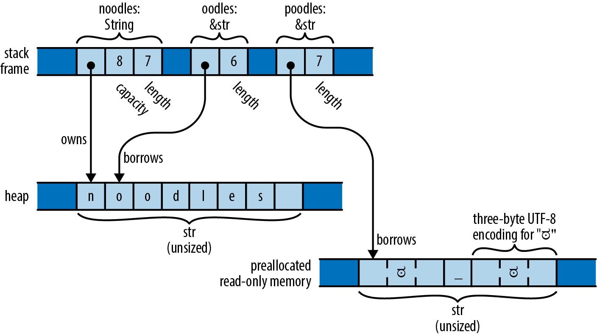

# 3-7. 文字列型
C++ に詳しいプログラマならば，C++ には2種類の文字列型があることを知っていると思います．
文字列リテラルはポインタ型 ```const char *``` を持ちます．
また，標準ライブラリでは，実行時に動的に文字列を作成できる ```std::string``` クラスが用意されています．

Rust でも似たような設計がなされています．
本章では，文字列リテラルの記述方法を示し，Rust の持つ2種類の文字列型を紹介します．
文字列やテキスト操作については第17章で扱います．

## 文字列リテラル
文字列リテラル (string literal) はダブルクォーテーションで囲むことで表します．
```char``` リテラルと同様，バックスラッシュによるエスケープシーケンスが使われます．

```rust
let speech = "\"Ouch!\" said the well.\n";
```

```char``` リテラルとは異なり，文字列リテラルではシングルクォーテーションをエスケープする必要はありません．
文字列は複数行にわたって記述できます．

```rust
println!("In the room the women come and go,
    Singing of Mount Abora");
```

文字列リテラルに含まれる改行文字は文字列に含まれるので，出力にも改行文字が表示されます．
また，2行目の行頭の空白についても同様です．
行の最後にバックスラッシュを挿入すると，改行文字と次の行の先頭にある空白文字は削除されます．

```rust
println!("It was a bright, cold day in April, and \
    there were four of us—\
    more or less.");
```

このコードはテキストを1行で表示します．
バックスラッシュの前に空白が挿入されているので，"and" と "there" の間には空白が表示されますが，
"us-" と "more" の間には空白は表示されません．

正規表現や Windows のパスのような場合には，文字列内の全てのバックスラッシュをエスケープする必要があり，非常に面倒です．
このような場合，Rust は生文字列 (raw string) を提供しています．
生文字列は小文字の ```r``` でタグづけされています．
生文字列内の全てのバックスラッシュと空白文字は，文字列にそのまま含まれます．
エスケープシーケンスは認識されません．

```rust
let default_win_install_path = r"C:\Program Files\Gorillas";
let pattern = Regex::new(r"\d+(\.\d+)*");
```

単にバックスラッシュをつけただけでは，生文字列でもダブルクォーテーションを表示することができません．
しかし，これにも解決策が用意されています．
生文字列の最初と最後にポンド記号 ```###``` をつけることで表示できます．

```rust
println!(r###"
    This raw string started with 'r###"'.
    Therefore it does not end until we reach a quote mark ('"')
    followed immediately by three pound signs ('###'):
"###);
```

生文字列の最後がはっきりわかるように，必要な分だけポンド記号の数を増やしたり減らしたりできます．

## バイト文字列
```b``` 接頭辞で始まる文字列リテラルをバイト文字列 (byte string) と呼びます．
このような文字列はユニコードのテキストではなく，```u8``` 型の値のスライス，すなわちバイトです．

```rust
let method = b"GET";
assert_eq!(method, &[b'G', b'E', b'T']);
```

```method``` の型は ```&[u8; 3]``` で，3バイトの配列への参照を表しています．
これから説明する文字列のメソッドは何も持っていません．
最も文字列らしいのは，これを書くのに使った構文です．

バイト文字列でも，複数行に記述したり，エスケープシーケンスやバックスラッシュによる行の結合を使ったりと，他の文字列文法を使うことができます．
生バイト文字列は　```br"``` で始まります．

バイト列には，任意のユニコード文字を含めることはできません．
ASCII と ```\xHH``` のエスケープシーケンスで対処する必要があります．

## メモリ上における文字列
Rust の文字列はユニコード文字のシーケンスですが，```char``` の配列としてメモリに格納されているわけではありません．
その代わり，変数単位でエンコードを行う UTF-8 を使って保存されています．
文字列中の ASCII 文字は1バイトで，それ以外の文字は複数のバイトを使って表されます．
次のような ```String``` や ```&str``` の値は，下の図のように生成されます．

```rust
let noodles = "noodles".to_string();
let oodles = &noodles[1..];
let poodles = "ಠ_ಠ";
```

<div align="center"></div>

```String``` はサイズ可変の UTF-8 テキストを保持するバッファを持ちます．
バッファはヒープ領域に確保されるので，必要や要求に応じてバッファのサイズを変えられます．
上記の例で，```noodles``` は8バイトのバッファを持つ ```String``` で，その内7文字分が使われています．
```String``` は整形された UTF-8 を保持することが保証された ```Vec<u8>``` と考えることができ，実際、```String``` はそのように実装されています．

```&str``` ("stir" または "string slice" と呼びます) は，他の人が所有するUTF-8テキストを参照することで，テキストを「借用」します．
上記の例で，```oodles``` は ```noodles``` に属するテキストの最後の6バイトを参照する ```&str``` なので，"oodles" というテキストになります．
他のスライス参照と同様に ```&str``` も，実際のデータが置かれているアドレスと，その長さを持ちます．
つまり、```&str``` は整形済み UTF-8 を保持することが保証された ```&[u8]``` に過ぎないと考えることができます．

文字列リテラルは事前に割り当てられたテキストを指す ```&str``` で，通常はプログラムのマシンコードと一緒に読み取り専用メモリに格納されます．
先ほどの例では，```poodles``` は文字列リテラルで，プログラムの実行開始時に作成され，プログラムが終了するまで7バイトを指しています．

```String``` と ```&str``` の ```len()``` メソッドはその長さを返しますが，文字数ではなくバイトで返します．

```rust
assert_eq!("ಠ_ಠ".len(), 7);
assert_eq!("ಠ_ಠ".chars().count(), 3);
```

```&str``` を変更することはできません．

```rust
let mut s = "hello";
s[0] = 'c';    // error: `&str` cannot be modified, and other reasons
s.push('\n');  // error: no method named `push` found for reference `&str`
```

実行時に新しく文字列を作成する場合には，```String``` を使います．

```&mut str``` は存在しますが，あまり使い勝手は良くありません．
これは，UTF-8 に対するほぼ全ての操作は，その全体のバイト長を変更可能で，スライスはその参照先を再割り当てできないからです．
実際，```&mut str``` で利用可能な処理は ```make_ascii_uppercase``` と ```make_ascii_lowercase``` だけで，これらはその場でテキストを変更し，定義上シングルバイト文字にしか影響を与えません．

## 文字列
```&str``` は，あるデータへのファットポインタである点において ```&[T]``` にとてもよく似ています．
```String``` は ```Vec<T>``` に近い性質を持ちます．

|  | Vec<T> | String |
| :-- | :--: | :--: |
| バッファの自動解放 | Yes | Yes |
| 可変サイズ | Yes | Yes |
| ```::new()``` や ```::with_capacity()``` が使える | Yes | Yes |
| ```reverse()``` や ```capacity()``` メソッドがある | Yes | Yes |
| ```push()``` や ```pop()``` メソッドがある | Yes | Yes |
| ```v[start..stop]``` で範囲指定できる | ```&T``` を返す | ```&str``` を返す |
| 自動変換 | ```&Vec<T>``` から ```&[T]``` | ```&String``` から ```&str``` |
| メソッドの継承 | ```&[T]``` から | ```&str``` から |

```Vec``` のように ```String``` も他の ```String``` とは共有されないバッファをヒープ領域に確保しています．
```String``` の変数がスコープから外れると，```String``` がいどうされない限り，バッファは自動的に解放されます．

```String``` の作成にはいくつか方法があります．

- ```to_string()``` メソッドは ```&str``` を ```String``` に変換します．
  ```rust
  let error_message = "too many pets".to_string();
  ```
  ```to_owned()``` メソッドも同じように使います．他の型でも使うことができ，これについては第13章で扱います．

- ```format!()``` マクロは標準出力に書き出す代わりに ```String``` を返すことと，最後に改行が自動挿入されないことを除いて ```println!()``` 似た動作をします．
  ```rust
  assert_eq!(format!("{}°{:02}′{:02}″N", 24, 5, 23), "24°05′23″N".to_string());
  ```

- 文字列の配列やスライス，ベクトルから ```concat()``` や ```join(sep)``` を使って，新しい ```String``` を形成します．
  ```rust
  let bits = vec!["veni", "vidi", "vici"];
  assert_eq!(bits.concat(), "venividivici");
  assert_eq!(bits.join(", "), "veni, vidi, vici");
  ```

```&str``` と ```String``` のどちらを使うかは迷いどころです．
これについては第5章で詳しく扱います．
今のところ，```&str``` は文字列リテラル (実行ファイルに格納されている) であろうと ```String``` (実行時に割り当てられ解放される) であろうと，あらゆる文字列のあらゆるスライスを参照できることを指摘するだけで十分でしょう．
つまり，```&str``` は呼び出し側がどちらの種類の文字列を渡すことも許される関数の引数に適しています．

## 文字列を使う
文字列は ```==``` と ```!=``` の演算子をサポートしています．
メモリ上のどこを指しているかに関わらず，2つの文字列が同じ文字を同じ順に含んでいる場合に等しくなります．

```rust
assert!("ONE".to_lowercase() == "one");
```

ドキュメントの "str (primitive type)" と "std::str" の項に書かれているメソッドや関数に加えて，```<```，```<=```，```>=```，```>``` の比較演算子もサポートしています．

```rust
assert!("peanut".contains("nut"));
assert_eq!("ಠ_ಠ".replace("ಠ", "■"), "■_■");
assert_eq!("    clean\n".trim(), "clean");

for word in "veni, vidi, vici".split(", ") {
    assert!(word.starts_with("v"));
}
```

ユニコードの性質上，```char``` と ```char``` の比較は必ずしも期待した通りにはならないことに留意しなければなりません．
例えば，```th\u{e9}``` と ```the\u{301}``` はどちらも同じくフランス語で tea という意味の "thé" を表す有効なユニコードです．
ユニコードでは同じように表示したり処理したりするように規定されていますが，Rust では全く異なる文字列として扱われます．
同様に，Rust の ```<``` などの順序付け演算子は，文字コードのポイント値に基づいた単純な字句順序を使用します．
この順序は，ユーザーの言語や文化でテキストに使われる順序と似ていることがあるだけです．
この問題については第17章で説明します．

## その他の文字列に似た型
Rust では文字列が有効な UTF-8 であることが保証されています．
しばしば，プログラムでは有効ではないユニコード文字列を扱える必要があります．
これは通常，Rustのプログラムが，そのようなルールを強制しない他のシステムと相互運用する必要がある場合に起こります．
例えば，ほとんどのオペレーティング・システムでは，有効なユニコードでないファイル名のファイルを簡単に作成することができます．
このようなファイル名に出会ったとき，Rust プログラムはどのように対処すればよいのでしょうか？

Rust ではいくつかの文字列に似た型を使って解決します．

- ユニコードのテキストでは ```String``` や ```&str``` を使うようにする．
- ファイル名を扱う場合には ```std::path::PathBuf``` や ```&Path``` を使うようにする
- UTF-8 でエンコードされていないバイナリデータには，```Vec<u8>``` や ```&[u8]``` を使うようにする
- OS によって提供される環境変数名やコマンドライン引数を扱う場合には，```OsString``` や ```&OsStr``` を使うようにする
- Null 終端文字列を用いた C ライブラリによる補完を用いる場合には，```std::ffi::CString``` や ```&CStr``` を使うようにする
