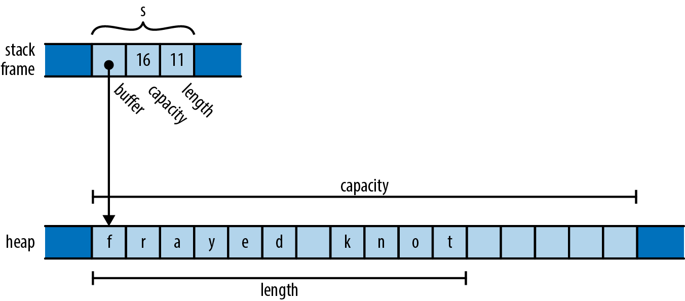
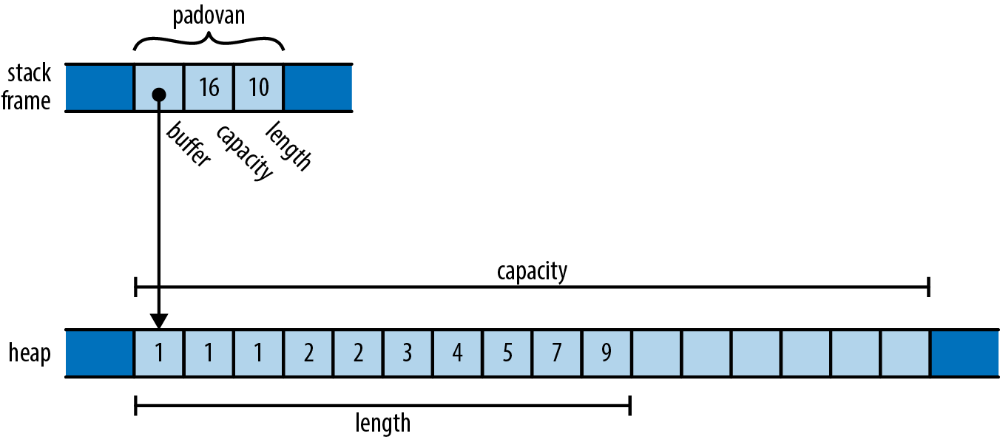
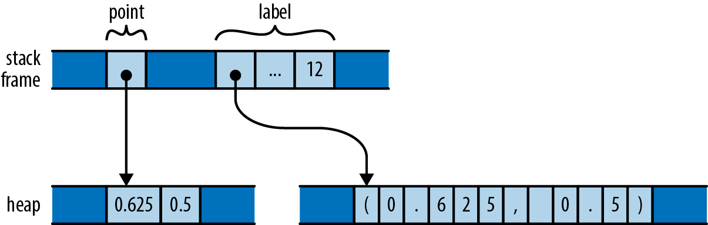
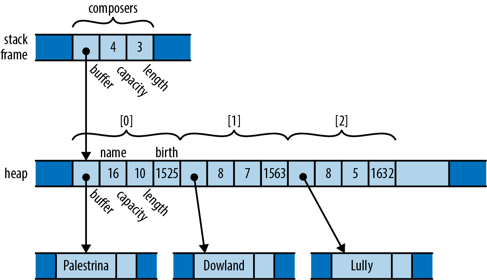

# 4-1. 所有権 (Ownership)
C/C++ のコードを読んだことがあれば，あるクラスのインスタンスが，それを指し示す他のあるオブジェクトを「所有している」というコメントを見たことがあるかも知れません．
これは一般的に，所有しているオブジェクトが所有されているオビジェクトをいつ解放するかを決められるということを意味します．
所有者が破壊されれば，その所有していたオブジェクトも破壊されます．

例えば，次のような C++ のコードを考えてみましょう．

```cpp
std::string s = "frayed knot";
```

```s``` は通常，次のようにメモリに格納されます．

<div align="center"></div>

ここで，実際の ```std::string``` オブジェクト自体は，ヒープ領域に確保されたバッファへのポインタ，バッファ全体の容量 (すなわち，より大きなバッファを確保する前にどれだけテキストを格納できるか)，現時点で保持しているテキストの長さという3つの要素で構成されています．
これらは ```std::string``` クラスのプライベートなフィールドで，ユーザからはアクセスできません．

```std::string``` はそのバッファを所有しています．
プログラムが文字列を破壊すると，文字列のデストラクタがバッファを解放します．
以前は，いくつかの C++ ライブラリが複数の ```std::string``` 値で単一のバッファを共有し，バッファをいつ解放するかを決める参照カウンタを使っていました．
より新しい C++ のバージョンでは，このような表現が事実上排除されており，最新のC++ライブラリはすべてここに示す方法を採用しています．

このような状況では，他のコードが所有するメモリへの一時的なポインタを作成することは問題ありませんが，所有者が所有するオブジェクトの破壊を決定する前に，そのポインタがなくなっていることを確認するのはそのコードの責任であると，一般には理解されています．
```std::string``` のバッファに存在する文字へのポインタを作成することはできますが，文字列が破壊されるとポインタは無効になり，そのポインタを使わないようにするのはプログラマの責任となります．
所有者の寿命は所有者が決定し，他のオブジェクトはその決定を尊重しなければなりません．

ここでは，```std::string``` を例に C++ における所有権について説明しました．
これは標準ライブラリ外一般的に従っている慣習で，言語としては同じ慣習を守るように推奨していますが，独自の型をどう設計するかは，究極的にはプログラマ次第です．

しかし，Rust では所有権の概念が言語自体に組み込まれており，コンパイル次のチェックで強制されます．
全ての値に単一の所有者が存在し，その寿命を決定します．
所有者が解放 (Rust の用語ではドロップ (drop)) されると，所有されている値もドロップされます．
これらのルールはコードを調査するだけで与えられた値のラ寿命を簡単に発見でき，システム言語が提供すべき寿命の制御を可能にすることを目的としています．

変数はその値を所有します．
制御が変数の宣言されたブロックから外れると，変数はドロップされるので，その値もドロップされます．

```rust
fn print_padovan() {
    let mut padovan = vec![1,1,1];  // allocated here
    for i in 3..10 {
        let next = padovan[i-3] + padovan[i-2];
        padovan.push(next);
    }
    println!("P(1..10) = {:?}", padovan);
}
```

変数 ```padovan``` の型は32ビット整数のベクトル ```Vec<i32>``` です．
メモリ上で ```padovan``` の最終的な値は次の図のようになります．

<div align="center"></div>

これは，バッファに格納されている要素が文字ではなく32ビットの値であることを除いて，先ほど示した C++ の ```std::string``` と非常に良く似ています．
ここで，```padovan``` のポインタと容量，長さは ```print_padovan``` 関数のスタックフレームに直接保持されており，ヒープ領域にはベクトルのバッファのみが確保されていることに注意して下さい．

先ほどの文字列 ```s``` と同様，ベクトルはバッファの保持する要素を所有しています．
関数の最後で変数 ```padovan``` がスコープから外れると，プログラムはベクトルをドロップします．
また，ベクトルはそのバッファも所有しているので，バッファもそれに従います．

```Box``` 型は別の所有権の例として挙げられます．
```Box<T>``` は ```T``` 型の値を格納したヒープ領域へのポインタです．
```Box::new(v)``` を呼び出すとヒープ領域にメモリが確保され，値 ```v``` がそこに移されて，そのヒープ領域を指すポインタが返されます．
```Box``` はその指し示す空間を所有しているので，```Box``` がドロップされると，その空間もドロップされます．

例えば，タプルは次のようにヒープ領域に割り当てられます．

```rust
{
    let point = Box::new((0.625, 0.5));  // point allocated here
    let label = format!("{:?}", point);  // label allocated here
    assert_eq!(label, "(0.625, 0.5)");
}                                        // both dropped here
```

```Box::new``` が呼び出されると，```f64``` 型の値を持つタプルがヒープ領域に確保され，引数の ```(0.625, 0.5)``` がその領域に移動されて，ポインタが返されます．
制御が ```assert_eq!``` の呼び出しに到達した時点でのスタックフレームは，次の図のようになります．

<div align="center"></div>

スタックフレーム自体は変数 ```point``` と ```label``` を保持しており，それぞれ所有しているヒープ上の確保領域を参照しています．
これらがドロップされると，それに伴って所有している確保領域も解放されます．

変数がその値を所有するように，構造体はそのフィールドを，タプルや配列，ベクトルはその要素を所有しています．

```rust
struct Person { name: String, birth: i32 }

let mut composers = Vec::new();
composers.push(Person { name: "Palestrina".to_string(), birth: 1525 });
composers.push(Person { name: "Dowland".to_string(), birth: 1563 });
composers.push(Person { name: "Lully".to_string(), birth: 1632 });
for composer in &composers {
    println!("{}, born {}", composer.name, composer.birth);
}
```

ここで，```composers``` は ```Vec<Person>``` という構造体のベクトルで，それぞれ文字列と数値を保持しています．
```composers``` の最終的な値は次のようになります．

<div align="center"></div>

ここには所有権の関係がたくさん存在しますが，それぞれは非常に簡単です．

- ```composers``` はベクトルを所有する
- ベクトルはその要素を所有する (各要素は ```Person``` 構造体)
- 各構造体はそのフィールドを所有する
- 文字列はそのテキストを所有する

```composers``` の宣言されたスコープから外れると，プログラムはその値をドロップし，そこに紐づいた全てのオブジェクトがドロップされます．
```HashMap``` や ```BTreeSet``` のような画像のコレクション類でも同じように処理されます．

ここで一歩下がって，これまで紹介した所有関係の結果を考えてみましょう．
全ての値で所有者は1人なので，ドロップするタイミングを決めるのが簡単になります．
ベクトル ```composers``` が全ての要素を所有しているように，単一の値が複数の値を所有している可能性があります．
また，```composers``` の各要素が文字列を所有し，文字列がテキストを所有しているように，所有されている値が他の値を所有していることもあります．

所有者とそれに所有される値は，所有者を親，所有している値を子とする木構造となっています．
そして，各木の究極的なルートは変数であり，その変数がスコープから外れると，木全体がそれに従います．
このような所有権の木は ```composers``` の図の中にもみられますが，探索着のデータ構造や DOM から生成される HTML ドキュメントの木構造とは異なります．
というより，木よりも複雑な構造になるような結合を禁止するという Rust の単一所有者のルールに従って，混合した型から木を構築しているのです．
プログラム中の全ての値はある変数をルートとする木のメンバです．

Rust のプログラムではしばしば，C/C++ で ```free``` や ```delete``` を使うような明示的な値のドロップが行われません．
Rust で値をドロップするには，何らかの方法で所有権の木構造からその値をドロップしてやります．
その方法としては，変数のスコープから外れるか，あるいはベクトルから要素を削除したり，それに類する操作をしたりします．
その時，Rust は値が正しくドロップされることを確約しています．

ある意味では，Rust は他の言語に比べてパワフルではないかも知れません．
Rust 以外の実践的なプログラミング言語では，プログラマが適していると思えば，互いに指し示し合うオブジェクトを任意のグラフ構造として構築できます．
しかし，Rust がパワフルではないからこそ，プログラムに対して行う解析はより強力なものとなるのです．
Rust の安全性の保証は，まさにコードの中で遭遇する可能性のある関係が扱いやすいからこそ実現できているのです．
これこそが Rust の「過激な賭け」でした，
実際に Rust では，問題を解く方法には十分すぎるほどの柔軟性があり，少なくともいくつかの完璧な解決策は，言語が課す制限の範囲内に収まることを保証することが主張されています．

とはいえ，これまで説明してきたような所有権の概念は，まだあまりに硬直的なので，使い勝手が悪くなっています．
Rust はこの単純な考え方をいくつかの方法で拡張しています．

- 値の所有者を移動することが可能．これによって木を構築し，再配置したり破壊したりできる．
- 指数や浮動小数点数，文字などの非常に単純な型は，所有権のルールから外されており，```Copy``` 型と呼ばれる．
- 標準ライブラリでは参照カウント型ポインタの ```Rc``` と ```Arc``` を提供している．これによって，いくつかの制限のもと，値が複数の所有者を持つことを可能にしている．
- 値への「参照を借りる」ことができる．参照は所有権のないポインタで，その寿命は限られている．

これらの戦略によって，Rust の公約を守りながら，所有権モデルの柔軟性を確保しています．
次章でリファレンスを取り上げながら，それぞれを順次解説していきます．
