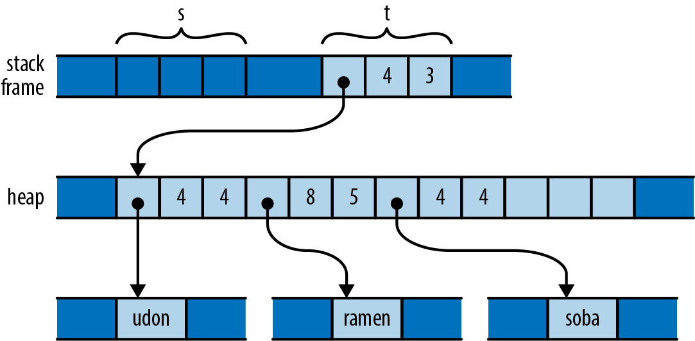

# 移動 (Move)
Rust のほとんどの型は，変数に値を代入したり，変数を関数を渡したり，返り値として関数から返すような操作では値のコピーを作成せず，「移動」させます．
移動元の変数は値の所有権を放棄して移動先に渡し，初期化前の状態になります．
その後は，渡した先の変数が値の寿命を制御します．
Rust のプログラムでは，1度に1つの値，1回の移動で複雑な構造体を構築したり破棄したりします．

Rust がこのような基本的な操作の意味を変えることに驚かれるかもしれません．
確かに代入というのは，この時点でかなり釘付けになるはずのものです．
しかし，様々な言語がどのように代入を扱ってきたかをよく見てみると，実に大きな違いがあることに気がつくでしょう．
また，比較することで Rust の選択の意味や結果もわかりやすくなります．

次のような Python のコードを考えてみましょう．

```python
s = ['udon', 'ramen', 'soba']
t = s
u = s
```

それぞれの Python オブジェクトは参照カウントを持ち，現在そのオブジェクトを参照している値の数を追跡しています．
従って，```s``` に代入された後，プログラムの状態は次の図のようになっています．
(いくつかのフィールドは省略しています．)

<div align="center"></div>

```s``` だけがリストを指しているので，リストの参照カウントは1となります．
また，リストが文字列を指し示す唯一のオブジェクトなので，各文字列の参照カウントも1となります．

それでは，```t``` や ```u``` への代入が実行されると何が起きるのでしょうか？
Python の実装では，代入元と同じオブジェクトを指し示すポインタが作成され，オブジェクトの参照カウントが加算されるだけです．
最終的な状態を以下に示します．

<div align="center"></div>

Python は ```s``` から　```t``` と ```u``` にポインタをコピーして，リストの参照カウントを3に更新します．
Python における代入処理は軽量ですが，オブジェクトへの新しい参照を作成するので，値を解放するタイミングを図るために参照カウントを管理する必要があります．

次に，同じような C++ のコードを見てみましょう．

```cpp
using namespace std;
vector<string> s = { "udon", "ramen", "soba" };
vector<string> t = s;
vector<string> u = s;
```

```s``` のオリジナルの値は次の図のように格納されています．

<div align="center"></div>

```s``` を ```t``` や ```u``` に代入した時，何が起きているのでしょうか？
```std::vector``` の代入によって C++ のベクトルのコピーが生成されます．
```std::string``` も同じような動作をします．
従って，このコードの最後まで到達した時点では，次の図のように，3つのベクトルと9つの文字列が確保されています．

<div align="center"></div>

関係する値にもよりますが，C++ における代入は無制限にメモリとプロセッサ時間を消費します．
しかし，確保されたメモリを開放する対みイングの決定は簡単になるという利点があります．
変数がスコープから外れれば，確保された全ての領域が自動的に解放されます．

ある意味，C++ と Python では真逆のトレードオフを選択したと言えます．
Python は代入を軽量に行えるようにする代わり，参照カウント (と一般的なケースではガベージコレクション) を行う必要があります．
一方，C++ は全てのメモリ領域の所有権を明確にして，オブジェクトの深いコピー (deep copy) を作成することで代入を実装しています．
C++ プログラマーは，この選択にはあまり乗り気ではありません．
深いコピーは高価ですし，通常はより実用的な代替手段があります．

それでは，同じ内容のコードを Rust で動かすとどうなるのでしょうか？

```rust
let s = vec!["udon".to_string(), "ramen".to_string(), "soba".to_string()];
let t = s;
let u = s;
```

C/C++ のように Rust では，```"udon"``` のような文字列リテラルは，何もなければ読み込み専用メモリに配置されます．
C++ や Python の例と比較しやすいように，```to_string``` を呼び出して，```String``` の値をヒープ領域に確保します．
Rust と C++ はベクトルと文字列で同じような表現を使うので，```s``` が初期化された直後の状態は，次の図のように C++ とよく似たものになります．

<div align="center"></div>

しかし，思い出してください．
Rust では，ほとんどの型の代入は値を移動元から移動先に「移動」し，移動元は未初期化の状態になります．
従って，```t``` の初期化後には，メモリは次の図に示すような状態になっています．

<div align="center"></div>

ここでは何が起きているのでしょうか？
```let t = s;``` で初期化された時に，3つのベクトルのヘッダフィールドが ```s``` から ```t``` に移動し，```t``` がベクトルを所有することになります．
ベクトルの要素は移動しませんし，文字列についても同様です．
所有者は変わっていますが，所有者は1人のまま変わりません．
参照カウントの調整は起こりませんし，コンパイラは ```s``` を未初期化の状態とみなします．

それでは，```let u = s;``` では何が起きるのでしょうか？
ここでは，初期化されていない値 ```s``` が ```u``` に代入されます．
Rust では初期化されていない値の使用を禁止しているので，次のようなエラーを吐いてコンパイルが中断されます．

```bash
error: use of moved value: `s`
  |
7 |     let s = vec!["udon".to_string(), "ramen".to_string(), "soba".to_string()];
  |         - move occurs because `s` has type `Vec<String>`,
  |           which does not implement the `Copy` trait
8 |     let t = s;
  |             - value moved here
9 |     let u = s;
  |             ^ value used here after move
```

ここで，Rust が移動を行なった結果を考えてみましょう．
プログラムは単に3ワード分のベクトルのヘッダを別の場所に移動するだけなので，Python のように代入は軽量です．
しかし，C++ のように所有権は明確です．
プログラムはベクトルの要素や文字列の内容を解放するタイミングを図るのに，参照カウントやガベージコレクションは必要ありません．

これらのコピーが必要な時には，明示的にそれを示す必要があります．
もし，C++ で示した場合と同じよう状態で終了するようにしたいのであれば，それぞれの変数が独立に構造体のコピーを持つように，ベクトルとその要素の深いコピーを作成する ```clone``` メソッドを呼び出す必要があります．

```rust
let s = vec!["udon".to_string(), "ramen".to_string(), "soba".to_string()];
let t = s.clone();
let u = s.clone();
```

参照カウントポインタ型 (reference-counted pointer type) を使えば，Python の時に示した状態を再現できますが，詳しくは本節の後半で扱います．

##　移動を伴う他の操作
これまでの例では，```let``` 宣言で変数がスコープに入ったときに値を与えて初期化するケースを見てきました．
変数への代入は少し異なる動作をします．
初期化済みの変数に値を移動すると，以前の変数の値はドロップされます．

```rust
let mut s = "Govinda".to_string();
s = "Siddhartha".to_string(); // value "Govinda" dropped here
```

この例では，```s``` に文字列 ```"Siddhartha"``` が代入されると，それまで保持していた ```"Govinda"``` は最初にドロップされます．
しかし，次のコードを見てみましょう．

```rust
let mut s = "Govinda".to_string();
let t = s;
s = "Siddhartha".to_string(); // nothing is dropped here
```

この場合，```t``` は ```s``` から元々持っていた文字列の所有権を受け取っているので，```s``` に値が代入された時には初期化されていない状態になっています．
この場合，文字列はドロップされません．

この例では簡単のために初期化と代入を使ってきましたが，Rust は移動というセマンティクスを値を使うほとんどの場面で適用しています．
関数の引数に渡す時には関数のパラメータに所有権が移りますし，関数から値を返す時には呼び出し側に所有権が移ります．
タプルを作成すると，タプルに値の所有権が移動します．

前節で提示した例の中で実際に何が起こっているのかが，よりよく理解できたのではないでしょうか？
例えば，作曲家のベクトルを構成するとき，このように記述しました．

```rust
struct Person { name: String, birth: i32 }

let mut composers = Vec::new();
composers.push(Person { name: "Palestrina".to_string(), birth: 1525 });
```

このコードでは，初期化と代入以外にもいくつかの場所で移動が起こっています．

- 関数から値を返す  
  ```Vec::new()``` の呼び出しによって，新しいベクトルが構築され，ベクトルへのポインタではなくベクトル自体が返ってきます．その所有権は ```Vec::new``` から変数 ```composers``` に移ります．同様に，```to_string``` の呼び出しでも新しい ```String``` のインスタンスが返されます．
- 新しい値を構築する  
  新しい ```Person``` 構造体の ```name``` フィールドが ```to_string``` の返す値によって初期化されます．構造体が文字列から所有権を受け取ります．
- 関数に値を渡す  
  ポインタではなく ```Person``` 構造体全体が，ベクトルの```push``` メソッドに渡され，構造体の最後に移動します．ベクトルは ```Person``` から所有権を受け取り，間接的に ```name``` の ```String``` の所有者にもなります．

このような値の取り回しは，非効率的に感じるかもしれません．
しかし，次の2点を心に留めておいてください．
1つ目が，移動は常にヒープ領域のストレージではなく，適切な値に対して適用されるということです．
ベクトルと文字列の場合，適切な値は3単語のヘッダだけで，潜在的に大きな要素配列とテキストバッファはヒープ領域に置かれます．
2つ目が，Rust コンパイラのコード生成は，このような移動を「見抜く」のが得意です．
実際に，機械語コードはしばしば値を本来の場所に直接格納します．

## 移動と制御フロー
これまでに挙げた例の制御フローは全てとてもシンプルです．
それでは，もっと複雑のコードではどのように移動が行われるのでしょうか？
一般的な原則では，ある変数の値が移動された可能性があり，それ以降，確実に新しい値が与えられていない場合，その変数は初期化されていないものとみなされます．
例えば，```if``` 節の条件判定の後でも変数は値を保持しているので，```if``` 節の制御文でも，```else``` 節の制御文でも使えることになります．

```rust
let x = vec![10, 20, 30];
if c {
    f(x); // ... ok to move from x here
} else {
    g(x); // ... and ok to also move from x here
}
h(x); // bad: x is uninitialized here if either path uses it
```

同じような理由で，ループ内で変数から移動することは禁止されています．

```rust
let x = vec![10, 20, 30];
while f() {
    g(x); // bad: x would be moved in first iteration, uninitialized in second
}
```

つまり，次のイテレーションまでに新しい値を与える必要があります．

```rust
let mut x = vec![10, 20, 30];
while f() {
    g(x);           // move from x
    x = h();        // give x a fresh value
}
e(x);
```

## 移動とインデックス付きのコンテンツ
これまで，移動先に値の所有権を取られるので，移動元の変数は初期化されていない状態になると言ってきました．
しかし，全ての種類の値の所有者が初期化されていない状態になるわけではありません．
例として次のコードを見てみましょう．

```rust
// Build a vector of the strings "101", "102", ... "105"
let mut v = Vec::new();
for i in 101 .. 106 {
    v.push(i.to_string());
}

// Pull out random elements from the vector.
let third = v[2]; // error: Cannot move out of index of Vec
let fifth = v[4]; // here too
```

このコードを動かすためには，Rust がベクトルの3番目と5番目の要素が初期化されていない要素が初期化されていない状態になったことを記憶しておいて，ベクトルがドロップされるまでその情報を追跡する必要があります．
最も一般的な場合では，ベクトルのどの要素が生きていて，どれが初期化されていないのかを示すためにベクトルが余計な情報を保持しておく必要があります．
これは明らかに，システムプログラミングを行う言語としては正しくない動作です．
ベクトルはベクトルでなければなりません．
実際，Rust は先程のコードで次のようなエラーを吐きます．

```bash
error: cannot move out of index of `Vec<String>`
   |
14 |     let third = v[2];
   |                 ^^^^
   |                 |
   |                 move occurs because value has type `String`,
   |                 which does not implement the `Copy` trait
   |                 help: consider borrowing here: `&v[2]`
```

同様のエラーが ```fifth``` への移動でも発生します．
エラーメッセージでは，移動を伴わずに要素をアクセスしたければ参照を使うように提案しています．
これは，イバしばやりたいことと合致するかもしれません．
しかし，本当にベクトルから要素を取り出したい場合にはどうすればいいのでしょうか？
それには，型の制限を守りながら，それを実現する方法を探さねばなりません．
次に，3っと理の方法を示します．

```rust
// Build a vector of the strings "101", "102", ... "105"
let mut v = Vec::new();
for i in 101 .. 106 {
    v.push(i.to_string());
}

// 1. Pop a value off the end of the vector:
let fifth = v.pop().expect("vector empty!");
assert_eq!(fifth, "105");

// 2. Move a value out of a given index in the vector,
// and move the last element into its spot:
let second = v.swap_remove(1);
assert_eq!(second, "102");

// 3. Swap in another value for the one we're taking out:
let third = std::mem::replace(&mut v[2], "substitute".to_string());
assert_eq!(third, "103");

// Let's see what's left of our vector.
assert_eq!(v, vec!["101", "104", "substitute"]);
```

それぞれの方法は，いずれも要素をベクトルから移動していますが，その際，ベクトルを小さくしても十分な数の要素を残した状態で移動させます．

```Vec``` のようなコレクション型では一般的に，全ての要素をループで処理する方法が用意されています．

```rust
let v = vec!["liberté".to_string(),
             "égalité".to_string(),
             "fraternité".to_string()];

for mut s in v {
    s.push('!');
    println!("{}", s);
}
```

```for ... in v``` のようにベクトルをループに直接渡すと，```v``` からベクトルを取り出して，```v``` が初期化されていない状態になります．
```for``` ループの内部機構では，ベクトルの所有権を取得して，それを要素に分解します．
各イテレーションで，ループはそれぞれの要素を変数 ```s``` に移します．
```s``` が文字列を所有することになるので，ループ本体で表示する前に修正できるようになります．
ベクトル自体はもはやコードから見えないので，ループの途中で部分的に空になったベクトルを観察することはできません．

もし，コンパイラが追跡できない所有者から値を移動する必要が出てきた場合には，所有者が値を所有しているか否かを追跡できるような型に変えることを検討すると良いでしょう．
例えば，先程の例は次のように書き換えられます．

```rust
struct Person { name: Option<String>, birth: i32 }

let mut composers = Vec::new();
composers.push(Person { name: Some("Palestrina".to_string()), birth: 1525 });
```

このような記述はできません．

```rust
let first_name = composers[0].name;
```

先程示した "cannot move out of index" と同じエラーが表示されます．
しかし，```name``` フィールドを ```String``` から ```Option<String>``` に変えたおかげで，```None``` をフィールドの値として取れるようになります．
そのため，次のコードが動くようになります．

```rust
let first_name = std::mem::replace(&mut composers[0].name, None);
assert_eq!(first_name, Some("Palestrina".to_string()));
assert_eq!(composers[0].name, None);
```

```replace``` を呼び出すと，```composers[0].name``` の値が移動されて，```None``` で置き換えられます．
元の値の所有権は呼び出し元に渡されます．
実際，この方法で ```Option``` を使用することは，この型がこの目的のために ```take``` メソッドを提供するほど一般的です．
先の操作をもっと読みやすく書くと，次のようになります．

```rust
let first_name = composers[0].name.take();
```

```take``` の呼び出しは，先程の ```replace``` と同じ働きがあります．
