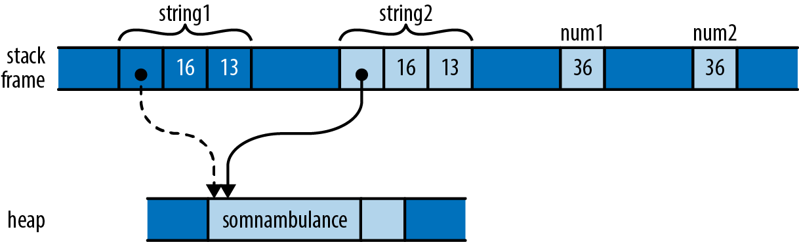

# 4-3. コピー型: 移動の例外
これまで紹介した例では，潜在的にメモリをの使用量が多く，コピーのコストが高いベクトルや文字列など，移動を伴う値を扱ってきました．
移動によって型の所有権が明確になり，代入を軽量に実現できました．
しかし，整数や文字など単純な型では，このような慎重な取り扱いは不要です．

```String``` を代入した時と，```i32``` 型の値を代入した時を比較してみましょう．

```rust
let string1 = "somnambulance".to_string();
let string2 = string1;

let num1: i32 = 36;
let num2 = num1;
```

このコードを実行すると，メモリは次のような状態になります．

<div align="center"></div>

先述のベクトルと同様，2つの文字列が同じバッファの解放に責任を持つことはできないので，代入によって ```string1``` から ```string2``` へと移動が生じます．
しかし，```num1``` と ```num2``` では状況が異なります．
```i32``` はメモリ上のビットパターンに過ぎず，ヒープ領域を占有しませんし，自身のバイト以外に依存することもありません．
```num2``` にビットを移動すると，完全に独立な ```num1``` のコピーが作成されます．

値の移動によって，移動元は初期化されていない状態になります．
しかし，```string1``` を値を持たないものとして扱うのは本質的な目的ですが，```num1``` をそのように扱うのは無意味であり，使い続けたところでなんら害はありません．
この場合，移動の利点は得られませんし，不便になるだけです．

先程は，慎重に「ほとんどの」型が移動を伴うと言いましたが，Rust で ```Copy``` 型として設計されている型こそが，その例外にあたります．
```Copy``` 型の値を代入すると，移動ではなく値のコピーが発生します．
代入元は，代入前と同じ値を持ち，初期化済みで使える状態のまま残ります．
```Copy``` 型を関数やコンストラクタに渡しても，同じような挙動を示します．

標準的な ```Copy``` 型には，機械語の整数や浮動小数点の数値型，```char``` 型，```bool``` 型，その他いくつかの型が含まれます．
```Copy``` 型のタプルや固定長配列は，それ自体も ```Copy``` 型になります．

```Copy``` 型になり得るのは，単純なビット単位のコピーで十分な型のみです．
既に説明しましたが，```String``` はヒープ領域にバッファを持つので，```Copy``` 型にはなりません．
同様の理由から，```Box<T>``` もヒープ領域を指すものなので ```Copy``` ではありません．
OS のファイルハンドルを表現する ```File``` 型は，複製によって OS に別のファイルハンドルを要求しなければならなくなるため，```Copy``` 型ではありません．
同様に，ロックされたミューテックスを表す ```MutexGuard``` 型も ```Copy``` ではありません．
この型は，一度に1つのスレッドだけがミューテックスを保持できるため，コピーにはまったく意味がありません．

経験的に，ドロップするときに何か特別な操作の必要な型は ```Copy``` にはなれません．
```Vec``` は要素を解放する必要がありますし，```File``` はファイルハンドルをクローズしなければなりません．
また，```MutexGuard``` はミューテックスのロックを解除しなければなりません．
こうした型をニット単位でコピーしてしまうと，大元の責任をどの値が持つのか不明確になってしまいます．

ユーザが定義した型はどうなるのでしょうか？
```struct``` や ```enum``` 型は，デフォルトでは ```Copy``` ではありません．

```rust
struct Label { number: u32 }

fn print(l: Label) { println!("STAMP: {}", l.number); }

let l = Label { number: 3 };
print(l);
println!("My label number is: {}", l.number);
```

このコードは，コンパイルが通りません．

```bash
error: borrow of moved value: `l`
   |
10 |     let l = Label { number: 3 };
   |         - move occurs because `l` has type `main::Label`,
   |           which does not implement the `Copy` trait
11 |     print(l);
   |           - value moved here
12 |     println!("My label number is: {}", l.number);
   |                                        ^^^^^^^^
   |                  value borrowed here after move
```

```Label``` は ```Copy``` ではないので， ```print``` 関数に渡すと値の所有権が関数に移動し，制御が戻る前にドロップされます．
しかし，```Label``` の中身は ```u32``` を大袈裟に書いただけで，このような挙動は馬鹿げています．
```l``` から ```print``` に値を移動する理由はありません．

しかし，ユーザの定義した型が ```Copy``` 出ないのは，デフォルトの設定に限った話です．
構造体の全てのフィールドが ```Copy``` であれば，定義の前に ```#[derive(Copy, Clone)]``` というタグを付与することで，その型を ```Copy``` にできます．

```rust
#[derive(Copy, Clone)]
struct Label { number: u32 }
```

このように変更すれば，上記のコードはエラーを吐かずにコンパイルできます．
しかし，フィールドが ```Copy``` ではない型で，これを試すと動作しません．
次のコードはエラーになります．

```rust
#[derive(Copy, Clone)]
struct Label { name: String }
```

```bash
error: the trait `Copy` may not be implemented for this type
  |
7 | #[derive(Copy, Clone)]
  |          ^^^^
8 | struct StringLabel { name: String }
  |                      ------------ this field does not implement `Copy`
```

なぜ，ユーザ定義の型は ```Copy``` 型にできるのに，自動的にそうならないのはなぜなのでしょうか？
型が ```Copy``` であるか否かは，コードでそれがどのように扱われるかに大きな影響を与えます．
```Copy``` 型は，代入やそれに関係する操作で，オリジナルの変数を定義されていない状態にはしないので，より柔軟な使い方ができます．
しかし，型を定義する側にとっては，真逆のことが起こります．
```Copy``` 型でない型には，ヒープ領域を使ったり，他のリソースを所有できる一方で，```Copy``` 型に含めることのできる中身は非常に限られます．
つまり、ある型を ```Copy``` にすることは，実装者にとって重大なコミットメントとなります．
もし，後で ```Copy``` でない型に変更する必要がある場合，その型を使用するコードの多くを変更する必要が出てくるかもしれません．

C++ では代入演算子をオーバロードしたり，特別なコピーや移動を行うコンストラクタを定義したりできますが，Rust ではこのようなカスタマイズは許されていません．
Rust では全ての移動はバイト単位の浅いコピーで，移動元は未定義の状態になります．
コピーはコピー元が初期化されたままであることを除けば同じです．
しかし，C++ のクラスは Rust の型にはない便利なインタフェースを提供することができ，普通のコードが暗黙のうちに参照カウントを調整したり，高価なコピーを後回しにしたり，その他の高度な実装トリックを使用することができます．

しかし，この柔軟性が言語としての C++ に与える影響は，代入やパラメータ渡し，関数から値を返すといった基本的な操作の予測性を低下させることにつながります．
例えば，この章の前半で，C++ である変数を別の変数に代入する際に，任意の量のメモリとプロセッサ時間を必要とすることを示しました．
Rust の原則の1つは，コストはプログラマにとって明白であるべきということです．
基本的な操作はシンプルでなければなりません．
例えば，先ほどの例で ```clone``` を呼び出すと，ベクトルとそれに含まれる文字列の深いコピーが作成されますが，これはコストがかかる可能性がある操作を明示的に行う必要があります。

この節では，```Copy``` と ```Clone``` について，型が持つ可能性のある特性という曖昧な表現で説明してきました．
これは Rust の自由な機能で，型を使って何ができるかに基づいて型を分類するものです．
特徴については第11章で一般的に説明し，```Copy``` と ```Clone``` については第13章で特に説明します．
