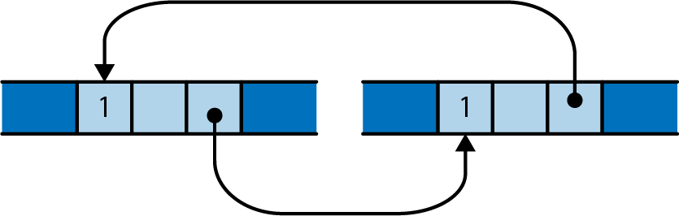

# Rc と Arc: 所有権の共有
典型的な Rust のコードでは，ほとんどの値にユニークな所有者がいますが，すべての値が必要な寿命を持つ単一の所有者を見つけるのが困難な場合があります．
つまり，その値が必要な全ての処理が完了するまで，その値を保持しておきたいような場合です．
このような場合，Rust は参照カウンタ付きポインタ型の ```Rc``` と ```Arc``` を提供しています．
もちろん，これらは安全に使える型で，C++ の参照カウント付きポインタ型で生じるような，参照カウントを調整し忘れたり，Rust が気づかないような他のポインタを作成したりといった問題は起こりません．

```Rc``` 型と ```Arc``` 型はとても似ています．
唯一の違いは，```Arc``` はスレッド間で直接安全に共有できるという点です．
```Arc``` という名前は Atomic Reference Count の略語です．
一方，```Rc``` はスレッド安全ではないコードで，高速に参照カウントを更新するのに使われます．
スレッド間でポインタを共有する必要がなければ，性能面でペナルティのある ```Arc``` を使う理由はありません．
よって，```Rc``` を使うのが妥当でしょう．
Rust は ```Rc``` が偶発的にスレッドの境界を越えて渡されるのを防いでくれます．
それ以外の点でふたつの型は等価ですので，以降は ```Rc``` についてのみお話しします．

以前，Python が値の寿命を管理するのに参照カウントをどう使っているのか紹介しました．
```Rc``` を使うことで，Rust でも似たような効果が得られます．
次のコードについて考えてみましょう．

```rust
use std::rc::Rc;

// Rust can infer all these types; written out for clarity
let s: Rc<String> = Rc::new("shirataki".to_string());
let t: Rc<String> = s.clone();
let u: Rc<String> = s.clone();
```

```T``` がどんな型でも，```Rc<T>``` の値は参照カウントを持った ```T``` 型のヒープ領域を指すポインタとなります．
```Rc<T>``` の値をクローンしても ```T``` をコピーしません．
代わりに，新しくポインタを作成して参照カウントをインクリメントします．
従って，上記のコードを実行すると，メモリの状態は次のようになります．

<div align="center"></div>

3つの ```Rc<String>``` ポインタは，それぞれメモリの同じブロックを指します．
そのブロックは，参照カウントと ```String``` 空間を保持しています．
通常の所有権の規則は ```Rc``` ポインタ自体にも適用され，最後の ```Rc``` がドロップされると，Rust は ```String``` もドロップします．

```Rc<String>``` でも，```String``` のメソッドは通常そのまま使えます．

```rust
assert!(s.contains("shira"));
assert_eq!(t.find("taki"), Some(5));
println!("{} are quite chewy, almost bouncy, but lack flavor", u);
```

```Rc``` ポインタの所有する値はイミュータブルです．
文字列の最後にテキストを追加してみましょう．

```rust
s.push_str(" noodles");
```

これはエラーになります．

```bash
error: cannot borrow data in an `Rc` as mutable
   |
13 |     s.push_str(" noodles");
   |     ^ cannot borrow as mutable
   |
```

Rust のメモリとスレッドの安全性の保証は，確実に値が同時に共有され，かつミュータブルになることがないことで実現しています．
Rust では ```Rc``` ポインタの参照は一般的に共有されているとみなすので，ミュータブルとなってはならないのです．
第5章で，この制限の重要性について説明します．

メモリ管理に参照カウントを使うことで生じる問題として，互いに指し合うような2つの参照カウンタ付きの値があると，いずれももう一方の参照カウントがゼロより大きくなるため，値が解放されないという問題がよく知られています．

<div align="center"></div>

Rust でこのように値が漏れることはあり得ますが，それは稀です．
ある時点で，古い値が新しい値を指すようにしなければ，循環参照ができることはありません．
これが起きるには，明らかに古い方の値がミュータブルである必要があります．
```Rc``` ポインタは参照先をイミュータブルに設定しているので，通常，循環参照はできないようになっています．
しかし，Rust はイミュータブルな値の一部をミュータブルにする方法を提供しています．
これは，「内部変更可能性」(Interior Mutability) と呼ばれ，後ほど扱います．
このテクニックと ```Rc``` ポインタを組み合わせると，循環参照やメモリリークを作り出せます．

```Rc``` ポインタの循環参照を作らないようにするには，代わりに ```std::rc::Weak``` という「弱いポインタ」(weak pointer) をリンクに使うことがあります．
詳細は標準ライブラリのドキュメントを参照してください．

所有権の木構造を硬直性を緩和する方法として，移動と参照カウント付きポインタの2つがあります．
次章では，3つ目の方法として，値への参照の借用を見ていきます．
所有権と借用に慣れると，Rustの学習曲線は一気に上向き，Rust のユニークな強みを活用できるようになるでしょう．
