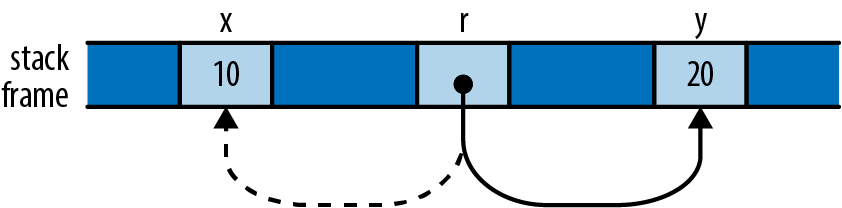
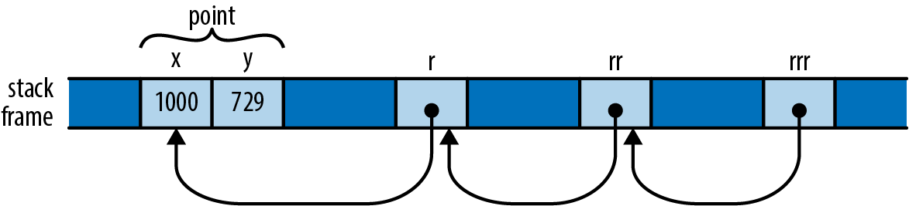

# 5-2. 参照を扱う
先程の例では，関数で所有権を受け取ることなく構造体にアクセスしたり，操作したりできるようにする，非常に典型的な参照の使い方を見てきました．
しかし，参照はより柔軟です．
礼を挙げながらより詳しく見ていきましょう．

## Rust の参照 vs C++ の参照
C++ の参照に慣れている人は，Rust の参照との共通する部分があります．
重要なのは，機械レベルではただのアドレスであるということです．
しかし，実用的には Rust の参照は全く異なる印象を受けるでしょう．

C++ では，変換によって暗黙的に参照が作成され，暗黙的に間接参照されます．

```cpp
int x = 10;
int &r = x;             // initialization creates reference implicitly
assert(r == 10);        // implicitly dereference r to see x's value
r = 20;                 // stores 20 in x, r itself still points to x
```

Rust では ```&``` 演算子によって明示的に参照が作成され，```*``` 演算子によって明示的に間接参照されます．

```rust
let x = 10;
let r = &x;             // &x is a shared reference to x
assert!(*r == 10);      // explicitly dereference r
```

ミュータブルな参照を作成するには，```&mut``` 演算子を使います．

```rust
let mut y = 32;
let m = &mut y;        // &mut y is a mutable reference to y
*m += 32;              // explicitly dereference m to set y's value
assert!(*m == 64);     // and to see y's new value
```

しかし，```show``` 関数を値の代わりに参照で芸術家のテーブルを受け取るように変更した時，```*``` 演算子は使いませんでした．
なぜでしょうか？

Rust は非常に幅広く ```Rust``` で使われているので，```.``` 必要に応じて左側のオペランドを暗黙のうちに間接参照します．

```rust
struct Anime { name: &'static str, bechdel_pass: bool }
let aria = Anime { name: "Aria: The Animation", bechdel_pass: true };
let anime_ref = &aria;
assert_eq!(anime_ref.name, "Aria: The Animation");

// Equivalent to the above, but with the dereference written out:
assert_eq!((*anime_ref).name, "Aria: The Animation");
```

```show``` 関数で使われている ```println!``` マクロは，```.``` 演算子を使うコードに拡張しているので，この暗黙的な間接参照を活用できます．

```.``` 演算子は，メソッドの呼び出しに必要であれば，左側のオペランドの参照を暗黙的に借用することもできます．
例えば，```Vec``` の ```sort``` メソッドは，ベクトルへのミュータブル参照を受け取るので，次の呼び出しは等価となります．

```rust
let mut v = vec![1973, 1968];
v.sort();           // implicitly borrows a mutable reference to v
(&mut v).sort();    // equivalent, but more verbose
```

まとめると，C++ では，参照と L 値 (メモリ上の場所を参照する式) を必要に応じて暗黙的に変換されますが，```Rust``` では，```&``` や ```*``` 演算子を使って参照の作成と追従を行います．
```.``` 演算子は例外で，暗黙的に借用や間接参照を行います．

## 参照の代入
変数に参照を代入すると，変数はどこか新しい領域を指すようになります．

```rust
let x = 10;
let y = 20;
let mut r = &x;

if b { r = &y; }

assert!(*r == 10 || *r == 20);
```

最初，```r``` は ```x``` を指します．
しかし，```b``` が ```true``` の時，代わりに ```y``` を指すようになります．

<div align="center"></div>

この動作は当然だと思うかもしれません．
もちろん，```r``` には ```&y``` を格納しているので，```y``` を指しています．
しかし，この例を示したのは，C++ の参照の挙動とは全く異なるからです．
先述したとおり，C++ で参照に値を代入すると，参照先に値を代入します．
C++ では一度参照を初期化すると，他の値を指すように変更することはできません．

## 参照の参照
Rust では参照への参照を使えます．

```rust
struct Point { x: i32, y: i32 }
let point = Point { x: 1000, y: 729 };
let r: &Point = &point;
let rr: &&Point = &r;
let rrr: &&&Point = &rr;
```

(ここでは参照の方を明記していますが，Rust で推論できないものは出てきていないので省略可能です．)
```.``` 演算子は値が見つかるまで，いくつでも参照をたどります．

```rust
assert_eq!(rrr.y, 729);
```

メモリ上では参照は次のようになっています．

<div align="center"></div>

そのため，```rrr.y``` という式は，```rrr``` の型に従って3回参照をたどって，```y``` フィールドをフェッチする前に ```Point``` に到達します．

## 参照の比較
```.``` 演算子と同様，Rust の比較演算子は参照が何重でも「見通して」しまいます．

```rust
let x = 10;
let y = 10;

let rx = &x;
let ry = &y;

let rrx = &rx;
let rry = &ry;

assert!(rrx <= rry);
assert!(rrx == rry);
```

最後の ```assert!``` が ```rrx``` と ```rry``` が異なる値 (```rx``` と ```ry```) を指していても成功するのは，```==``` 演算子が全ての参照をたどって，```x``` や ```y``` についての比較を行います．
特にジェネリック関数を記述する場合など，ほとんどの場合でこの挙動は期待されるものでしょう．
2つの参照が同じメモリを指しているかを知りたい場合には，アドレスの比較を行う ```std::ptr::eq``` を使います．

```rust
assert!(rx == ry);              // their referents are equal
assert!(!std::ptr::eq(rx, ry)); // but occupy different addresses
```

比較するオペランドは，参照まで含めて同じ型を持っている必要があることに注意してください．

```rust
assert!(rx == rrx);    // error: type mismatch: `&i32` vs `&&i32`
assert!(rx == *rrx);   // this is okay
```

## 参照は Null にならない
Rust の参照は Null 値を取りません．
C の ```NULL``` や C++ の ```nullptr``` に該当する値はありません．
参照の初期値はデフォルトでは存在しません (型によらず，全ての変数は初期化されるまで使えません．) し，(```unsafe``` コードの外側では) 整数を参照に変換しないので，ゼロ値を参照に変換することはできません．

C/C++ のコードでは，値がないことを示すためにヌルポインタがしばしば使われます．
例えば，```malloc``` 関数はメモリ上の新しいブロックへのポインタか，十分なメモリ領域を確保できず要求を満たせない場合には ```nullptr``` を返します．
Rust では，何かに対する参照かそうでないかを表す値が必要な場合には，```Option<&T>``` 型を使います．
機械レベルでは，Rust はヌルポインタとして ```None``` を，ゼロではないアドレスとして ```Some(r)``` (```r``` は ```&T``` 型の値) を使うので，```Option<&T>``` は C/C++ のヌル値をとるポインタと同じ効果が得られます．
さらに，```None``` であるか否かを使う前にチェックすることになるので，より安全に扱うことができます．

## 任意の式への参照を借用する
C/C++ では ```&``` 演算子はある特定の種類の式にのみ適用しますが，Rust ではあらゆる種類の式の値について参照を借用することができます．

```rust
fn factorial(n: usize) -> usize {
    (1..n+1).product()
}
let r = &factorial(6);
// Arithmetic operators can see through one level of references.
assert_eq!(r + &1009, 1729);
```

この場合，Rust では単純に，式の値を格納する匿名の変数と，それを指し示す参照が作成されます．
この匿名の変数の寿命は，その参照を用いて何をするかによって決まります．

- ```let``` によって直ぐに参照を変数に代入する (あるいは構造体や配列の一部で使う) 場合には，変数が ```let``` で初期化されるまでが匿名の変数の寿命となります．先程の例では ```r``` の参照先に，この処理が実行されます．
- それ以外の場合には，匿名変数はステートメントの最後まで残ります．上記の例では，```1009``` を保持する匿名変数が該当し，```assert_eq!``` の完了まで残ります．

C/C++ に慣れていると，この動作はエラーの温床に見えるかもしれません．
しかし，Rust ではダングリング参照を生み出すようなコードは書けないようになっていることを思い出してください．
匿名変数の寿命を超えて参照を使おうとした場合には，コンパイル時にエラーとなります．
そうなったら，適切な寿命を持つ変数で参照先を保持するようにコードを修正すれば大丈夫です．

## スライスやトレイトへの参照
ここまで見てきた参照は，いずれも単一のアドレスでした．
しかし，Rust は2種類のファットポインタをサポートしています．
これは，ある値のアドレスと，その値を使用するために必要な追加情報を持つ2ワード型の値です．

スライスへの参照はファットポインタで，先頭のアドレスとスライスの長さを含んでいます．
これについては第3章で扱いました．

もう1つのファットポインタがトレイト (trait) オブジェクトで，あるトレイトを実装する値への参照です．
トレイトオブジェクトは，値のアドレスと，その値に適したトレイトの実装へのポインタを持ち，トレイトのメソッドを呼び出すために使用されます．
これについては第11章の中で扱います．

このような追加のデータを保持している以外は，スライスやトレイトオブジェクトの参照は，これまでに本章で見てきた参照と同じように動作します．
参照先を所有せず，参照先より長くは生きられず，ミュータブルか共有のどちらかです．
